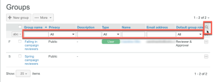

# Administrar grupos mediante [!DNL Workfront Proof]

>[!IMPORTANT]
>
>Este artículo se refiere a la funcionalidad en el producto independiente [!DNL Workfront Proof]. Para obtener información sobre pruebas en el interior [!DNL Adobe Workfront], consulte [Prueba](../../../review-and-approve-work/proofing/proofing.md).

Como [!DNL Workfront Proof] administrador, puede administrar los grupos públicos y privados en la página Grupos .

## Apertura de la página Grupos

1. Haga clic en **[!UICONTROL Grupos]** en la barra lateral de navegación izquierda.
En el [!UICONTROL Grupos] , puede:

   * Vea todos sus grupos públicos y privados.
   * Crear un nuevo grupo. Para obtener más información, consulte [Crear grupos de prueba usando [!DNL Workfront Proof]](../../../workfront-proof/wp-mnguserscontacts/groups/create-proofing-groups.md).
   * Exportar grupos a un archivo CSV.
   * Filtrar y ordenar grupos.
   * Después de seleccionar uno o varios Grupos, estarán disponibles las siguientes opciones adicionales:

      * Agregue personas a los Grupos seleccionados.

         

      * Haga que los grupos seleccionados sean públicos o privados, tal como se describe en [Convertir grupos en privados mediante [!DNL Workfront Proof]](../../../workfront-proof/wp-mnguserscontacts/groups/make-groups-private.md)
      * Los grupos privados solo son visibles para sus creadores.
      * Eliminar los grupos seleccionados.

         
   * Puede realizar acciones en Grupos también en cada Grupo separadamente de las suyas **[!UICONTROL Más]** (tres puntos):

      

      * Ver detalles del grupo.

         También puede ver los detalles del grupo haciendo clic en el nombre del grupo.
      * Agregar personas.
      * Hacer que un grupo sea público/privado.
      * Eliminar un grupo.

## Clasificación de grupos

Puede ordenar grupos por nombre de grupo, estado de privacidad y descripción.

1. Haga clic en el encabezado de columna por el que desee ordenar.
O bien, seleccione una opción de clasificación en el menú Ordenar.
   
El triángulo del encabezado de una columna indica el orden de clasificación. Apuntado hacia arriba, indica el orden ascendente; al señalar hacia abajo se indica el orden descendente.

## Filtrado de grupos

1. Haga clic en el **[!UICONTROL Filtro]** a la derecha de los encabezados de columna para mostrar las opciones de filtrado debajo de los encabezados de columna.
   

1. Select [!UICONTROL opciones de filtrado] en los menús desplegables, escriba los cuadros de filtrado que aparecen debajo del encabezado de cada columna y, a continuación, haga clic en el botón **[!UICONTROL Filtro]** para aplicar las opciones.
O\
   Seleccione la primera letra del nombre del grupo.
   

## Visualización y edición de detalles de grupo

1. Haga clic en el **[!UICONTROL Más]** situado a la derecha del nombre del grupo y haga clic en **[!UICONTROL Ver detalles del grupo]** en el menú desplegable.
En la página que aparece, puede ver todas las personas que están actualmente en el grupo, junto con sus funciones predeterminadas y las alertas por correo electrónico para el grupo.

1. Realice una de las siguientes acciones para editar los detalles del Grupo:

   * Edite el nombre y la descripción del grupo haciendo clic en él y escribiendo. Al hacer clic en cualquier lugar fuera del campo, se guardan los cambios.
   * Haga clic en **[!UICONTROL Privacidad]** para cambiar la configuración de privacidad del grupo en el menú desplegable.
   * Haga clic en **[!UICONTROL Agregar al grupo]** para agregar nuevas personas al Grupo.

      

   * Haga clic en **[!UICONTROL Eliminar grupo]** en la esquina superior derecha para eliminar el grupo.\

      

   * Haga clic en la casilla de verificación situada al principio de la fila de un miembro del grupo y utilice cualquiera de las opciones que aparecen justo encima de la lista.
   * Haga clic en el **[!UICONTROL Más]** al final de la fila de un miembro del Grupo y utilice cualquiera de las opciones del menú desplegable.

      

## Agregar contactos a grupos

1. Haga clic en **[!UICONTROL Contactos]** en el panel de navegación izquierdo para ir al **[!UICONTROL Contactos]** página.

1. Seleccione las casillas de verificación situadas junto al nombre o los nombres de los contactos que desee agregar a un grupo.
1. Haga clic en el **[!UICONTROL Agregar al grupo]** botón.
   
La variable **[!UICONTROL Agregar al grupo]** aparece en el cuadro de diálogo.

1. En el **[!UICONTROL People]** sección:

   1. Utilice los menús desplegables para cambiar el **Función** o **Alertas de correo electrónico**. Para obtener más información, consulte [Administrar funciones de prueba en [!DNL Workfront Proof]](../../../workfront-proof/wp-work-proofsfiles/share-proofs-and-files/manage-proof-roles.md) y  [Configure las opciones de notificación por correo electrónico en [!DNL Workfront Proof]](../../../workfront-proof/wp-emailsntfctns/email-alerts/config-email-notification-settings-wp.md).

   1. Utilice la variable **[!UICONTROL Escriba un nombre de contacto]** o **[!UICONTROL dirección de correo electrónico]** para agregar contactos adicionales al grupo.

1. En el **[!UICONTROL Grupos]** , seleccione el grupo al que desea agregar el contacto o los contactos.
1. Haga clic en **[!UICONTROL Agregar al grupo]**.
