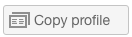

# Crear y administrar perfiles personalizados mediante [!DNL Workfront Proof]

>[!IMPORTANT]
>
>Este artículo se refiere a la funcionalidad en el producto independiente [!DNL Workfront Proof]. Para obtener información sobre pruebas en el interior [!DNL Adobe Workfront], consulte [Prueba](../../../review-and-approve-work/proofing/proofing.md).

Los administradores y administradores de facturación pueden crear y administrar perfiles personalizados para especificar lo que los usuarios pueden hacer en la cuenta de su organización y en la configuración de la cuenta.

Esta función solo está disponible en cuentas Premium.

## Permisos del módulo {#module-permissions}

Los permisos de módulo le permiten decidir qué acceso desea que tengan los usuarios sobre sus propios elementos y sobre los elementos que sean propiedad de otros usuarios de la cuenta.

La sección de acceso básico determina si los usuarios pueden leer, crear, editar y eliminar sus propios elementos en la cuenta.

La variable [!UICONTROL Administración de datos] determina los derechos que los usuarios tienen sobre los artículos que son propiedad de otros usuarios de la cuenta.

Ambas secciones permiten conceder derechos sobre los siguientes elementos de la cuenta:

* Pruebas Para obtener más información, consulte [Generar pruebas en [!DNL Workfront Proof]](../../../workfront-proof/wp-work-proofsfiles/create-proofs-and-files/generate-proofs.md).

* Archivos Para obtener más información, consulte [Cargar archivos y contenido web a [!DNL Workfront Proof]](../../../workfront-proof/wp-work-proofsfiles/create-proofs-and-files/upload-files-web-content.md).

* Carpetas públicas Para obtener más información, consulte [Explicación de los permisos de carpetas en [!DNL Workfront Proof]](../../../workfront-proof/wp-work-proofsfiles/organize-your-work/folder-permissions.md).

* Carpetas privadas Para obtener más información, consulte [Explicación de los permisos de carpetas en [!DNL Workfront Proof]](../../../workfront-proof/wp-work-proofsfiles/organize-your-work/folder-permissions.md).

* Contactos Para obtener más información, consulte [Contactos](https://support.workfront.com/hc/en-us/sections/115000920808-Contacts).

* Grupos Para obtener más información, consulte [Grupos](https://support.workfront.com/hc/en-us/sections/115000920828-Groups).

* Etiquetas Para obtener más información, consulte [Crear y administrar etiquetas en [!DNL Workfront Proof]](../../../workfront-proof/wp-work-proofsfiles/organize-your-work/create-and-manage-tags.md).

* Vistas personalizadas Para obtener más información, consulte [Crear y administrar vistas personalizadas en [!DNL Workfront Proof]](../../../workfront-proof/wp-work-proofsfiles/manage-your-work/create-and-manage-custom-views.md).

## Permisos administrativos {#administrative-permissions}

En esta sección puede conceder permisos administrativos a los usuarios. Algunos permisos vinculan y, cuando se seleccionan, habilitan automáticamente otros permisos necesarios para llevar a cabo la tarea. Por ejemplo, permitir que el usuario administre perfiles de permisos automáticamente permite administrar usuarios en la cuenta.

Puede otorgar los siguientes permisos:

* Administrar configuración de cuenta Para obtener información, consulte [Configuración de la cuenta](https://support.workfront.com/hc/en-us/sections/115000912147-Account-settings).

* Administrar usuarios Para obtener más información, consulte [Usuarios](https://support.workfront.com/hc/en-us/sections/115000911887-Users).

* Administrar decisiones Para obtener más información, consulte [Tome una decisión sobre una prueba en el visor de pruebas](../../../review-and-approve-work/proofing/reviewing-proofs-within-workfront/make-a-decision-on-a-proof/make-decisions-on-proof.md).

* Administrar socios Para obtener información, consulte [Socios](https://support.workfront.com/hc/en-us/sections/115000912107-Partner-accounts).

* Administrar aplicaciones Para obtener más información, consulte [Integraciones](https://support.workfront.com/hc/en-us/categories/115000588707-Integrations).

* Administrar campos personalizados Para obtener información, consulte [Cree y administre campos personalizados en [!DNL Workfront Proof]](../../../workfront-proof/wp-acct-admin/account-settings/create-and-manage-custom-fields.md).

* Administrar zona desplegable Para obtener más información, consulte [Dropzone](../../../workfront-proof/wp-work-proofsfiles/create-proofs-and-files/dropzone.md).

* Administrar flujo de trabajo avanzado Para obtener información, consulte [Resumen del flujo de trabajo automatizado](../../../review-and-approve-work/proofing/proofing-overview/automated-workflow.md).

* Administrar SSO Para obtener más información, consulte [Inicio de sesión único [!DNL Workfront Proof]](../../../workfront-proof/wp-acct-admin/managing-security/single-sign-on-overview.md).

* Ver historial de cuentas Para obtener información, consulte [Información sobre [!DNL Workfront Proof] Pista de auditoría de actividades](../../../workfront-proof/wp-work-proofsfiles/basic-features/activity-audit-trail.md).

* Ver copias de seguridad de la cuenta Para obtener información, consulte [Haga una copia de seguridad de su [!DNL Workfront Proof] Datos](../../../workfront-proof/wp-work-proofsfiles/organize-your-work/back-up-data.md).

* Administrar facturaciones Para obtener más información, consulte [Administrar la facturación](https://support.workfront.com/hc/en-us/sections/115000912187-Managing-your-billing).

* Crear cuentas satélite Para obtener más información, consulte [Configuración de una cuenta de satélite en [!DNL Workfront Proof]](../../../workfront-proof/wp-acct-admin/satellite-accounts/configure-sat-acct-in-wp.md).

* papelera vacía Para obtener información, consulte [Restaurar y vaciar la papelera en [!DNL Workfront Proof]](../../../workfront-proof/wp-work-proofsfiles/manage-your-work/restore-and-empty-trash.md).

* Administrar perfiles de permisos Para obtener información, consulte [Perfiles de permisos de prueba en [!DNL Workfront Proof]](../../../workfront-proof/wp-acct-admin/account-settings/proof-perm-profiles-in-wp.md).

* Ver análisis

## Creación de un nuevo perfil personalizado

1. Vaya a **[!UICONTROL Configuración de la cuenta]** y, a continuación, haga clic en el botón **[!UICONTROL Perfiles]** pestaña .

1. Haga clic en **[!UICONTROL Crear nuevo perfil]**.

1. En el **[!UICONTROL Detalles del perfil]** sección:

   1. En el **[!UICONTROL Nombre]** , especifique un nombre para el perfil personalizado.
   1. Select **[!UICONTROL Habilitar perfil]**. 

1. En el **[!UICONTROL Permisos del módulo]** sección:

   1. Seleccionar permisos para **Acceso básico**.
   1. **Administración de datos**. Para obtener más información, consulte [Permisos del módulo](#module-permissions)

1. En el **[!UICONTROL Permisos administrativos]** , seleccione permisos para funciones administrativas.

   Para obtener más información, consulte [Permisos administrativos](#administrative-permissions).

1. Haga clic en **[!UICONTROL Crear]**.
El nuevo perfil ya está disponible en la **[!UICONTROL Usuarios]** pestaña .

1. (Opcional) Asigne el nuevo perfil a cuentas de usuario nuevas y existentes.
Para obtener más información, consulte [Perfiles de permisos de prueba en [!DNL Workfront Proof]](../../../workfront-proof/wp-acct-admin/account-settings/proof-perm-profiles-in-wp.md).

## Activación y desactivación de un perfil {#enabling-and-disabling-a-profile}

1. Vaya a **[!UICONTROL Configuración de la cuenta]** y haga clic en el botón **[!UICONTROL Perfiles]** pestaña .

1. Seleccione el perfil que desea activar o desactivar.
O Para habilitar o deshabilitar varios perfiles simultáneamente, seleccione los perfiles manualmente o **[!UICONTROL Nombre]** para seleccionar todos los perfiles personalizados.
   

1. Haga clic en el **[!UICONTROL Más]** menú desplegable y, a continuación, haga clic en cualquiera de las siguientes opciones, en función de si desea habilitar o deshabilitar el perfil:

   * **Habilitar perfiles:** El perfil se activa y se puede ver en la variable [!DNL Workfront Proof] menús.
   * **Deshabilitar perfiles:** Aparece un cuadro de confirmación. Select **[!UICONTROL Sí]** para confirmar. El perfil se vuelve inactivo y se elimina del [!DNL Workfront Proof] menús.

      >[!NOTE]
      >
      >Ya no se puede asignar un perfil deshabilitado a los usuarios de la cuenta. Si los usuarios con ese perfil existen en la cuenta, seleccione un perfil diferente para ellos antes de que el perfil esté deshabilitado.

      

## Copia de perfiles

Cree copias de un perfil existente para configurar varios perfiles con permisos similares.

1. Vaya a **[!UICONTROL Configuración de la cuenta]** y, a continuación, haga clic en el botón **[!UICONTROL Perfiles]** pestaña .

1. Haga clic en el nombre del perfil y en la **[!UICONTROL Copiar perfil]** botón.

   

   El perfil copiado ahora aparece en la lista de perfiles. Tiene el nombre de perfiles original con la palabra &quot;Copiar&quot; antes de él.

   

1. (Opcional) Para habilitar el perfil copiado, consulte [Activación y desactivación de un perfil](#enabling-and-disabling-a-profile).
1. (Opcional) Para realizar ediciones en el perfil copiado, consulte [Edición de perfiles](#editing-a-profile).

## Edición de perfiles {#editing-a-profile}

Si edita un perfil, las actualizaciones se aplican a todos los usuarios a los que este perfil está asignado actualmente.

1. Vaya a **[!UICONTROL Configuración de la cuenta]** y, a continuación, haga clic en el botón **[!UICONTROL Perfiles]** pestaña .

1. Haga clic en el nombre de perfil que desee editar.
1. Realice los cambios necesarios en el nombre o los permisos del perfil. Estos cambios se guardan y se actualizan automáticamente.
Para obtener más información sobre los permisos, consulte [Permisos del módulo](#module-permissions) y [Permisos administrativos](#administrative-permissions).

>[!NOTE]
>
>Predeterminado [!DNL Workfront Proof] los perfiles están visibles en la lista de perfiles, pero no se pueden modificar.

## Eliminación de un perfil

1. Vaya a **[!UICONTROL Configuración de la cuenta]** y, a continuación, haga clic en el botón **[!UICONTROL Perfiles]** pestaña .

1. Seleccione el perfil o perfiles que desee eliminar.
1. Haga clic en el **[!UICONTROL Papelera]** en la parte superior de la página.

   

1. Haga clic en **[!UICONTROL Sí]** en el **[!UICONTROL Cuadro de diálogo Confirmar]** que aparece.

1. Si el perfil está asignado a un usuario, utilice el menú desplegable del cuadro de diálogo para seleccionar un perfil diferente que asignar a este usuario. Haga clic en **[!UICONTROL Sí]** para confirmar.

   

>[!NOTE]
>
>No es posible eliminar perfiles estándar de la cuenta. Es posible deshabilitar los perfiles estándar si no desea usarlos en su cuenta.

Para obtener más información sobre la desactivación de perfiles, consulte [Activación y desactivación de un perfil](#enabling-and-disabling-a-profile).
