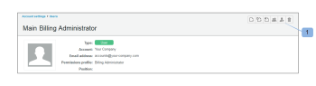

# Mover usuarios entre cuentas usando [!DNL Workfront Proof]

>[!IMPORTANT]
>
>Este artículo hace referencia a la funcionalidad del producto independiente [!DNL Workfront Proof]. Para obtener información sobre la revisión dentro de [!DNL Adobe Workfront], vea [Revisión](../../../review-and-approve-work/proofing/proofing.md).

Si es administrador de [!DNL Workfront] Proof y tiene una o más cuentas satélite conectadas a su cuenta principal, puede mover los usuarios entre todas estas cuentas.

## Mover usuarios entre cuentas conectadas

1. Haga clic en **[!UICONTROL Configuración]** > **[!UICONTROL Configuración de la cuenta]**.

1. Abra la ficha **[!UICONTROL Usuarios]**.
1. Haga clic en el icono **[!UICONTROL Mover usuario]** (1). 

1. En el cuadro Mover usuario que aparece, confirme el usuario que desea mover (1).
1. Seleccione una cuenta de destino de la lista cuentas conectadas (2).
1. Asigne el permiso de perfil (3) que este usuario debe tener en la nueva cuenta.
1. Seleccione un usuario (4) que sea propietario de los elementos que no se moverán.
Esto incluye los elementos que decidirá dejar en la cuenta antigua y los elementos que no se pueden mover (consulte [Elementos que no se pueden mover](https://support.workfront.com/knowledge/articles/115004087708/en-us?brand_id=662728&amp;return_to=%2Fhc%2Fen-us%2Farticles%2F115004087708#Items-that-can&#39;t-be-moved) a continuación).

1. Marque las casillas de verificación si desea mover las pruebas (5) y los archivos (6) junto con el usuario.
1. Cree un nombre para la carpeta (7) en la que se colocarán todos los elementos movidos en la nueva cuenta.
1. Haga clic en **[!UICONTROL Mover usuario]** (8) para iniciar el proceso.
   

Si decide mover el usuario sin sus pruebas y archivos, esta acción se realizará inmediatamente. Si decide mover el usuario junto con sus pruebas y archivos, el perfil del usuario se reasignará inmediatamente, pero las pruebas y los archivos aparecerán gradualmente en la cuenta de destino, ya que esta operación requiere tiempo para transferir los datos.

Dependiendo del número de archivos y pruebas, el proceso de movimiento puede tardar desde unos minutos hasta unas pocas horas.

>[!NOTE]
>
>Si sospecha que el proceso toma más tiempo del esperado o que las pruebas y/o archivos movidos no aparecen en la nueva cuenta, póngase en contacto con nuestro equipo de soporte.

## Elementos que no se pueden mover

### Carpetas creadas o propiedad del usuario desplazado

Debido a la naturaleza de los distintos permisos aplicados a las carpetas y su contenido (por ejemplo, pueden compartirse con otros usuarios y cuentas), no podemos mover estructuras de carpetas con el usuario.

Si una carpeta es propiedad del usuario que se ha movido, la propiedad se transferirá al usuario seleccionado (4) en la ventana emergente &quot;Mover usuario&quot;.

>[!NOTE]
>
>Si el usuario que se ha movido ha creado una carpeta, seguirá siendo su creador, solo se transferirá la propiedad. La carpeta permanecerá visible para el usuario que la haya movido en la barra lateral de su nueva cuenta. El usuario movido seguirá teniendo acceso de &quot;solo lectura&quot; a los elementos colocados dentro de estas carpetas.

Si no desea que el usuario que se ha movido conserve estos permisos o si el usuario que se ha movido no desea ver sus carpetas antiguas en la cuenta antigua, la solución aquí sería eliminar las carpetas de la siguiente manera:

1. Cree una nueva carpeta en la cuenta antigua.
1. Mueva todos los elementos de las carpetas del usuario movido a la recién creada.
1. Elimine todas las carpetas que haya dejado el usuario que ha movido.

### Conjuntos de versiones con diferentes propietarios

Si una prueba tiene algunas versiones y cada una de ellas es propiedad de un usuario diferente, las versiones propiedad del usuario movido no se moverán. La propiedad de dichas versiones se transferirá a otro usuario según su elección (4) en el cuadro Mover usuario. (Para obtener más información, consulte ).

>[!NOTE]
>
>Un usuario que se ha trasladado debe ser propietario de todas las versiones de prueba del conjunto para que se pueda trasladar la prueba.

### Grupos

El usuario que se haya movido tendrá que volver a crear los grupos en su nueva cuenta. Para obtener más información, consulte [Crear grupos de revisión con [!DNL Workfront Proof]](../../../workfront-proof/wp-mnguserscontacts/groups/create-proofing-groups.md).

### Vistas personalizadas

El usuario que se haya movido deberá volver a crear las vistas personalizadas personales en la nueva cuenta. Para obtener más información, consulte [Crear y administrar vistas personalizadas en [!DNL Workfront Proof] Revisión](../../../workfront-proof/wp-work-proofsfiles/manage-your-work/create-and-manage-custom-views.md).

### Campos personalizados

Los campos personalizados no se pueden mover y los datos de los campos personalizados se perderán, por lo que asegúrese de generar los informes sobre los elementos necesarios antes del movimiento.

### Plantillas de flujo de trabajo automatizadas

Es necesario volver a crear las plantillas de flujo de trabajo automatizadas en la nueva cuenta, pero las fases se conservarán en las pruebas que se hayan movido y creado con las plantillas.

### Acciones en los comentarios

Las acciones en los comentarios permanecerán en las pruebas, pero ya no será posible filtrarlas. La solución sería crear Acciones coincidentes en la nueva cuenta y volver a marcar los comentarios con las nuevas acciones si es necesario.
