# Aplicación móvil de Workfront Proof

>[!IMPORTANT]
>
>Este artículo hace referencia a la funcionalidad del producto independiente [!DNL Workfront Proof]. Para obtener información sobre la revisión dentro de [!DNL Adobe Workfront], consulte [Revisión](../../../review-and-approve-work/proofing/proofing.md).

Descargue la aplicación [!DNL Workfront Proof] desde Apple App Store o Google Store para ser productivo esté donde esté. La aplicación [!DNL Workfront Proof] tiene las siguientes características en iPhone y iPod Touch:

* Ver, revisar y aprobar pruebas estáticas y audiovisuales
* Ver, añadir y responder a comentarios
* Administrar las pruebas a través del panel de control y las vistas

No necesita ser un usuario de [!DNL Workfront Proof] (es decir, tener sus propias credenciales de inicio de sesión) para revisar y aprobar una prueba a través de la aplicación de iOS. Siempre que descargue la aplicación en su dispositivo iOS y acceda a su URL personal a través de su aplicación de correo electrónico de iOS, podrá revisar y aprobar sobre la marcha.

## Requisitos del dispositivo

Requiere iOS 7.0 o posterior. Android 4.0 y versiones anteriores. Compatible con iPhone, iPad e iPod Touch.

## Descargar e instalar la aplicación

>[!IMPORTANT]
>
>La aplicación móvil de Workfront Proof ya no es compatible y está disponible tal cual.  No se solucionará ningún problema en la aplicación.

En el caso de los dispositivos iOS, asegúrese de desinstalar la aplicación [!DNL Workfront Proof] anterior para dispositivos iOS antes de instalar la nueva.

La aplicación [!DNL Workfront Proof] detecta automáticamente qué tipo de dispositivo está usando. Si quiere utilizar la aplicación en su tableta, consulte [[!DNL Workfront Proof] Aplicación móvil para tabletas](../../../workfront-proof/wp-mobile/wp-mobile-apps/wp-mobile-app-tablet.md).

>[!NOTE]
>
>Debido a las limitaciones de software de los dispositivos móviles, no es posible revisar los archivos de SWF o archivos de audio, como MP3, en los dispositivos iOS. Si desea revisar una prueba creada a partir de un archivo de SWF o un archivo de audio en un dispositivo móvil, conviértala a un formato compatible antes de cargarla en [!DNL Workfront Proof].

## Introducción a la aplicación

No necesita ser un usuario de [!DNL Workfront Proof] para comenzar a utilizar la aplicación. Solo tiene que instalar la aplicación en su dispositivo y hacer clic en el vínculo **[!UICONTROL Ir a la revisión]** en su notificación por correo electrónico. La aplicación se inicia automáticamente y carga la prueba.

Si es un usuario de [!DNL Workfront Proof], puede iniciar sesión en la aplicación antes de abrir cualquier prueba. La aplicación le permite examinar todas las pruebas compartidas con usted y cambiar fácilmente entre ellas.

1. Abra la aplicación.
1. Escriba su correo electrónico y contraseña y pulse **[!UICONTROL Iniciar sesión]**.

   O

   Use el inicio de sesión único, si está configurado en su cuenta de [!DNL Workfront Proof].

   Puede utilizar la opción **[!UICONTROL Olvidé la contraseña]** si no recuerda su contraseña.

## El panel de control

Después de iniciar sesión en su cuenta de [!DNL Workfront Proof], aparecerá el panel de control. Aquí puede acceder fácilmente a sus pruebas. Puede abrir una de las vistas disponibles, Mis pruebas y Todas las pruebas. También puede pulsar el nombre de una de las revisiones recientes para ir directamente al visor de corrección.

De forma predeterminada, el panel de control abrirá la vista del número total de pruebas. Esta vista muestra todas las pruebas que son suyas o que se han compartido con usted. Puede cambiar la vista pulsando en la barra de la parte superior de la página para abrir un menú desplegable que contiene las opciones [!UICONTROL A tiempo], [!UICONTROL En riesgo], [!UICONTROL Retrasado] y [!UICONTROL Reciente]. Para abrir una revisión desde cualquier vista, desplácese hacia abajo por la lista hasta encontrar la revisión que desee y, a continuación, pulse en su nombre para ir al visor de corrección.

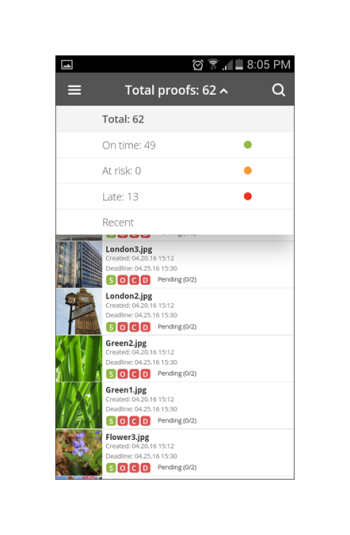

| **Vista A tiempo** | Muestra todas las pruebas activas en su cuenta que tiene permiso para ver y que no tienen fecha límite o cuando faltan más de 24 horas para la fecha límite. |
|---|---|
| **Vista En riesgo** | Muestra todas las pruebas cuya fecha límite es de menos de 24 horas. |
| **Vista Retrasado** | Enumera todas las pruebas en las que no se completan todas las acciones para las que ya se ha incumplido la fecha límite. |
| **Vista reciente** | Incluye las pruebas a las que ha accedido recientemente y de las que es propietario, para las que tiene permisos de visualización según los permisos de perfil y las que se compartieron con usted. Esta vista muestra solamente las pruebas que usted mismo ha abierto (ya sea a través del visualizador [!DNL Workfront Proof] o a través de la página de detalles de la prueba). |
| **Vínculo de correo electrónico** | Para abrir una prueba desde su correo electrónico, solo necesita abrir el correo electrónico en su aplicación de correo electrónico, haga clic en el vínculo de botón [!UICONTROL Go to proof] del correo electrónico (1) y se le redirigirá a la prueba en la aplicación [!DNL Workfront Proof]. |

{style="table-layout:auto"}

## Revisión de una prueba estática en la aplicación

Al abrir una prueba en la aplicación móvil, puede hacer lo siguiente:

* Lea y responda a los comentarios de otros revisores (1: el dígito visible en el icono indica el número de comentarios que quedaron en la prueba; si no quedaron comentarios en la prueba, este botón mostrará 0 y estará atenuado).
* Añada comentarios y marcas (2).
* La visibilidad del botón Comentario y decisión depende de la función de prueba.
* Tome una decisión (3).
* Vaya al menú (4).
* Escale la prueba pellizcando la pantalla.
  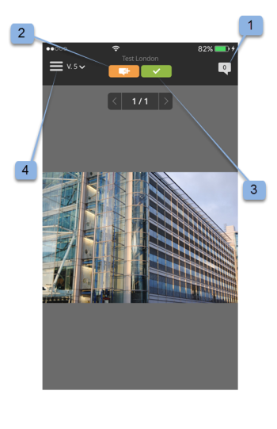

## Añadir comentarios y respuestas

1. Cuando haya abierto una revisión, pulse el botón **[!UICONTROL Add commen]** (1).

   

1. Escriba su comentario (2).

   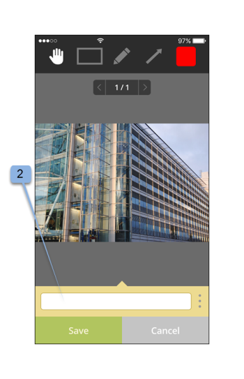

1. Haga clic en **[!UICONTROL Guardar]**.

## Leer y responder a comentarios

1. Abra la prueba y, a continuación, pulse el icono de llamada en la esquina superior derecha para ver la lista de comentarios (1) y elija el comentario que desea revisar.
1. Pulse en el anclaje para abrir el comentario asociado (2).

   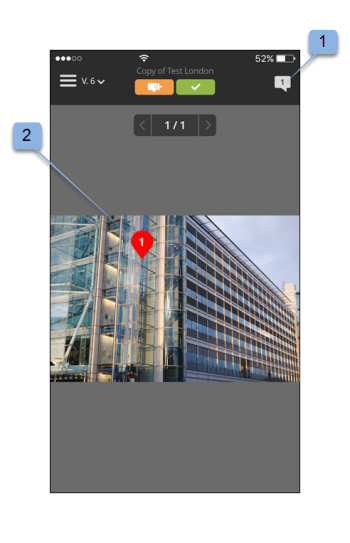

1. Realice una de las siguientes acciones:

   * Para responder a un comentario, pulse el botón **[!UICONTROL Reply]** (3).
   * Para volver a la imagen de prueba, pulse el icono de [!UICONTROL callout].
   * Para ver el comentario completo y sus respuestas, pulse en el propio comentario.

     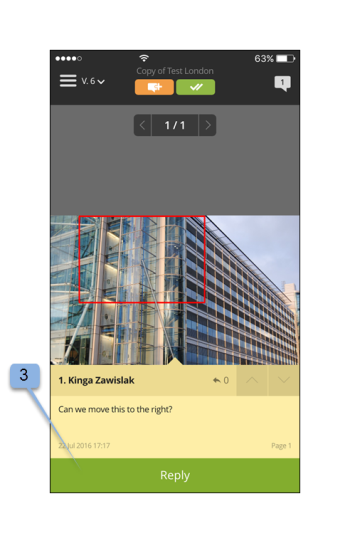

   * Para aplicar una acción a un comentario:

      1. Abra un comentario.
      1. Pulse **[!UICONTROL Responder]**.
      1. Abra el menú de [!UICONTROL acciones] en el lado derecho del campo de texto (1).
      1. Pulse **[!UICONTROL Add action]** (2).

         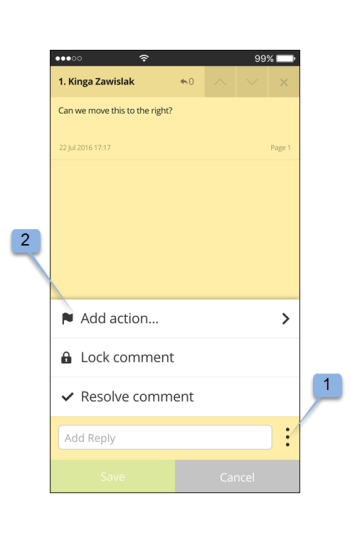

         Para obtener más información acerca de las acciones, vea [Usar acciones en comentarios sobre una prueba](../../../review-and-approve-work/proofing/reviewing-proofs-within-workfront/comment-on-a-proof/use-actions-on-comments-in-viewer.md).

## Añadir marcas

Puede añadir una marca (como un cuadro que resalta un área de la prueba) y escribir un comentario que esté adjunto a la marca. También puede hacer un comentario sin añadir ninguna marca. Y puede añadir varias marcas a un solo comentario.

1. En una prueba que haya abierto, pulse **Añadir comentario** (1).

   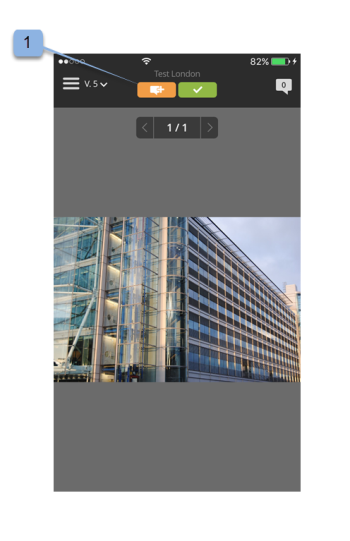

1. Elija entre [!UICONTROL pan mode] (2), [!UICONTROL rectangle tool] (3), [!UICONTROL freehand drawing] (4) o la herramienta [!UICONTROL arrow] (5).

   También puede cambiar el color de línea de la marca (6).

1. Para dibujar una marca en la prueba, toque la pantalla y, a continuación, mueva el dedo por la prueba.

   No es necesario que añada texto para guardar las marcas (7).

1. Pulse **[!UICONTROL Cancel]** (8) si desea descartar el marcado

   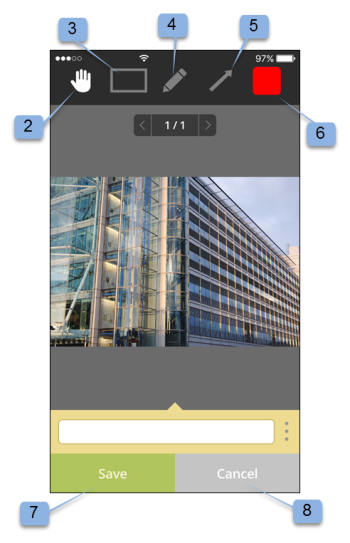

   Al marcar un área en la prueba, se abre automáticamente el campo de comentario. Para quitar el marcado creado, pulse en la cruz situada junto a la forma de marcado (9).

   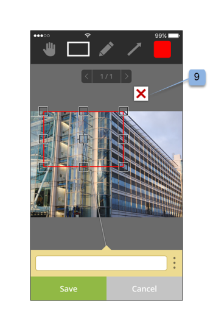

## Toma de decisiones sobre una prueba

1. Abra la prueba en el Visor de pruebas y pulse el botón [!UICONTROL Decision] (1).

   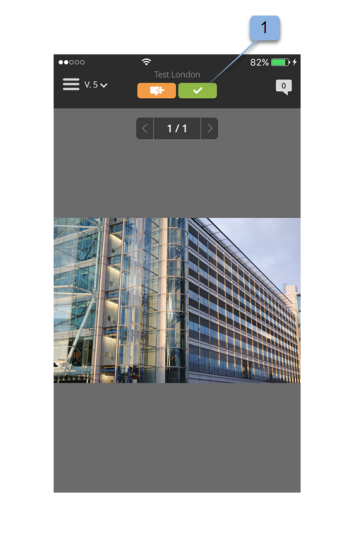

1. Pulse la decisión que desee enviar (2).
1. Pulse **[!UICONTROL Save]** para enviar la decisión.

   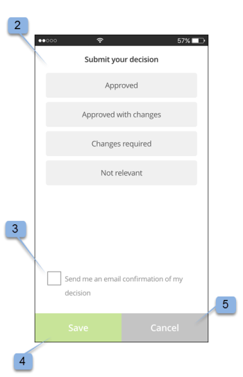

   >[!NOTE]
   >
   >* Si se establece un mensaje emergente sobre la decisión en la cuenta en la que se ha creado la prueba, también aparecerá en la aplicación de iOS cuando se tome una decisión sobre una prueba.
   >* Si configura motivos de decisión, se mostrarán en la pantalla [!UICONTROL Submit your decision] para poder elegir.

   Si ya ha enviado una decisión y desea cambiarla o quitarla, puede hacerlo fácilmente. Después de enviar una decisión, aparece una nueva opción, **[!UICONTROL Remove my decision]** (6), en la pantalla [!UICONTROL Submit your decision].

   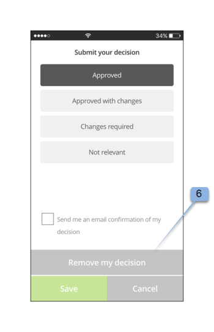

## Revisar una prueba de audio o vídeo en la aplicación

La revisión de una prueba de audio-vídeo en la aplicación de iOS es tan sencilla como la de un archivo estático:

1. Pulse el botón [!UICONTROL play/pause] para reproducir o pausar el vídeo (1).
1. Para navegar por el vídeo, pulse la barra de [!UICONTROL navigation] (2).
1. Para dejar un comentario, pulse el botón **[!UICONTROL Comment]** (3) y siga las instrucciones descritas anteriormente.

   Cualquier comentario o marcado dejado en la prueba se marcará con anclajes a lo largo de la barra de navegación (4).

1. Si desea revisar los comentarios dejados en la prueba, pulse el botón **[!UICONTROL Comments]** (5) y siga las instrucciones descritas anteriormente.
1. Para tomar una decisión, pulse el botón **[!UICONTROL Decision]** (6) y siga las instrucciones anteriores.

   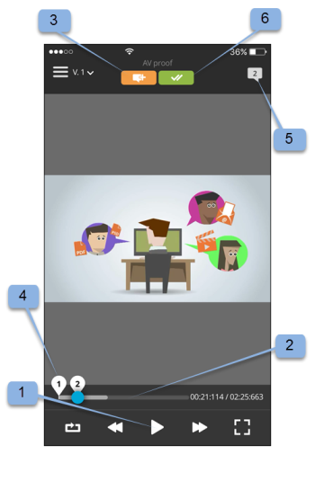
