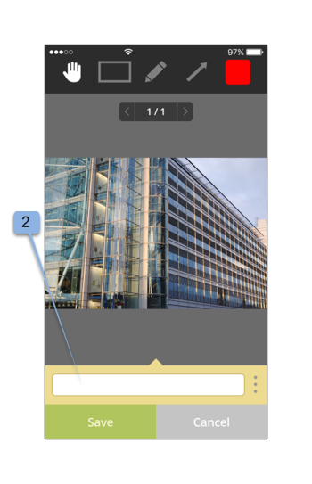

# Aplicación móvil de Workfront Proof

>[!IMPORTANT]
>
>Este artículo se refiere a la funcionalidad en el producto independiente [!DNL Workfront Proof]. Para obtener información sobre pruebas en el interior [!DNL Adobe Workfront], consulte [Prueba](../../../review-and-approve-work/proofing/proofing.md).

Descargue el [!DNL Workfront Proof] de Apple App Store o Google Store para que sea productivo dondequiera que esté. La variable [!DNL Workfront Proof] La aplicación cuenta con las siguientes funciones en iPhone y iPod Touch:

* Ver, revisar y aprobar pruebas estáticas y audiovisuales
* Ver, agregar y responder a comentarios
* Administre las pruebas a través del panel y las vistas

No necesita ser usuario de [!DNL Workfront Proof] (es decir, tenga sus propias credenciales de inicio de sesión) para revisar y aprobar una prueba a través de la aplicación de iOS. Siempre y cuando descargue la aplicación en su dispositivo iOS y acceda a su URL personal a través de su aplicación de correo electrónico de iOS, puede revisar y aprobar sobre la marcha.

## Requisitos del dispositivo

Requiere iOS 7.0 o posterior. Android 4.0 y posteriores. Compatible con iPhone, iPad y iPod touch.

## Descargar e instalar la aplicación

>[!IMPORTANT]
>
>La aplicación móvil Workfront Proof ya no es compatible y está disponible tal cual.  No se corregirán los problemas de la aplicación.

Descargue nuestra [!DNL Workfront Proof] Aplicación móvil directamente desde [Apple App Store](https://itunes.apple.com/us/app/workfront-proof/id1030372728?mt=8) o [Google Play Store](https://play.google.com/store/apps/details?id=com.proofhq.tabletapp).

Para dispositivos iOS, asegúrese de desinstalar la anterior [!DNL Workfront Proof] para dispositivos iOS antes de instalar la nueva aplicación.

La variable [!DNL Workfront Proof] la aplicación detecta automáticamente qué tipo de dispositivo está utilizando. Si desea utilizar la aplicación en la tableta, consulte [[!DNL Workfront Proof] aplicación móvil para tabletas](../../../workfront-proof/wp-mobile/wp-mobile-apps/wp-mobile-app-tablet.md).

>[!NOTE]
>
>No es posible revisar archivos de SWF o archivos de audio, como MP3 en dispositivos iOS, debido a las limitaciones de software de los dispositivos móviles. Si desea revisar una prueba creada a partir de un archivo SWF o un archivo de audio en un dispositivo móvil, conviértala a un formato compatible antes de cargarla a [!DNL Workfront Proof].

## Introducción a la aplicación

No tiene que ser un [!DNL Workfront Proof] para empezar a usar la aplicación. Simplemente instale la aplicación en su dispositivo y haga clic en un **[!UICONTROL Ir a prueba]** en la notificación por correo electrónico. La aplicación se inicia automáticamente y carga la prueba.

Si es [!DNL Workfront Proof] usuario puede iniciar sesión en la aplicación antes de abrir cualquier prueba. La aplicación le permite examinar todas las pruebas compartidas con usted y cambiar fácilmente entre ellas.

1. Abra la aplicación.
1. Escriba su correo electrónico y contraseña y pulse **[!UICONTROL Inicio de sesión]**.

   O

   Utilice el inicio de sesión único, si está configurado en su [!DNL Workfront Proof] cuenta.

   Puede usar la variable **[!UICONTROL Contraseña olvidada]** si no recuerda su contraseña.

## El panel

Después de iniciar sesión en su [!DNL Workfront Proof] , aparecerá el panel. Aquí podrá acceder fácilmente a sus pruebas. Puede abrir una de las vistas disponibles, Mis pruebas y Todas las pruebas. También puede pulsar el nombre de una de las pruebas recientes para ir directamente al visor de pruebas.

De forma predeterminada, el panel abrirá la vista Pruebas totales . Esta vista muestra todas las pruebas de que usted es el propietario de o que compartieron con usted. Para cambiar la vista, toque la barra situada en la parte superior de la página para abrir un menú desplegable que contenga la variable [!UICONTROL Tiempo de activación], [!UICONTROL En riesgo], [!UICONTROL Late] y [!UICONTROL Reciente] opciones. Para abrir una prueba desde cualquier vista, desplácese hacia abajo por la lista para encontrar la prueba que desee y, a continuación, pulse su nombre para ir al visor de pruebas.

| **Vista en tiempo** | Muestra todas las pruebas activas de la cuenta que tiene permiso para ver y que no tienen fecha límite, o que hay más de 24 horas hasta la fecha límite. |
|---|---|
| **Vista en riesgo** | Muestra todas las pruebas para las que la fecha límite es inferior a 24 horas. |
| **Vista tardía** | Enumera todas las pruebas en las que no se completan todas las acciones para las que ya se ha infringido la fecha límite. |
| **Vista reciente** | Incluye las pruebas a las que usted y su propietario han accedido recientemente, tienen permisos para ver según sus permisos de perfil y que se compartieron con usted. Esta vista muestra únicamente las pruebas que usted mismo ha abierto (ya sea a través del [!DNL Workfront Proof] Visualizador o a través de la página de detalles de la prueba). |
| **Vínculo de correo electrónico** | Para abrir una prueba desde el correo electrónico, simplemente abra el correo electrónico en la aplicación de correo electrónico y haga clic en el botón [!UICONTROL Vaya a la prueba] en el vínculo del correo electrónico (1) y se le redirigirá a la prueba en la [!DNL Workfront Proof] aplicación. |

{style="table-layout:auto"}

## Revisar una prueba estática en la aplicación

Al abrir una prueba en la aplicación móvil, puede hacer lo siguiente:

* Lea y responda a los comentarios dejados por otros revisores (1 - el dígito visible en el icono indica los números de comentarios que quedan en la prueba, si no se dejaron comentarios en la prueba, este botón mostrará 0 y estará atenuado).
* Añadir comentarios y marcas (2).
* La visibilidad del botón Comentario y Decisión depende de la función de prueba.
* Adoptar una decisión (3).
* Vaya al menú (4).
* Escale la prueba pellizcando la pantalla.
   

## Añadir comentarios y respuestas

1. Cuando haya abierto una prueba, pulse la tecla **[!UICONTROL Añadir comentario]** botón (1).

   

1. Escriba el comentario (2).

   

1. Haga clic en **[!UICONTROL Guardar]**.

## Leer y responder comentarios

1. Abra la prueba y, a continuación, pulse el icono de llamada en la esquina superior derecha para ver la lista de comentarios (1) y elija el comentario que desea revisar.
1. Pulse el pin para abrir el comentario asociado a él (2).

   

1. Realice una de las siguientes acciones:

   * Para responder a un comentario, pulse el botón **[!UICONTROL Responder]** botón (3).
   * Para volver a la imagen de prueba, toque el [!UICONTROL llamada] icono.
   * Para ver el comentario completo y sus respuestas, pulse en el comentario en sí.

      

   * Para aplicar una acción a un comentario:

      1. Abra un comentario.
      1. Toque **[!UICONTROL Responder]**.
      1. Abra el [!UICONTROL acciones] a la derecha del campo de texto (1).
      1. Toque **[!UICONTROL Agregar acción]** (2)

         

         Para obtener más información sobre las acciones, consulte [Usar acciones en comentarios de prueba](../../../review-and-approve-work/proofing/reviewing-proofs-within-workfront/comment-on-a-proof/use-actions-on-comments-in-viewer.md).

## Agregar marcas

Puede agregar un marcado (como un cuadro que resalte un área de la prueba) y escribir un comentario que esté adjunto al marcado. También puede realizar un comentario sin añadir un marcado. Y puede agregar varias marcas a un solo comentario.

1. En una prueba que haya abierto, pulse **Añadir comentario** (1)

   

1. Elija entre las [!UICONTROL modo pan] (2) [!UICONTROL herramienta rectángulo] (3) [!UICONTROL dibujo a mano alzada] (4) o [!UICONTROL flecha] herramienta (5).

   También puede cambiar el color de línea del marcado (6).

1. Para dibujar un marcado en la prueba, toque la pantalla y, a continuación, mueva el dedo por la prueba.

   No es necesario añadir texto para guardar el marcado (7).

1. Toque **[!UICONTROL Cancelar]** (8) si desea descartar el marcado .

   

   Al marcar un área en la prueba, se abre automáticamente el campo de comentarios. Para eliminar las marcas creadas, toque la cruz que hay junto a la forma de marcado (9).

   

## Tomar decisiones sobre una prueba

1. Abra la prueba en el visor de pruebas y pulse el botón [!UICONTROL Decisión] botón (1).

   

1. Pulse la decisión que desee presentar (2).
1. Toque **[!UICONTROL Guardar]** para presentar su decisión.

   

   >[!NOTE]
   >
   >* Si se establece un mensaje emergente en la cuenta en la que se creó la prueba, también aparecerá en la aplicación de iOS cuando se tome una decisión sobre una prueba.
   >* Si configura los motivos de decisión, se mostrarán en la variable [!UICONTROL Enviar su decisión] para que elija.

   Si ya ha enviado una decisión y desea cambiarla o eliminarla, puede hacerlo fácilmente. Después de presentar una decisión, una nueva opción, **[!UICONTROL Eliminar mi decisión]** (6), aparece en el [!UICONTROL Enviar su decisión] en el Navegador.

   

## Revisar una prueba de audio o vídeo en la aplicación

La revisión de una prueba de audio y vídeo en la aplicación iOS es tan sencilla como la revisión de un archivo estático:

1. Toque en la [!UICONTROL reproducir/pausar] para reproducir o pausar el vídeo (1).
1. Para navegar por el vídeo, pulse el botón [!UICONTROL navegación] barra (2).
1. Para dejar un comentario, pulse el botón **[!UICONTROL Comentario]** (3), siga las instrucciones descritas anteriormente.

   Los comentarios o marcas que queden en la prueba se marcarán con pines en la barra de navegación (4).

1. Si desea revisar los comentarios que quedan en la prueba, pulse el botón **[!UICONTROL Comentarios]** (5), siga las instrucciones descritas anteriormente.
1. Para tomar una decisión, pulse el botón **[!UICONTROL Decisión]** botón (6), siga las instrucciones anteriores.

   
