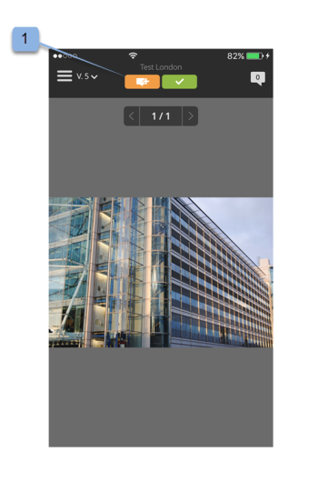

# Aplicación móvil Workfront Proof

>[!IMPORTANT]
>
>Este artículo hace referencia a la funcionalidad del producto independiente [!DNL Workfront Proof]. Para obtener información sobre la revisión dentro de [!DNL Adobe Workfront], consulte [Revisión](../../../review-and-approve-work/proofing/proofing.md).

Descargue la [!DNL Workfront Proof] aplicación de Apple App Store o Google Store para ser productivo esté donde esté. El [!DNL Workfront Proof] La aplicación tiene las siguientes funciones en iPhone y iPod Touch:

* Ver, revisar y aprobar pruebas estáticas y audiovisuales
* Ver, agregar y responder a comentarios
* Administre las pruebas a través del panel y las vistas

No necesita ser un usuario de [!DNL Workfront Proof] (es decir, tenga sus propias credenciales de inicio de sesión) para revisar y aprobar una prueba a través de la aplicación de iOS. Siempre que descargue la aplicación en su dispositivo iOS y acceda a su URL personal a través de su aplicación de correo electrónico de iOS, podrá revisarla y aprobarla en sus desplazamientos.

## Requisitos del dispositivo

Requiere iOS 7.0 o posterior. Android 4.0 y versiones posteriores. Compatible con iPhone, iPad y iPod touch.

## Descargue e instale la aplicación

>[!IMPORTANT]
>
>La aplicación móvil Workfront Proof ya no es compatible y está disponible tal cual.  No se solucionará ningún problema en la aplicación.

Descargue nuestro [!DNL Workfront Proof] Aplicación móvil directamente desde [Apple App Store](https://itunes.apple.com/us/app/workfront-proof/id1030372728?mt=8) o el [Tienda Google Play](https://play.google.com/store/apps/details?id=com.proofhq.tabletapp).

Para dispositivos iOS, asegúrese de desinstalar el anterior [!DNL Workfront Proof] para dispositivos iOS antes de instalar la nueva aplicación.

El [!DNL Workfront Proof] La aplicación detecta automáticamente qué tipo de dispositivo está utilizando. Si desea utilizar la aplicación en su tableta, consulte [[!DNL Workfront Proof] aplicación móvil para tabletas](../../../workfront-proof/wp-mobile/wp-mobile-apps/wp-mobile-app-tablet.md).

>[!NOTE]
>
>Debido a las limitaciones de software de los dispositivos móviles, no es posible revisar archivos de SWF o archivos de audio, como MP3, en dispositivos iOS. Si desea revisar una prueba creada a partir de un archivo de SWF o un archivo de audio en un dispositivo móvil, conviértala a un formato compatible antes de cargarla en [!DNL Workfront Proof].

## Introducción a la aplicación

No tiene que ser un [!DNL Workfront Proof] para comenzar a usar la aplicación. Simplemente instale la aplicación en su dispositivo y haga clic en un **[!UICONTROL Ir a la revisión]** en la notificación por correo electrónico. La aplicación se inicia automáticamente y carga la prueba.

Si es un [!DNL Workfront Proof] usuario puede iniciar sesión en la aplicación antes de abrir cualquier prueba. La aplicación le permite examinar todas las pruebas compartidas con usted y cambiar fácilmente entre ellas.

1. Abra la aplicación.
1. Introduzca su correo electrónico y contraseña y pulse **[!UICONTROL Iniciar sesión]**.

   O

   Use el inicio de sesión único, si está configurado en su [!DNL Workfront Proof] cuenta.

   Puede usar el complemento **[!UICONTROL Contraseña olvidada]** opción si no recuerda la contraseña.

## El panel

Después de iniciar sesión en su [!DNL Workfront Proof] , aparecerá el panel. Aquí puede acceder fácilmente a sus pruebas. Puede abrir una de las vistas disponibles, Mis pruebas y Todas las pruebas. También puede pulsar el nombre de una de las pruebas recientes para ir directamente al visualizador de pruebas.

De forma predeterminada, el panel abrirá la vista Total proofs. Esta vista muestra todas las pruebas de las que es propietario o que se han compartido con usted. Puede cambiar la vista tocando la barra situada en la parte superior de la página para abrir un menú desplegable que contenga la variable [!UICONTROL A tiempo], [!UICONTROL En riesgo], [!UICONTROL Retrasado] y [!UICONTROL Reciente] opciones. Para abrir una prueba desde cualquier vista, desplácese hacia abajo por la lista hasta encontrar la prueba que desee y, a continuación, pulse su nombre para ir al visualizador de pruebas.

| **Vista de Tiempo de activación** | Muestra todas las pruebas activas en su cuenta para las que tiene permiso de visualización y que no tienen fecha límite o que quedan más de 24 horas hasta la fecha límite. |
|---|---|
| **Vista en riesgo** | Muestra todas las pruebas cuya fecha límite sea inferior a 24 horas. |
| **Vista tardía** | Enumera todas las pruebas en las que no se completan todas las acciones para las que ya se ha incumplido la fecha límite. |
| **Vista reciente** | Incluye las pruebas a las que ha accedido recientemente y que posee, para las que tiene permisos de visualización según los permisos de perfil y que se compartieron con usted. Esta vista muestra solo las pruebas que ha abierto usted mismo (a través de la [!DNL Workfront Proof] Visualizador o a través de la página de detalles de Prueba). |
| **Vínculo de correo electrónico** | Para abrir una prueba desde el correo electrónico, simplemente abra el correo electrónico en la aplicación de correo electrónico y haga clic en [!UICONTROL Ir a la revisión] en el correo electrónico (1) y se le redirigirá a la prueba en el [!DNL Workfront Proof] aplicación. |

{style="table-layout:auto"}

## Revisión de una prueba estática en la aplicación

Al abrir una prueba en la aplicación móvil, puede hacer lo siguiente:

* Lea y responda a los comentarios de otros revisores (1: el dígito visible en el icono indica el número de comentarios que quedaron en la prueba; si no quedaron comentarios en la prueba, este botón mostrará 0 y estará atenuado).
* Agregar comentarios y marcas (2).
* La visibilidad del botón Comentario y decisión depende de la función de prueba.
* Tomar una decisión (3).
* Vaya al menú (4).
* Escale la prueba pellizcando la pantalla.
  

## Agregar comentarios y respuestas

1. Cuando haya abierto una prueba, pulse el botón **[!UICONTROL Añadir comentario]** botón (1).

   

1. Escriba su comentario (2).

   

1. Haga clic en **[!UICONTROL Guardar]**.

## Leer y responder a comentarios

1. Abra la prueba y, a continuación, pulse el icono de llamada en la esquina superior derecha para ver la lista de comentarios (1) y elija el comentario que desea revisar.
1. Pulse el fijador para abrir el comentario asociado (2).

   

1. Realice una de las siguientes acciones:

   * Para responder a un comentario, pulse el botón **[!UICONTROL Responder]** botón (3).
   * Para volver a la imagen de prueba, pulse la tecla [!UICONTROL llamada] icono.
   * Para ver el comentario completo y sus respuestas, pulse en el comentario en sí.

     

   * Para aplicar una acción a un comentario:

      1. Abra un comentario.
      1. Tocar **[!UICONTROL Responder]**.
      1. Abra el [!UICONTROL acciones] menú a la derecha del campo de texto (1).
      1. Tocar **[!UICONTROL Añadir acción]** (2).

         

         Para obtener más información sobre las acciones, consulte [Uso de acciones en comentarios de prueba](../../../review-and-approve-work/proofing/reviewing-proofs-within-workfront/comment-on-a-proof/use-actions-on-comments-in-viewer.md).

## Agregar marcas

Puede agregar una marca (como un cuadro que resalta un área de la prueba) y escribir un comentario que esté adjunto a la marca. También puede hacer un comentario sin agregar un margen. Y puede agregar varias marcas a un solo comentario.

1. En una revisión que haya abierto, pulse **Añadir comentario** (1).

   

1. Elija entre las [!UICONTROL modo panorámico] (2), [!UICONTROL herramienta rectángulo] (3), [!UICONTROL dibujo a mano libre] (4), o el [!UICONTROL flecha] herramienta (5).

   También puede cambiar el color de línea de la marca (6).

1. Para dibujar una marca en la prueba, toque la pantalla y, a continuación, mueva el dedo por la prueba.

   No es necesario que agregue texto para guardar las marcas (7).

1. Tocar **[!UICONTROL Cancelar]** (8) si desea descartar el marcado .

   

   Al marcar un área en la prueba, se abre automáticamente el campo de comentario. Para quitar las marcas creadas, puntee en la cruz situada junto a la forma de marcas (9).

   

## Toma de decisiones sobre una prueba

1. Abra la prueba en el Visor de pruebas y pulse el botón [!UICONTROL Decisión] botón (1).

   

1. Pulse la decisión que desee enviar (2).
1. Tocar **[!UICONTROL Guardar]** para enviar su decisión.

   

   >[!NOTE]
   >
   >* Si se establece un mensaje emergente sobre la decisión en la cuenta en la que se creó la prueba, también aparecerá en la aplicación de iOS cuando se tome una decisión sobre una prueba.
   >* Si configura motivos de decisión, se mostrarán en la [!UICONTROL Envíe su decisión] para que usted elija.

   Si ya ha enviado una decisión y desea cambiarla o eliminarla, puede hacerlo fácilmente. Después de enviar una decisión, una nueva opción, **[!UICONTROL Eliminar mi decisión]** (6), aparece en la [!UICONTROL Envíe su decisión] pantalla.

   

## Revisar una prueba de audio o vídeo en la aplicación

La revisión de una prueba de audio-vídeo en la aplicación de iOS es tan sencilla como la de un archivo estático:

1. Pulse en [!UICONTROL reproducir/pausar] para reproducir o pausar el vídeo (1).
1. Para desplazarse por el vídeo, pulse el botón [!UICONTROL navegación] barra (2).
1. Para dejar un comentario, pulse el botón **[!UICONTROL Comentario]** botón (3) y siga las instrucciones descritas anteriormente.

   Cualquier comentario o marca que quede en la revisión se marcará con alfileres a lo largo de la barra de navegación (4).

1. Si desea revisar los comentarios que quedan en la prueba, pulse el botón **[!UICONTROL Comentarios]** botón (5) y siga las instrucciones descritas anteriormente.
1. Para tomar una decisión, pulse el botón **[!UICONTROL Decisión]** botón (6), luego siga las instrucciones anteriores.

   
