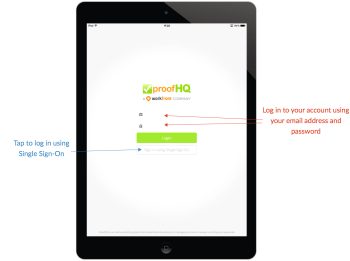

# [!DNL Workfront Proof] aplicación móvil para tabletas

>[!IMPORTANT]
>
>Este artículo hace referencia a la funcionalidad del producto independiente [!DNL Workfront Proof]. Para obtener información sobre la revisión dentro de [!DNL Adobe Workfront], vea [Revisión](../../../review-and-approve-work/proofing/proofing.md).

La aplicación para tableta [!DNL Workfront Proof] le permite revisar y aprobar convenientemente sus pruebas cuando esté fuera de casa. La aplicación está disponible para descarga para todos, no es necesario ser usuario de [!DNL Workfront Proof] para poder revisar las pruebas en la tableta o el teléfono.

Los invitados pueden simplemente hacer clic en el botón [!UICONTROL Ir a la revisión] de la notificación por correo electrónico que reciben para abrir la revisión en la aplicación.

[!DNL Workfront Proof] usuarios pueden iniciar sesión en la aplicación y usar el panel para administrar convenientemente su trabajo.

## Requisitos del dispositivo

* dispositivos iOS: iPad 3, iPad air, iPad mini
* Dispositivos Android: Android OS versión 4.4+, 5+; Samsung Galaxy Tab 3+ (10,1&quot;)

Se trata de una aplicación diseñada específicamente para tabletas. Si quieres usar [!DNL Workfront Proof] en tu iPhone, descarga la aplicación de iOS desde la iTunes Store.

## Descargue la aplicación

>[!IMPORTANT]
>
>La aplicación móvil de Workfront Proof ya no es compatible y está disponible tal cual.  No se solucionará ningún problema en la aplicación.

La aplicación para tableta [!DNL Workfront Proof] está disponible en Apple App Store y Google Play Store.

1. Haga clic en el vínculo siguiente para descargar la aplicación e instalarla en su dispositivo.

   

   

## Iniciar sesión

La aplicación para tableta [!DNL Workfront Proof] le proporciona acceso al tablero con las pruebas que requieren su atención. Para acceder al tablero:

1. Realice una de las siguientes acciones:

   * Inicie sesión con sus credenciales de [!DNL Workfront Proof].

     Si recibe un correo electrónico de invitación de prueba y lo abre en su dispositivo móvil, el vínculo le llevará a la prueba en la aplicación. No es necesario que sea un usuario para poder revisar las pruebas, pero para poder verlas es necesario tener la aplicación instalada en el dispositivo.

   * Si el inicio de sesión único está habilitado en su cuenta, pulse esa opción en la pantalla de inicio de sesión.

     Se le redirigirá a la página de inicio de sesión que le pedirá su dirección de correo electrónico. Después de escribir su dirección de correo electrónico, se le redirigirá a la página de su proveedor de identidad, donde podrá iniciar sesión con su contraseña.

     

## El panel

Si desea mantener la sesión iniciada en su cuenta de [!DNL Workfront Proof]:

1. Habilitar **[!UICONTROL Mantenerme conectado]** en el menú de la barra lateral bajo **[!UICONTROL Configuración]**:

El vínculo *[!UICONTROL Tablero]* le devolverá al tablero desde cualquier vista de la aplicación. También puede utilizarlo para volver a cargar el tablero.

Otros elementos del tablero son la barra de búsqueda que le permite buscar la cuenta por el nombre de la prueba y diferentes vistas que le ayudan a administrar de forma eficaz la carga de trabajo.

## Administrar la carga de trabajo mediante las vistas Panel

Al igual que los gráficos de panel de nuestra aplicación web, en la aplicación móvil mostramos una lista de pruebas que se compartieron con usted. El mensaje de bienvenida que aparece en la parte superior de la página le indicará el número total de pruebas y, en la parte inferior, le indicará que las desglosamos en *A tiempo*, *En riesgo* y *Pruebas tardías*.

* **Pruebas de hora de activación** son las pruebas que no tienen un plazo establecido o que han expirado en más de 24 horas.
* **Las pruebas en riesgo** son aquellas en las que la fecha límite es dentro de las próximas 24 horas; la barra de progreso es naranja para estas pruebas.
* **Pruebas tardías** son las pruebas que ya han pasado la fecha límite. La barra de progreso está en rojo para estas pruebas. Al llegar a la fecha límite [!DNL Workfront Proof], envía a los responsables de las decisiones que se retrasan y al propietario de la prueba un correo electrónico de recordatorio automatizado.

Estas pruebas se agrupan en vistas independientes, lo que le permite priorizar convenientemente su trabajo, empezando por las pruebas que ya han pasado la fecha límite.

Otra vista que puede encontrar útil es la vista Reciente: muestra las pruebas a las que accedió recientemente en la aplicación, por lo que si desea volver a ver la misma prueba, puede encontrarla fácilmente en esa lista.

## Revisión de pruebas en la aplicación

1. Haga clic en el nombre de la revisión para abrirla en el visor [!DNL Workfront Proof].

   O

   Para abrir una revisión a partir de una notificación enviada por correo electrónico, los revisores pueden hacer clic en el vínculo **[!UICONTROL Ir a la revisión]** de la notificación.
Si tiene una cuenta de [!DNL Workfront Proof], puede iniciar sesión y acceder a la revisión desde el panel.

   >[!NOTE]
   >
   >Debe tener la aplicación instalada en el dispositivo para poder revisar las pruebas en [!DNL Workfront Proof], aunque no tenga una cuenta de [!DNL Workfront Proof].

   Cuando abra una prueba por primera vez, le mostraremos un recorrido que le ayudará a empezar a revisar pruebas en la aplicación.

   

1. Navegue en la prueba:

   * Para saltar a una página específica de la prueba, desliza el dedo hacia los lados o usa la lista [!UICONTROL miniaturas].

     También puede utilizar las flechas en la parte inferior de la página o colocar un número de página específico.

   * Para ir a una versión diferente de la prueba, utilice el menú desplegable de versión en la parte superior de la página.
   * Para acercar, pellizque la pantalla.
   * Para desplazarse, mantenga presionada la tecla y mueva la imagen hasta que encuentre la posición correcta.

     Revisar pruebas en la aplicación móvil es tan sencillo como hacerlo con el visor [!DNL Workfront Proof]. A continuación analizaremos más de cerca la adición de comentarios y marcas, la administración de comentarios y la toma de decisiones. También analizaremos las diferentes opciones disponibles en la barra lateral de la aplicación.

## Comentario en la aplicación

El siguiente vídeo muestra los conceptos básicos para comentar en la aplicación móvil. Muestra cómo hacer un comentario, cómo publicar una respuesta a un comentario, cómo utilizar diferentes marcas y eliminarlas, y cómo editar y eliminar comentarios.

Solo puede editar y eliminar comentarios si no se ha publicado ninguna respuesta. Si no ve el icono [!UICONTROL papelera], es posible que el administrador de [!DNL Workfront Proof] haya deshabilitado esta opción.

Hay tres opciones de visualización de comentarios en la aplicación. Puede cambiar entre ellos haciendo clic en el botón de comentario.

* **[!UICONTROL Vista de lista]** muestra una lista de todos los comentarios. Puede explorarlos tocando cada comentario o tocando las flechas arriba y abajo.
* **[!UICONTROL La vista de un solo comentario]** muestra un comentario cada vez. Para ir al siguiente comentario, pulse la flecha situada en la parte superior de la página.
* **[!UICONTROL Ocultar vista de comentarios]** oculta todos los comentarios.

Cada marcado que queda en la prueba suelta un pin en la imagen. Para ver el comentario y el marcado asociados con el pin, simplemente pulse el pin. Solo puede hacerlo si el cuadro de edición de comentarios está cerrado. Para cerrar el cuadro de comentarios, pulsa [!UICONTROL x] en el comentario superior izquierdo del cuadro.

## Herramienta Anotación de texto

La revisión de texto en los desplazamientos se realiza en la aplicación de tableta [!DNL Workfront Proof]. La herramienta de anotación de texto está disponible en la barra de herramientas de marcas después de hacer clic en el botón **[!UICONTROL Agregar comentario]** naranja.

1. Seleccione la herramienta y, a continuación, pulse la palabra que desee resaltar.
1. Mantenga presionado el dedo sobre la palabra hasta que esté disponible el resaltado y utilice los controles deslizantes para resaltar la palabra o frase completa que desee marcar.

   La herramienta de texto tiene cuatro opciones para elegir:

   | **[!UICONTROL Resaltar]** | Resalta el texto y lo copia en el cuadro de comentarios. |
   |---|---|
   | **[!UICONTROL Reemplazar]** | Agrega [[!UICONTROL REPLACE]] y [[!UICONTROL WITH]] al cuadro de comentarios junto con el texto, lo que facilita la recomendación del texto de reemplazo. |
   | **[!UICONTROL Eliminar]** | Toca el texto y agrega [DELETE] al cuadro de comentarios. |
   | **[!UICONTROL Insertar después]** | Agrega [INSERTAR DESPUÉS] al cuadro de comentarios. |

   {style="table-layout:auto"}

1. (Opcional) Para pegar texto de otro documento guardado en la tableta, pulse y mantenga presionado el dedo en el cuadro de comentarios hasta que vea una opción para pegar el texto copiado del documento.

## Administración de comentarios en la aplicación móvil

Después de que todos hayan dejado sus comentarios y marcas en la prueba, con mucha frecuencia el administrador de pruebas debe revisar los comentarios y decidir qué cambios se deben aplicar a la siguiente versión de la prueba. En [!DNL Workfront Proof] puede usar Acciones en los comentarios para marcar cada comentario individual y marcar los que se deben realizar acciones.

El administrador de [!DNL Workfront Proof] debe configurar en su cuenta las acciones relacionadas con los comentarios. Solo las personas que tengan derechos de edición pueden utilizarlas en una prueba.

Cuando esté trabajando en la preparación de la siguiente versión de la prueba, puede desactivar los comentarios sobre la marcha. El comentario se marca como resuelto con una marca de verificación verde. Si necesita volver a abrir el comentario, puede hacer clic en la flecha situada en la parte inferior del cuadro de comentarios.

Si desea evitar que otros revisores respondan a un hilo de comentarios, puede bloquearlo. Para poder hacerlo, debe tener derechos de edición en la prueba. Bloquear el hilo de comentarios es muy simple, todo lo que tiene que hacer es tocar el icono de candado en la parte inferior del cuadro de comentarios.

## Revisión de pruebas de vídeo

Revisar vídeos sobre la marcha es fácil con la aplicación para tableta [!DNL Workfront Proof]. El siguiente vídeo muestra cómo realizar comentarios, marcas y decisiones en la aplicación.

## Modo de comparación

El modo de comparación en la aplicación de tableta le permite comparar fácilmente dos versiones diferentes de una prueba o dos pruebas desde la misma carpeta.

>[!NOTE]
>
>Debido a las limitaciones de iOS, la comparación de dos vídeos no está disponible en los iPads. Está disponible en tabletas con sistemas operativos Android.

El modo de comparación está disponible en la esquina superior derecha de la pantalla.

La herramienta de comparación muestra las dos versiones más recientes de la prueba.

1. Para cambiar las versiones que desea comparar, utilice los desplegables de versión en la parte superior de la página.
1. Para seleccionar una prueba diferente en la misma carpeta, utilice el explorador de carpetas (el icono de la carpeta disponible en la parte superior de la página).

   
   
La herramienta de comparación permite comparar versiones una al lado de la otra para comprobar si se han realizado los cambios solicitados. Si desbloquea la navegación, podrá comparar diferentes páginas de ambas versiones.

   

   Ahora puede comparar diferentes páginas de las pruebas que está viendo. También puede comparar diferentes páginas de la misma prueba, lo que puede resultar útil si comprueba las pruebas para comprobar la coherencia de la mensajería y la promoción de la marca.

   

## Tome decisiones en la aplicación

1. Pulse el botón de decisión verde en la parte superior de la página.

   

   Si no ve el botón verde **[!UICONTROL Finalizar revisión]** y cree que debería tomar una decisión sobre la revisión, su administrador de [!DNL Workfront Proof] puede actualizar su rol de revisión, como se explica en [Administrar roles de revisión en [!DNL Workfront Proof]](../../../workfront-proof/wp-work-proofsfiles/share-proofs-and-files/manage-proof-roles.md).

## Barra lateral del visor de revisión

La barra lateral contiene muchas funciones y características útiles. Según los permisos de la prueba, es posible que no los vea todos. Debajo de todos ellos se discuten en más detalle.

| Panel de control | Le lleva de nuevo al panel de la aplicación móvil. |
|---|---|
| **[!UICONTROL Flujo de trabajo]** | Muestra los detalles de las fases de revisión, junto con una lista de revisores, sus plazos, barras de progreso, decisiones y el número de comentarios y respuestas. |
| **[!UICONTROL Detalles]** | Muestra información sobre la prueba, las opciones de uso compartido adicionales y la pista de auditoría de actividades. |
| **[!UICONTROL Compartir]** | Muestra la URL de prueba y el código de incrustación. |
| **[!UICONTROL Notificaciones]** | Permite actualizar las alertas de correo electrónico de la revisión actual. Esto no altera la configuración predeterminada. |
| **[!UICONTROL Bloquear]** | Le permite bloquear la prueba. Debe tener derechos de edición en la prueba para poder ver esta opción. |
| **[!UICONTROL Eliminar]** | Mueve la prueba a la carpeta Papelera. Debe tener derechos de edición en la prueba para poder eliminarla. |
| **[!UICONTROL Configuración]** | Puedes decidir mostrar anclajes y/o marcas en la revisión; también puedes habilitar [!UICONTROL Mantener mi sesión] para evitar que cierres la sesión de la aplicación. |
| **[!UICONTROL Ayuda]** | Le permite volver a mostrar el paseo por la aplicación. |
| **[!UICONTROL Cerrar sesión]** | Cierra la sesión de la aplicación y de la cuenta. |
