# Aplicación móvil de [!DNL Workfront Proof] para tabletas

>[!IMPORTANT]
>
>Este artículo hace referencia a la funcionalidad del producto independiente [!DNL Workfront Proof]. Para obtener información sobre la revisión dentro de [!DNL Adobe Workfront], consulte [Revisión](../../../review-and-approve-work/proofing/proofing.md).

La aplicación para tabletas [!DNL Workfront Proof] le permite revisar y aprobar sus pruebas cómodamente desde cualquier lugar. La aplicación está disponible para su descarga para todo el mundo, no es necesario ser usuario de [!DNL Workfront Proof] para poder revisar las pruebas en su tableta o teléfono.

Los invitados solo tienen que hacer clic en el botón [!UICONTROL Ir a la prueba] de la notificación por correo electrónico que reciben para abrir la prueba en la aplicación.

Los usuarios de [!DNL Workfront Proof] pueden iniciar sesión en la aplicación y usar el panel de control para gestionar cómodamente su trabajo.

## Requisitos del dispositivo

* dispositivos iOS: iPad 3, iPad air, iPad mini
* Dispositivos Android: Android OS versión 4.4+, 5+; Samsung Galaxy Tab 3+ (10,1&quot;)

Se trata de una aplicación diseñada específicamente para tabletas. Si desea usar [!DNL Workfront Proof] en su iPhone, descargue la aplicación de iOS desde iTunes Store.

## Descargue la aplicación

>[!IMPORTANT]
>
>La aplicación móvil de Workfront Proof ya no es compatible y está disponible tal cual.  No se solucionará ningún problema en la aplicación.

La aplicación para tabletas [!DNL Workfront Proof] está disponible en la App Store de Apple y la Google Play Store.

1. Haga clic en el vínculo siguiente para descargar la aplicación e instalarla en su dispositivo.

   

   

## Iniciar sesión

La aplicación para tabletas [!DNL Workfront Proof] le proporciona acceso al panel de control con las pruebas que requieren su atención. Para acceder al panel de control:

1. Realice una de las siguientes acciones:

   * Inicie sesión con sus credenciales de [!DNL Workfront Proof].

     Si recibe un correo electrónico de invitación de prueba y lo abre en su dispositivo móvil, el vínculo le llevará a la prueba en la aplicación. No es necesario que sea un usuario para poder revisar las pruebas, pero para poder verlas es necesario tener la aplicación instalada en el dispositivo.

   * Si el inicio de sesión único está habilitado en su cuenta, pulse esta opción en la pantalla de inicio de sesión.

     Se le redirigirá a la página de inicio de sesión que le pedirá su dirección de correo electrónico. Después de escribir su dirección de correo electrónico, se le redirigirá a la página de su proveedor de identidad, donde podrá iniciar sesión con su contraseña.

     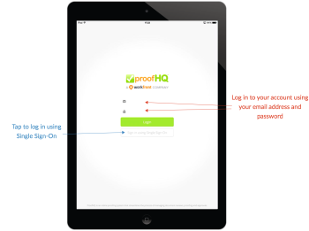

## El panel de control

Si desea mantener la sesión iniciada en su cuenta de [!DNL Workfront Proof]:

1. Habilite **[!UICONTROL Mantenerme conectado]** en el menú de la barra lateral que aparece bajo **[!UICONTROL Configuración]**:

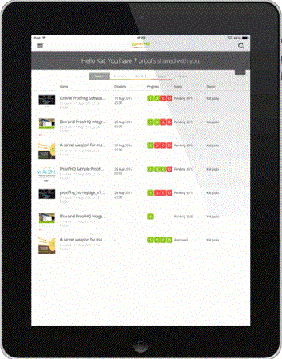

El vínculo *[!UICONTROL Panel de control]* le devolverá al panel de control desde cualquier vista de la aplicación. También puede utilizarlo para volver a cargar el panel de control.

Otros elementos del panel de control son la barra de búsqueda que le permite buscar la cuenta por el nombre de la prueba y diferentes vistas que le ayudan a administrar de forma eficaz la carga de trabajo.

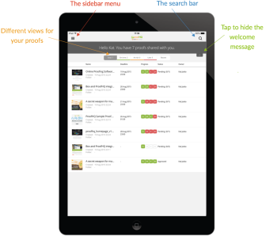

## Administrar la carga de trabajo mediante las vistas del panel de control

Al igual que los gráficos de panel de control de nuestra aplicación web, en la aplicación móvil mostramos una lista de pruebas que se compartieron con usted. El mensaje de bienvenida que aparece en la parte superior de la página le indicará el número total de pruebas y, en la parte inferior, aparecen desglosadas en *A tiempo*, *En riesgo* y *Pruebas tardías*.

* Las **pruebas fuera de plazo** son las pruebas que, o bien no tienen un plazo fijado o han expirado en más de 24 horas.
* Las **pruebas en riesgo** son aquellas en las que la fecha límite es dentro de las próximas 24 horas; la barra de progreso es naranja para estas pruebas.
* Las **pruebas tardías** son las pruebas que ya han pasado la fecha límite. La barra de progreso está en rojo para estas pruebas. Al llegar a la fecha límite, [!DNL Workfront Proof] envía a los responsables de la toma de decisiones de retraso y al propietario de la prueba un correo electrónico de recordatorio automatizado.

Estas pruebas se agrupan en vistas independientes, lo que le permite priorizar cómodamente su trabajo, empezando por las pruebas que ya han pasado la fecha límite.

Otra vista que puede resultarle útil es la vista Reciente: muestra las pruebas a las que accedió recientemente en la aplicación, de modo que si desea volver a ver la misma prueba, puede encontrarla fácilmente en esa lista.

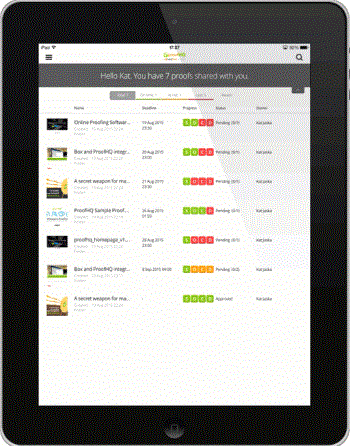

## Revisión de pruebas en la aplicación

1. Haga clic en el nombre de la prueba para abrirla en el visor de [!DNL Workfront Proof].

   O

   Para abrir una prueba a partir de una notificación enviada por correo electrónico, los revisores pueden hacer clic en el vínculo **[!UICONTROL Ir a la prueba]** de la notificación.
Si tiene una cuenta de [!DNL Workfront Proof], puede iniciar sesión y acceder a la prueba desde el panel de control.

   >[!NOTE]
   >
   >Debe tener la aplicación instalada en el dispositivo para poder revisar las pruebas en [!DNL Workfront Proof], aunque no tenga una cuenta de [!DNL Workfront Proof].

   Cuando abra una prueba por primera vez, le mostraremos un recorrido que le ayudará a empezar a revisar pruebas en la aplicación.

   

1. Navegue en la prueba:

   * Para saltar a una página específica de la prueba, deslice el dedo hacia los lados o utilice la lista [!UICONTROL miniaturas].

     También puede utilizar las flechas en la parte inferior de la página o introducir un número de página específico.

   * Para ir a una versión diferente de la prueba, utilice el menú desplegable de versión en la parte superior de la página.
   * Para acercar, pellizque la pantalla.
   * Para desplazarse, mantenga presionada la tecla y mueva la imagen hasta que encuentre la posición correcta.

     Revisar pruebas en la aplicación móvil es tan sencillo como hacerlo con el visor [!DNL Workfront Proof]. A continuación analizaremos más de cerca la adición de comentarios y marcas, la administración de comentarios y la toma de decisiones. También analizaremos las diferentes opciones disponibles en la barra lateral de la aplicación.

## Comentario en la aplicación

El siguiente vídeo muestra los conceptos básicos para comentar en la aplicación móvil. Muestra cómo hacer un comentario, cómo publicar una respuesta a un comentario, cómo utilizar diferentes marcas y eliminarlas, y cómo editar y eliminar comentarios.

Solo puede editar y eliminar comentarios si no se ha publicado ninguna respuesta. Si no ve el icono de la [!UICONTROL papelera], es posible que el administrador de [!DNL Workfront Proof] haya deshabilitado esta opción.

Hay tres opciones de visualización de comentarios en la aplicación. Puede alternar entre ellas haciendo clic en el botón de comentario.

* **[!UICONTROL Vista de lista]** muestra una lista de todos los comentarios. Puede explorarlos tocando cada comentario o tocando las flechas arriba y abajo.
* **[!UICONTROL La vista de un solo comentario]** muestra un comentario a la vez. Para ir al siguiente comentario, pulse la flecha situada en la parte superior de la página.
* **[!UICONTROL Ocultar vista de comentarios]** oculta todos los comentarios.

Cada marca dejada en la prueba deja caer un anclaje sobre la imagen. Para ver el comentario y el marcado asociados con el anclaje, simplemente pulse el anclaje. Solo podrá hacerlo si el cuadro de edición de comentarios está cerrado. Para cerrar el cuadro de comentarios, pulse [!UICONTROL x] en el comentario superior izquierdo del cuadro.

## Herramienta de anotación de texto

La revisión de texto sobre la marcha se realiza en la aplicación para tabletas [!DNL Workfront Proof]. La herramienta de anotación de texto está disponible en la barra de herramientas de marcas después de hacer clic en el botón naranja **[!UICONTROL Añadir comentario]**.

1. Seleccione la herramienta y, a continuación, pulse la palabra que desee resaltar.
1. Mantenga el dedo sobre la palabra hasta que aparezca resaltado y utilice los controles deslizantes para resaltar toda la palabra o frase que desee marcar.

   La herramienta de texto tiene cuatro opciones para elegir:

   | **[!UICONTROL Resaltar]** | Resalta el texto y lo copia en el cuadro de comentarios. |
   |---|---|
   | **[!UICONTROL Reemplazar]** | Añade [[!UICONTROL REPLACE]] y [[!UICONTROL WITH]] al cuadro de comentarios junto con el texto, lo que facilita la recomendación del texto de sustitución. |
   | **[!UICONTROL Eliminar]** | Tacha el texto y añade [ELIMINAR] al cuadro de comentarios. |
   | **[!UICONTROL Insertar después]** | Añade [INSERTAR DESPUÉS] al cuadro de comentarios. |

   {style="table-layout:auto"}

1. (Opcional) Para pegar texto de otro documento que haya guardado en su tableta, mantenga pulsado el dedo sobre el cuadro de comentarios hasta que aparezca una opción para pegar el texto copiado del documento.

## Administración de comentarios en la aplicación móvil

Después de que todos hayan dejado sus comentarios y marcas en la prueba, con mucha frecuencia el administrador de pruebas debe revisar los comentarios y decidir qué cambios deben aplicarse a la siguiente versión de la prueba. En [!DNL Workfront Proof] puede utilizar Acciones en los comentarios para marcar cada comentario individual y marcar aquellos en los que debe realizarse alguna acción.

El administrador de [!DNL Workfront Proof] debe configurar en su cuenta las acciones relacionadas con los comentarios. Solo los usuarios que tengan derechos de edición pueden utilizarlas en una prueba.

Cuando esté trabajando en la preparación de la siguiente versión de su prueba, puede ir tachando los comentarios a medida que avanza. El comentario se marca como resuelto con una marca de verificación verde. Si necesita volver a abrir el comentario, puede hacer clic en la flecha situada en la parte inferior del cuadro de comentarios.

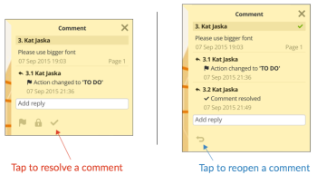

Si desea impedir que otros revisores respondan a un hilo de comentarios, puede bloquearlo. Para poder hacerlo, debe tener derechos de edición en la prueba. Bloquear el hilo de comentarios es muy sencillo; solo debe tocar el icono de candado en la parte inferior del cuadro de comentarios.

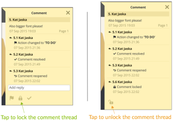

## Revisión de pruebas de vídeo

Revisar vídeos sobre la marcha es fácil con la aplicación para tabletas [!DNL Workfront Proof]. En el siguiente vídeo se muestra cómo realizar comentarios, marcas y decisiones en la aplicación.

## Modo de comparación

El modo de comparación en la aplicación para tabletas le permite comparar fácilmente dos versiones diferentes de una prueba o dos pruebas desde la misma carpeta.

>[!NOTE]
>
>Debido a las limitaciones de iOS, la comparación de dos vídeos no está disponible en los iPad. Está disponible en tabletas con sistemas operativos Android.

El modo de comparación está disponible en la esquina superior derecha de la pantalla.

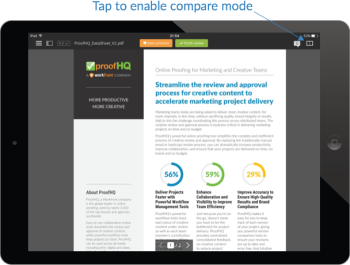

La herramienta de comparación muestra las dos versiones más recientes de la prueba.

1. Para cambiar las versiones que desea comparar, utilice los desplegables de versión en la parte superior de la página.
1. Para seleccionar una prueba diferente en la misma carpeta, utilice el explorador de carpetas (el icono de la carpeta disponible en la parte superior de la página).

   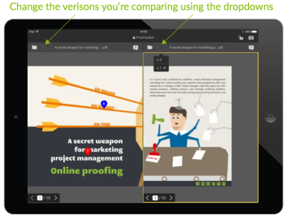
   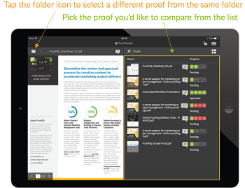
La herramienta de comparación permite comparar versiones una al lado de la otra para comprobar si se han realizado los cambios solicitados. Si desbloquea la navegación, podrá comparar diferentes páginas de ambas versiones.

   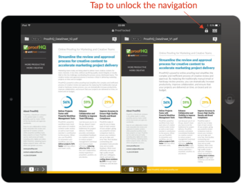

   Ahora puede comparar diferentes páginas de las pruebas que está viendo. También puede comparar diferentes páginas de la misma prueba, lo que puede ser útil si está comprobando la coherencia del mensaje y la marca de sus pruebas.

   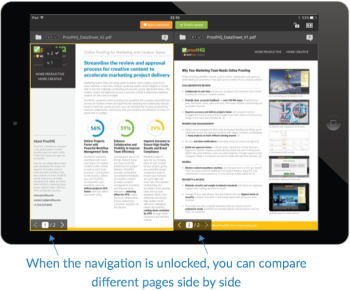

## Toma de decisiones en la aplicación

1. Pulse el botón de decisión verde en la parte superior de la página.

   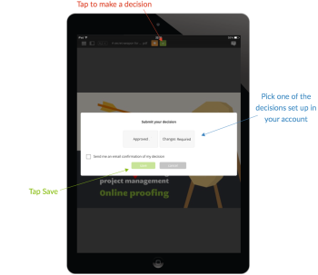

   Si no ve el botón verde **[!UICONTROL Finalizar revisión]** y cree que debería tomar una decisión sobre la prueba, su administrador de [!DNL Workfront Proof] puede actualizar su función de revisión, como se explica en [Administrar funciones de revisión en [!DNL Workfront Proof]](../../../workfront-proof/wp-work-proofsfiles/share-proofs-and-files/manage-proof-roles.md).

## Barra lateral del visor de corrección

La barra lateral contiene un gran número de funciones y características útiles. Según los permisos de la prueba, es posible que no las vea todas. A continuación se analizan todas ellas con más detalle.

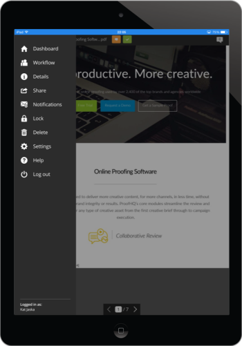

| Panel de control | Volverá al panel de control de la aplicación móvil. |
|---|---|
| **[!UICONTROL Flujo de trabajo]** | Muestra los detalles de las fases de revisión, junto con una lista de revisores, sus plazos, barras de progreso, decisiones y el número de comentarios y respuestas. |
| **[!UICONTROL Detalles]** | Muestra información sobre la prueba, las opciones de uso compartido adicionales y el seguimiento de auditoría de las actividades. |
| **[!UICONTROL Compartir]** | Muestra la URL y el código incrustado de la prueba. |
| **[!UICONTROL Notificaciones]** | Permite actualizar las alertas de correo electrónico de la revisión actual. Esto no altera la configuración predeterminada. |
| **[!UICONTROL Bloquear]** | Le permite bloquear la prueba. Debe tener derechos de edición en la prueba para poder ver esta opción. |
| **[!UICONTROL Eliminar]** | Traslada la prueba a la carpeta Papelera. Debe tener derechos de edición en la prueba para poder eliminarla. |
| **[!UICONTROL Configuración]** | Puede decidir mostrar los anclajes y/o marcas en la revisión; también puede habilitar la opción [!UICONTROL Mantener mi sesión] para evitar que se cierre la sesión de la aplicación. |
| **[!UICONTROL Ayuda]** | Le permite volver a mostrar el paseo por la aplicación. |
| **[!UICONTROL Cerrar sesión]** | Cierra la sesión de la aplicación y de la cuenta. |
