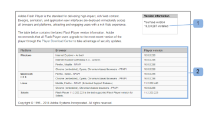
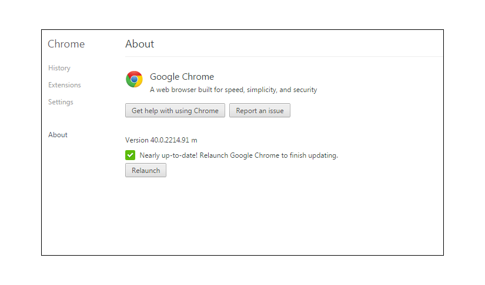
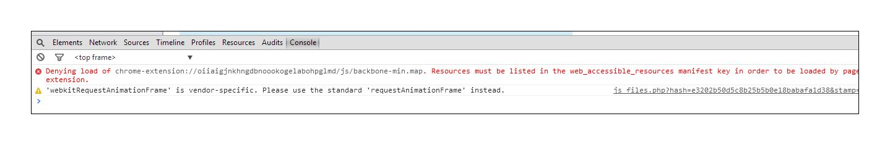

# Solución de problemas - [!DNL Workfront Proof] visor de revisión

<!-- Audited: 01/2024 -->

>[!IMPORTANT]
>
>Este artículo hace referencia a la funcionalidad del producto independiente [!DNL Workfront Proof]. Para obtener información sobre la revisión dentro de [!DNL Adobe Workfront], consulte [Revisión](../../../review-and-approve-work/proofing/proofing.md).

Si el contenido de la revisión no se carga y solo puede ver un visor de revisiones vacío, lo más probable es que algo esté bloqueando esta acción localmente. Pruebe las posibles soluciones siguientes.

## Asegúrese de que la versión del explorador <!--and [!DNL Flash Player]--> esté actualizada

Todos los desarrolladores trabajan constantemente en sus aplicaciones y lanzan regularmente nuevas funciones y correcciones para sus productos. Esto sirve para mejorar la experiencia del usuario y mantener el nivel de seguridad, por lo que se recomienda utilizar solo las versiones más recientes. Esto también ayuda a evitar conflictos entre las aplicaciones.

<!--
### [!DNL Flash Player] Plugin Version

To check your current [!DNL Flash Player] version visit the [[!DNL Adobe] website](http://www.adobe.com/software/flash/about/).

If your version number differs from the one listed for your platform go to the [[!DNL Flash Player] download page](http://get.adobe.com/flashplayer/otherversions/) and get the latest version.

Please note: we do recommend using the original [!DNL Adobe] plugin, so if your browser uses a built-in solution deactivate it and install the [!DNL Adobe] solution.
-->

### Versión del explorador

Por lo general, la mayoría de los navegadores se actualizan automáticamente, pero si estás experimentando algún problema, vale la pena verificar qué versión estás usando y realizar una actualización, si es necesario.

En su navegador, vaya a [!UICONTROL Menú] y localice la opción [!UICONTROL Acerca de] (en algunos casos, esto puede estar visible bajo un menú de [!UICONTROL Ayuda]). En la ventana emergente [!UICONTROL Acerca de], encontrarás información sobre la versión actual del navegador y también una opción para actualizar o buscar actualizaciones.

Por ejemplo, en Chrome:

Una vez que tenga instalada la última versión del explorador, intente volver a abrir la prueba y compruebe si se ha resuelto el problema.

<!--

## Ensure Your Local [!DNL Flash] Storage is Available

Our [!DNL Workfront Proof] Viewer is based on Flash, and we store some data about the proofs (i.e., comments, proof tiles, [!DNL Workfront Proof] Viewer settings) on your computer using [!DNL Flash Player]. If the [!DNL Workfront Proof] Viewer opens, but there is no content inside you will want to make sure that the Flash Storage is available on your machine and that [!DNL Workfront Proof] is allowed to use it.

If there is some storage allocated, but you're working with the bigger proofs with multiple pages and comments try to increase the [!DNL Flash] Storage and re-load your proof.

-->

## Identificar dónde está el problema

* ¿Las pruebas se abren en un explorador diferente?
* Si usa un explorador a diario y tiene problemas para ver las pruebas ahí, intente abrir la misma prueba en un explorador diferente en su ordenador. Para ello, simplemente, copie el vínculo de prueba de la barra URL del explorador principal y péguelo en un explorador diferente. Si la prueba se abre allí, revise la configuración principal del explorador, los complementos y las extensiones, ya que podrían estar interfiriendo.
* No tenemos ningún navegador preferido, pero si tiene problemas de rendimiento en su navegador actual, le recomendamos cambiar a uno diferente.
* ¿Las pruebas se abren en un equipo diferente de su ubicación?
Si la revisión no se abre en ningún explorador del equipo, intente abrirla en otro equipo de su ubicación o fuera de ella. Esto le permitirá determinar si hay un problema en su equipo concreto o si se trata de un problema de la red local.
Si su nivel de seguridad es mayor, es posible que las conexiones a [!DNL Workfront Proof] estén bloqueadas por:

   * Su software AV local
   * Su solución de seguridad de red
   * Configuración de DNS, cortafuegos o proxy
   * Estos son los ajustes que están fuera de nuestro control. Existen varias soluciones de seguridad disponibles y no podemos saber cuáles están implementadas en tu red ni cuáles pueden estar bloqueando conexiones a [!DNL Workfront Proof]. Tampoco es tarea de [!DNL Workfront Proof] decidir la configuración de seguridad interna. Si tiene problemas para abrir las pruebas en varias máquinas en su ubicación/red, te recomendamos que te pongas en contacto con su equipo de TI para que verifiquen la configuración de la red y autoricen o añadan el [!DNL Workfront Proof] a la lista de permitidos, si es necesario.

* ¿Se permiten las conexiones a [!DNL Workfront Proof] en su red?
Dentro del visualizador de pruebas cargamos los mosaicos: fragmentos de las páginas. Si este contenido no se carga correctamente en su extremo, es posible que algunas conexiones a [!DNL Workfront Proof] estén bloqueadas en su red. Debe asegurarse de que todas las conexiones y todo el contenido de *.proofhq.com se añada a la lista de permitidos. Su equipo de TI debe poder ayudarle a verificar esto.

## Revisar complementos

Si su navegador está actualizado y tu red no está bloqueando las conexiones a [!DNL Workfront Proof], puede haber algo en su navegador que esté afectando la visualización de las pruebas. A menudo, hay varios complementos y extensiones disponibles en el explorador, y algunos de ellos podrían interferir o entrar en conflicto con los demás.

La práctica recomendada es eliminar todos los complementos desconocidos y conservar solo los que utilice y en los que confíe. Cada navegador debe ofrecerle opciones para comprobar, modificar o eliminar los complementos y las extensiones. Utilizamos JavaScript para cargar el visor [!DNL Workfront Proof], por lo que querrá revisar especialmente los complementos que podrían afectar a ese visor.

Si algún complemento en particular interfiere con la carga de las pruebas, puede intentar comprobar los detalles en la consola del explorador.

En la mayoría de los navegadores más recientes, hay disponibles algunas herramientas adicionales para desarrolladores, que se pueden utilizar para una resolución de problemas más avanzada.

Si tiene problemas para ver las pruebas:

* Abra la consola del explorador y vuelva a cargar la prueba.
* Compruebe si hay alertas o mensajes en la consola. Estos detalles pueden ayudar a identificar cuál es la causa principal de los problemas.
* Pida a su equipo de TI que analice los resultados. Deben ser capaces de asesorar y ayudar a resolver el problema local.
* Comparta los resultados con nuestro equipo de asistencia. Estaremos encantados de ayudarle.

## Comprobación de configuración de contenido mixto

Todas las conexiones a [!DNL Workfront Proof] se realizan a través de HTTPS. Sin embargo, en el visor [!DNL Workfront Proof] se cargan los mosaicos a través de HTTP y los datos se protegen con los tókenes. Esto crea contenido mixto que algunos exploradores o soluciones de seguridad pueden estar bloqueando (de forma predeterminada o mediante configuración manual).

Si esta es la razón por la que las pruebas no se abren en su ordenador (deberías poder ver las alertas correspondientes en la consola del navegador), autorice dichas conexiones para [!DNL Workfront Proof] o modifica su configuración para permitir contenido mixto pasivo en su equipo. El contenido mixto puede ser bloqueado por su navegador, software AV o configuración de red para determinar la causa exacta. Debe ponerse en contacto con su equipo de TI o con los administradores de red. También deben poder ayudar a habilitar el contenido mixto en el equipo.

