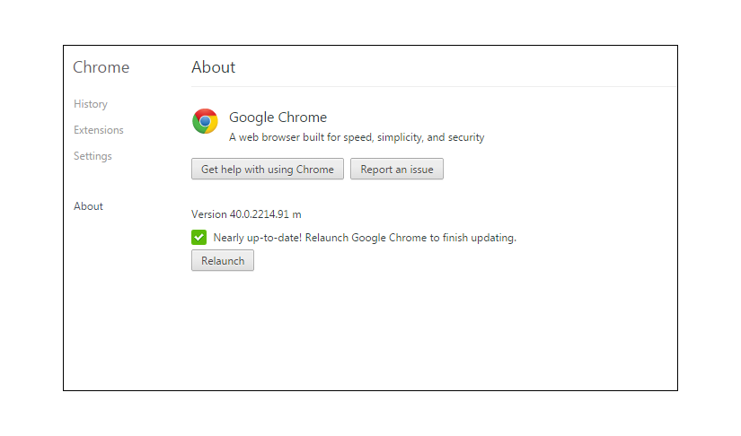

# Solución de problemas - [!DNL Workfront Proof] visualizador de pruebas

<!-- Audited: 01/2024 -->

>[!IMPORTANT]
>
>Este artículo hace referencia a la funcionalidad del producto independiente [!DNL Workfront Proof]. Para obtener información sobre la revisión dentro de [!DNL Adobe Workfront], consulte [Revisión](../../../review-and-approve-work/proofing/proofing.md).

Si el contenido de la prueba no se carga y solo puede ver un visor de pruebas vacío, lo más probable es que algo esté bloqueando esta acción localmente. Pruebe las posibles soluciones siguientes.

## Asegúrese de que su explorador <!--and [!DNL Flash Player]--> La versión de está actualizada

Todos los desarrolladores trabajan constantemente en sus aplicaciones y lanzan regularmente nuevas funciones y correcciones para sus productos. Esto sirve para mejorar la experiencia del usuario y mantener el nivel de seguridad, por lo que se recomienda utilizar solo las versiones más recientes. Esto también ayuda a evitar conflictos entre las aplicaciones.

<!--
### [!DNL Flash Player] Plugin Version

To check your current [!DNL Flash Player] version visit the [[!DNL Adobe] website](http://www.adobe.com/software/flash/about/).

If your version number differs from the one listed for your platform go to the [[!DNL Flash Player] download page](http://get.adobe.com/flashplayer/otherversions/) and get the latest version.

Please note: we do recommend using the original [!DNL Adobe] plugin, so if your browser uses a built-in solution deactivate it and install the [!DNL Adobe] solution.
-->

### Versión del explorador

Por lo general, la mayoría de los navegadores se actualizan automáticamente, pero si tienes algún problema vale la pena comprobar qué versión estás utilizando y realizar una actualización, si es necesario.

En el explorador, vaya a [!UICONTROL Menú] y busque el [!UICONTROL Acerca de] (en algunos casos, esto puede ser visible en una [!UICONTROL Ayuda] menú). En el [!UICONTROL Acerca de] , encontrará información sobre la versión actual del explorador y también una opción para actualizar o buscar actualizaciones.

Por ejemplo, en Chrome:

Una vez que tenga instalada la última versión del explorador, intente volver a abrir la prueba y compruebe si se ha resuelto el problema.

<!--
## Ensure Your Local [!DNL Flash] Storage is Available

Our [!DNL Workfront Proof] Viewer is based on Flash, and we store some data about the proofs (i.e., comments, proof tiles, [!DNL Workfront Proof] Viewer settings) on your computer using [!DNL Flash Player]. If the [!DNL Workfront Proof] Viewer opens, but there is no content inside you will want to make sure that the Flash Storage is available on your machine and that [!DNL Workfront Proof] is allowed to use it.

If there is some storage allocated, but you're working with the bigger proofs with multiple pages and comments try to increase the [!DNL Flash] Storage and re-load your proof.

Please see [Problems With Viewing Proofs - [!DNL Flash] Shared Objects Explained](../../../workfront-proof/wp-tech-corner/troubleshooting/view-proof-flash-shared-object.md) for the detailed instructions.
-->

## Identificar dónde está el problema

* ¿Las pruebas se abren en un explorador diferente?
* Si utiliza un explorador diariamente y tiene problemas para ver las pruebas allí, intente abrir la misma prueba en un explorador diferente del equipo. Para ello, simplemente copie el vínculo de prueba de la barra URL del explorador principal y péguelo en un explorador diferente. Si la prueba se abre allí, revise la configuración principal del explorador, los complementos y las extensiones, ya que podrían estar interfiriendo.
* No tenemos ningún navegador preferido, pero si tiene problemas de rendimiento en su navegador actual, le recomendamos cambiar a uno diferente.
* ¿Las pruebas se abren en un equipo diferente de su ubicación?
Si la revisión no se abre en ningún explorador del equipo, intente abrirla en otro equipo de su ubicación o fuera de ella. Esto le permitirá determinar si hay un problema en su equipo concreto o si se trata de un problema de la red local.
Si su nivel de seguridad es mayor, las conexiones a [!DNL Workfront Proof] puede ser bloqueado por:

   * Su software AV local
   * Su solución de seguridad de red
   * Configuración de DNS, cortafuegos o proxy
   * Estos son los ajustes que están fuera de nuestro control. Hay varias soluciones de seguridad disponibles y no podemos saber cuáles están implementadas en su red y cuáles pueden estar bloqueando las conexiones a [!DNL Workfront Proof]. Tampoco depende de [!DNL Workfront Proof] para decidir la configuración de seguridad interna. Si tiene problemas para abrir las pruebas en varios equipos de su ubicación o red, le recomendamos que se ponga en contacto con su equipo de TI para que pueda comprobar la configuración de la red y autorizar o agregar el [!DNL Workfront Proof] a la lista de permitidos, si es necesario.

* Son las conexiones a [!DNL Workfront Proof] ¿está permitido en su red?
Dentro del visualizador de pruebas cargamos los mosaicos: fragmentos de las páginas. Si este contenido no se carga correctamente en su extremo, es posible que algunas conexiones a [!DNL Workfront Proof] están bloqueados en su red. Debe asegurarse de que todas las conexiones y todo el contenido de *.proofhq.com se añada a la lista de permitidos. Su equipo de TI debe poder ayudarle a verificar esto.

## Revisar complementos

Si su explorador y [!DNL Flash Player] está actualizado y la red no está bloqueando las conexiones a. [!DNL Workfront Proof] es posible que haya algo en el explorador que esté afectando la visualización de las pruebas. Hoy en día hay varios plugins y extensiones disponibles en su navegador y algunos de ellos interfieren o entran en conflicto con los demás.

La práctica recomendada es eliminar todos los complementos desconocidos y conservar solo los que utilice y en los que confíe. Cada navegador debe ofrecerle opciones para comprobar, modificar o eliminar los complementos y las extensiones. Nuestro [!DNL Workfront Proof] El visor se basa en [!DNL Flash] y utilizamos JavaScript para cargar el visor, por lo que querrá revisar especialmente los complementos que podrían afectar a estos.

Si algún complemento en particular interfiere con la carga de las pruebas, puede intentar comprobar los detalles en la consola del explorador.

En la mayoría de los exploradores más recientes hay algunas herramientas adicionales disponibles para desarrolladores que se pueden utilizar para una solución de problemas más avanzada.

Si tiene problemas para ver las pruebas:

* Abra la consola del explorador y vuelva a cargar la prueba.
* Compruebe si hay alertas o mensajes en la consola. Estos detalles pueden ayudar a identificar cuál es la causa principal de los problemas.
* Pida a su equipo de TI que analice los resultados. Deben ser capaces de asesorar y ayudar a resolver el problema local.
* Comparta los resultados con nuestro equipo de asistencia. Estaremos encantados de ayudarle.

## Comprobación de configuración de contenido mixto

Todas las conexiones a [!DNL Workfront Proof] son a través de HTTPS. Sin embargo, en el [!DNL Workfront Proof] Al visualizar, cargamos los mosaicos a través de HTTP y los datos se aseguran con los tokens. Esto crea contenido mixto que algunos exploradores o soluciones de seguridad pueden estar bloqueando (de forma predeterminada o según la configuración manual).

Si este es el motivo por el que las pruebas no se abren en el equipo (debería poder ver las alertas relevantes en la consola del explorador), autorice estas conexiones para [!DNL Workfront Proof] o modifique la configuración para permitir contenido mixto pasivo en el equipo. El contenido mixto puede ser bloqueado por su navegador, software AV, configuración de red, etc - para determinar la causa exacta, póngase en contacto con su equipo de TI / administradores de red. También deben poder ayudar a habilitar el contenido mixto en el equipo.

