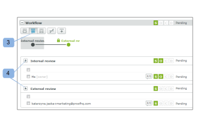

# Administrar una revisión configurada con un flujo de trabajo automatizado en [!DNL Workfront Proof]

>[!IMPORTANT]
>
>Este artículo hace referencia a la funcionalidad del producto independiente [!DNL Workfront Proof]. Para obtener información sobre la revisión dentro de [!DNL Adobe Workfront], vea [Revisión](../../../review-and-approve-work/proofing/proofing.md).

Puede seguir de cerca el progreso de sus revisiones de Flujo de trabajo automatizado en la sección Flujo de trabajo de la página [!UICONTROL Detalles de la revisión]. Puede ver el trabajo realizado en cada etapa y modificar, agregar, iniciar y bloquear las etapas en la prueba.

## Ver un flujo de trabajo automatizado

Puede ver el flujo de trabajo automatizado de tres formas principales:

* [Ver una etapa en detalle](#view-a-stage-in-detail)
* [Ver todas las fases](#view-all-stages)
* [Ver todas las etapas en detalle](#view-all-stages-in-detail)

### Ver una etapa en detalle {#view-a-stage-in-detail}

1. Haga clic en el botón en la parte superior de la sección (1).

   Puede cambiar entre etapas mediante el diagrama. El escenario que está viendo se resaltará en gris (2).

1. Para ver una etapa diferente, selecciónela en el diagrama.

### Ver todas las fases {#view-all-stages}

Para ver todas las fases en un flujo de trabajo automatizado:

1. Haga clic en el botón en la parte superior de la página (3).

   Todas las fases del flujo de trabajo automatizado se enumeran en la sección; sin embargo, los detalles están ocultos.

1. Para ver los detalles de una fase, haga clic en el icono de signo más situado junto al nombre de cada fase (4).

### Ver todas las etapas en detalle {#view-all-stages-in-detail}

Para ver en detalle todas las fases del flujo de trabajo automatizado:

1. Haga clic en el botón en la parte superior de la página (5).

   Esto le mostrará todas las etapas del flujo de trabajo automatizado con los detalles de cada etapa expandidos.

   Puede ocultar los detalles de cada etapa haciendo clic en el icono menos (6).

## Utilizar el diagrama de flujo de trabajo automatizado

El diagrama del [!UICONTROL flujo de trabajo] automatizado se muestra en la parte superior de la sección Flujo de trabajo.

Para ocultar el diagrama

1. Haga clic en el botón **[!UICONTROL Ocultar]** (1).

Las fases del diagrama se marcan de la siguiente manera:

: una fase activa

: una fase inactiva\
  - un escenario privado

  - un escenario bloqueado

Las líneas entre las fases muestran las dependencias entre las fases. Las líneas que conducen a etapas inactivas se puntean hasta que se activa la etapa.

Al pasar el ratón por encima de una fase del diagrama, se mostrará el progreso de la fase. Si la fase no está activa y tiene derechos de edición en la fase, podrá iniciarla desde la ventana emergente con el botón [!UICONTROL Iniciar fase]. Del mismo modo, se mostrará la opción Bloquear una fase activa.

Para obtener más información sobre la barra de progreso, consulte  [Ver el progreso y el estado de una revisión en [!DNL Workfront] Revisión](../../../workfront-proof/wp-work-proofsfiles/manage-your-work/view-progress-and-status-of-proof.md).

## Añadir una nueva etapa

Puede agregar una nueva etapa al flujo de trabajo automatizado desde la página [!UICONTROL Detalles de la prueba].

1. Haga clic en el botón **[!UICONTROL Nueva etapa]** (1).

En el cuadro **Nueva etapa** que aparece, puede rellenar los detalles y la configuración de la etapa.

## Administrar configuración de fase

En los detalles de la página, puede modificar la configuración de cada fase (si tiene derechos de edición):

* Cambiar, añadir o eliminar la fecha límite de la fase (1)
* Bloquear la fase (2): esta opción se activará si la fase está activa; para las fases inactivas verá la opción Iniciar la fase
* Modificar la configuración mediante la edición en línea (3)
* Habilitar o deshabilitar solo se requiere una decisión en la fase (4)
* Cambiar la privacidad del escenario (5)

También puede mover a los revisores entre etapas simplemente arrastrándolos y soltándolos de una etapa a otra. Las etapas disponibles se resaltarán en azul con las áreas de colocación de cada etapa claramente marcadas.

## Opciones de escenario

El menú [!UICONTROL Acciones] (1) de cada etapa tiene las siguientes opciones:

* Enviar mensaje a todos (2): puede enviar un correo electrónico recordatorio a todos los revisores del escenario
* Compartir (3): puede añadir nuevos revisores a la fase
* Eliminar etapa (4): si el propietario de la prueba está en esa etapa, se le pedirá que elija una nueva etapa para ellos
