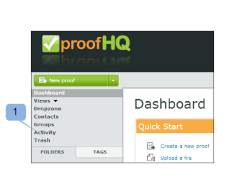
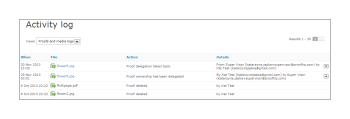

# Explicación de la pista de auditoría de actividad [!DNL Workfront Proof]

>[!IMPORTANT]
>
>Este artículo se refiere a la funcionalidad del producto independiente [!DNL Workfront Proof]. Para obtener información sobre la revisión en [!DNL Adobe Workfront], consulte [Revisión](../../../review-and-approve-work/proofing/proofing.md).

La página [!UICONTROL Pista de auditoría de actividad] le proporciona una lista completa de todas las actividades que se han realizado en su cuenta.

Para tener acceso a la página [!UICONTROL Actividad]:

1. En la barra lateral izquierda, haga clic en **[!UICONTROL Actividad]**.\
   \
   Se muestra la página [!UICONTROL Activity Audit Trail].\
   

1. En el menú desplegable Ver, seleccione la vista que desee mostrar.\
   Puede elegir entre las siguientes vistas:

   * **[!UICONTROL Pruebas y registros de medios]**: muestra toda la actividad en pruebas y archivos de su cuenta.
   * **[!UICONTROL Folders logs]:** muestra toda la actividad en las carpetas de su cuenta.
   * **[!UICONTROL Profile log]:** muestra todos los cambios realizados en su perfil personal.
   * **[!UICONTROL Account log]:** muestra todos los cambios en la configuración de la cuenta. Esta vista solo está disponible para usuarios con derechos de administrador.
   * **[!UICONTROL Authentication log]:** muestra toda la actividad de inicio de sesión en la cuenta, mostrando intentos correctos e incorrectos.
   * **[!UICONTROL Billing log]:** muestra el historial de facturación en su cuenta. Esta vista solo está disponible para usuarios con derechos de administrador de facturación.
   * **[!UICONTROL Email log]:** muestra todos los mensajes de correo electrónico enviados desde su cuenta.
