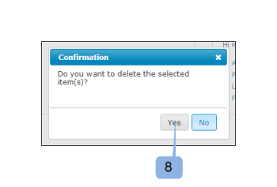
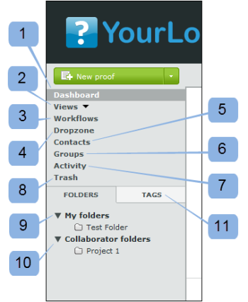

# El panel de control en [!DNL Workfront Proof]

>[!IMPORTANT]
>
>Este artículo hace referencia a la funcionalidad del producto independiente [!DNL Workfront Proof]. Para obtener información sobre la revisión dentro de [!DNL Adobe Workfront], consulte [Revisión](../../../review-and-approve-work/proofing/proofing.md).

El panel de control es la primera página que ve al iniciar sesión en su cuenta de [!DNL Workfront Proof]. Resume la actividad de su cuenta de [!DNL Workfront Proof] y proporciona vínculos rápidos a otras secciones y funciones dentro de [!DNL Workfront Proof].

El panel de control contiene lo siguiente:

* Logotipo de la organización (1)
* Navegación superior (2)
* Buscar (3)

* Menú de encabezado (4)
* Menú Nuevo (5)
* Barra lateral (6)
* Sección de bienvenida (7)
* Información general (8)
* Elementos a los que se ha accedido recientemente (9)
* Actividad reciente (10)

>[!NOTE]
>
>Los menús y vínculos que puede ver y utilizar en el panel de control dependerán del perfil y de los permisos del usuario.

Puede personalizar la marca de su cuenta para mostrar el logotipo de su propia organización, los colores, los vínculos personalizados y mucho más. Para obtener más información, consulte [Personalizar la marca del sitio de  [!DNL Workfront Proof] ](../../../workfront-proof/wp-acct-admin/branding/brand-wp-site.md).

Si no personaliza la marca de su cuenta, aparecerán el logotipo y los colores estándar de [!DNL Workfront Proof].

## Menú del encabezado

### Escriba el nombre del usuario

El nombre de usuario (2) que ha elegido aparecerá aquí. Se puede cambiar en la configuración personal.

### Configuración

Aquí (3) puede acceder a su:

* Configuración personal
* Configuración de la cuenta
* Facturación

>[!NOTE]
>
>La visibilidad de los menús anteriores depende de su perfil. Consulte Perfiles y permisos de usuario para obtener más información.

### Ayuda

Aquí (4) puede acceder a:

* Artículos de ayuda
* Películas de demostración

>[!NOTE]
>
>Con nuestros planes Select y Premium puede configurar las opciones de Ayuda para que sus usuarios apunten a su propio contenido. Consulte nuestras opciones de personalización de marca avanzadas para obtener más información.

### Cerrar sesión

Haga clic aquí para cerrar la sesión de su cuenta.

## El menú nuevo

Para abrir el menú nuevo,

1. Haga clic en la flecha desplegable (7).

   El menú **[!UICONTROL Nuevo]** tiene las siguientes opciones:

   * Nueva prueba (8)
   * Cargar archivo (9)
   * Nueva carpeta (10)
   * Nuevo invitado (11)
   * Nuevo usuario (12)
   * Nuevo grupo (13)

## El menú Panel de control

El menú Panel de control contiene los siguientes menús:

* Editar etiquetas
* Mover a
* Más acciones
* Eliminar

## Editar etiquetas

El menú [!UICONTROL Editar etiquetas] (1) le permite:

* Aplicar una etiqueta a uno o varios elementos
* Crear nuevas etiquetas
* Administrar etiquetas (2)

## Mover a

Esta función permite mover pruebas y archivos a una de las carpetas. Para ello:

1. Seleccione la casilla de verificación de los elementos relevantes.
1. Haga clic en **[!UICONTROL Mover a]** (3) y elija la carpeta correspondiente (4).
1. Haga clic en **[!UICONTROL Guardar]** (5).

   

### Más acciones

En el menú [!UICONTROL Más acciones] (6) puede realizar las siguientes acciones:

* Bloqueo (solo pruebas)
* Activar
* Archivar (solo pruebas)
* Desarchivar (solo pruebas)
* Cambiar propietario

### Eliminar

Para eliminar elementos:

1. Seleccione la casilla de verificación situada a la izquierda de los elementos y haga clic en **[!UICONTROL Eliminar]** (7).

1. En la pantalla de confirmación que aparece, compruebe los detalles y confirme haciendo clic en **[!UICONTROL Sí]** (8).

### La barra lateral

La barra lateral tiene vínculos a las siguientes páginas:

* Panel de control (1)
* Vistas (2)
* Flujos de trabajo (3) (solo planes Premium)
* Dropzone (4) (planes Select y Premium)
* Contactos (5)
* Grupos (6)
* Actividad (7)
* Papelera (8)
* Mis carpetas (9) (también puede acceder a cada carpeta individual desde la barra lateral)
* Otras carpetas de organizaciones (10) (donde puede encontrar elementos que otras organizaciones han compartido con usted)
* Etiquetas (11)

La barra lateral se describe con más detalle en la página de ayuda de la barra lateral.

### Sección de [!UICONTROL bienvenida]

La sección de [!UICONTROL bienvenida] tiene los siguientes vínculos útiles:

* Ver nuestras películas de demostración (1)
* Páginas de ayuda (2)
* Detalles de contacto con el servicio de asistencia (3)
* Vínculo &quot;No volver a mostrar la sección de bienvenida&quot; (4)

### Información general

En esta sección encontrará los vínculos rápidos para efectuar lo siguiente:

* Crear una nueva prueba Cargar un archivo
* Crear una nueva carpeta
* Crear un nuevo usuario
* Cambiar la contraseña:

La sección de información general también muestra información prefiltrada. Consta de lo siguiente:

* Pruebas para administrar: número total de pruebas activas que son propiedad suya y que se le han delegado
* Pruebas en espera de decisión: número total de pruebas activas que requieren sus decisiones

  

Aquí puede ver de inmediato cuántas pruebas requieren una acción inmediata por su parte o por parte de sus revisores:

* Total
* A tiempo: pruebas que no tienen fecha límite o que faltan más de 24 horas para la fecha límite
* En riesgo: pruebas con un plazo inferior a 24 horas
* Pruebas tardías: sin todas las acciones completadas y con fecha límite vencida

>[!NOTE]
>
>Se puede hacer clic en los valores de los gráficos: puede ir fácilmente a la lista detallada de los elementos.

### Elementos a los que se ha accedido recientemente

La sección [!UICONTROL Elementos a los que se ha accedido recientemente] muestra los elementos a los que ha tenido acceso recientemente. Esto incluye los elementos que posee, los elementos para los que tiene permisos de visualización según los permisos de perfil y los elementos compartidos con usted. Esta sección incluirá solamente los elementos que usted mismo haya abierto (ya sea a través del visor de [!DNL Workfront Proof] o a través de la página de detalles de la revisión).

La sección [!UICONTROL Elementos a los que se ha accedido recientemente] muestra la siguiente información sobre pruebas y archivos recientes:

* Nombre
* Progreso
* Estado
* Decisión
* Propietario

Resumen (esta información se contraerá de forma predeterminada: haga clic en el botón expandir/contraer situado a la izquierda de la prueba correspondiente para abrir el resumen de la prueba)

Menú Acciones

Consulte Diseños de página para ver las distintas opciones de diseño disponibles en esta sección.

>[!NOTE]
>
>Al hacer clic en el nombre de la revisión en la sección [!UICONTROL Elementos a los que se ha accedido recientemente], accederá directamente a la prueba en el Visor de corrección.

Para acceder a la página de detalles de la revisión:

1. Haga clic en el menú **[!UICONTROL Acciones]** (1) que se encuentra disponible a la derecha del nombre de la revisión.
1. Seleccione **[!UICONTROL Ver detalles de la revisión]** (2) en el menú.

### Actividad reciente

Esta sección muestra los siguientes detalles sobre la actividad reciente en su cuenta:

* Prueba de fecha y hora/Nombre del archivo
* Acción
* Detalles

También puede ir a la página Detalles de un elemento haciendo clic en el menú Acciones del elemento y seleccionando Ver detalles. Para obtener más información sobre la actividad de su cuenta, consulte Pista de auditoría de actividad.

>[!NOTE]
>
>Al hacer clic en el nombre de la prueba en la sección [!UICONTROL Actividad reciente], se abrirá la prueba en el Visor de corrección.

Para ir a la página de detalles de la revisión de esa prueba:

1. Haga clic en el menú **[!UICONTROL Acciones]** (1).
1. Seleccione **[!UICONTROL Ver detalles de la revisión]** (2) en el menú desplegable.

   
