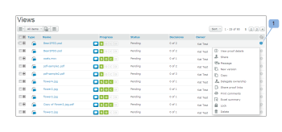
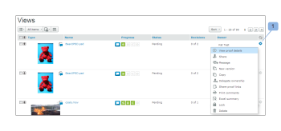
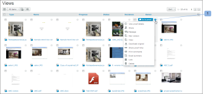
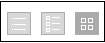
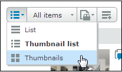

# Diseño de página en la pestaña Vistas de [!DNL Workfront Proof]

>[!IMPORTANT]
>
>Este artículo hace referencia a la funcionalidad del producto independiente [!DNL Workfront Proof]. Para obtener información sobre la revisión dentro de [!DNL Adobe Workfront], consulte [Revisión](../../../review-and-approve-work/proofing/proofing.md).

Puede ajustar el diseño de la página en la pestaña [!UICONTROL Vistas]. Estas son las opciones de diseño disponibles:

## Lista

* Muestra el nombre de la prueba o del archivo más las columnas de vista estándar
* El menú [!UICONTROL acciones de revisión] se encuentra a la derecha de la línea (1)

  

## Lista de vistas en miniaturas

* Muestra el icono de imagen/archivo de la prueba, la prueba o el nombre de archivo más las columnas de vista estándar
* El menú [!UICONTROL acciones de revisión] se encuentra en el lado derecho de la línea (1)
* Tenga en cuenta que esta es la vista estándar predeterminada.

  

## Miniaturas

* Muestra solo el icono de imagen/archivo de la prueba y el nombre de la prueba /archivo
* El menú [!UICONTROL acciones de revisión] se encuentra en la esquina superior derecha de cada revisión (1)

  

## Cambiar el diseño de la página

Para cambiar el diseño de página en el panel de control o en la página de la papelera, elija la vista que prefiera haciendo clic en uno de los botones de vista en la parte superior de la página:

Para cambiar el diseño de la página en todas las demás páginas de vistas de su cuenta, expanda el menú desplegable en la parte superior de la página y haga clic en el diseño de página que prefiera:

