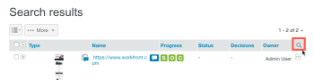

# Buscando prueba de [!DNL Workfront]

>[!IMPORTANT]
>
>Este artículo hace referencia a la funcionalidad del producto independiente [!DNL Workfront Proof]. Para obtener información sobre la revisión dentro de [!DNL Adobe Workfront], consulte [Revisión](../../../review-and-approve-work/proofing/proofing.md).

Puede buscar los siguientes tipos de contenido en el sitio de [!DNL Workfront Proof]:

* Pruebas (incluidas las pruebas archivadas)
* Archivos
* Carpetas
* Etiquetas
* Asunto de la prueba
* Mensaje de la prueba
* Campos personalizados
* Nombre del creador
* Elementos que se han compartido con usted

Para buscar en el sitio de [!DNL Workfront Proof]:

1. Escriba el texto que desea buscar y pulse **[!UICONTROL Intro]**.\
   Tenga en cuenta lo siguiente sobre los resultados de búsqueda:

   * La herramienta de búsqueda busca elementos que contengan todas las palabras clave que escriba. Para minimizar los resultados de búsqueda y maximizar la precisión de la búsqueda, asegúrese de deletrear las palabras clave correctamente y añada espacios entre ellas.
   * Los resultados de la búsqueda se ordenan por relevancia.
   * Puede reducir los resultados de la búsqueda añadiendo más palabras clave en el campo de búsqueda (separadas por un espacio) y buscando de nuevo. La nueva búsqueda solo se realiza en los elementos que ya se muestran en los resultados de la búsqueda.
   * Si introduce el nombre de una versión de prueba anterior en el campo de búsqueda, la versión más reciente de esa prueba aparece en los resultados de búsqueda.
   * Las carpetas principales y las subcarpetas se muestran por separado.

1. (Opcional) En los resultados de búsqueda que aparecen, ordene por columna haciendo clic en el encabezado en la parte superior de una columna. (Opcional) Añada filtros a los resultados haciendo clic en el icono [!UICONTROL buscar] al final de la fila del encabezado. 

   Esto añade menús desplegables en los que puede seleccionar filtros para restringir la búsqueda.

   

1. (Opcional) Reduzca la búsqueda abriendo la ficha [!UICONTROL Etiquetas] y haciendo clic en una etiqueta en la barra lateral de navegación de la izquierda. Los elementos asociados con esa etiqueta aparecen en los resultados de la búsqueda.

   

   El nombre de la etiqueta aparece en el campo de búsqueda en la esquina superior derecha de Workfront Proof. Puede afinar su búsqueda seleccionando etiquetas adicionales o escribiendo más palabras clave en el campo de búsqueda. Para quitar una etiqueta del campo de búsqueda, haga clic en el icono x junto al nombre de la etiqueta.

Para obtener información sobre cómo buscar texto en el contenido de una prueba, consulte [Búsqueda de contenido dentro de una prueba](../../../review-and-approve-work/proofing/reviewing-proofs-within-workfront/review-a-proof/search-in-a-proof.md).
