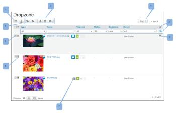

# La Dropzone

>[!IMPORTANT]
>
>Este artículo hace referencia a la funcionalidad del producto independiente [!DNL Workfront Proof]. Para obtener información sobre la revisión dentro de [!DNL Adobe Workfront], vea [Revisión](../../../review-and-approve-work/proofing/proofing.md).

Si tiene el plan Enterprise, puede utilizar Dropzone para enviar nuevas pruebas y nuevas versiones de pruebas a su cuenta sin tener que iniciar sesión en su cuenta.

Cuando envía una prueba a través de Dropzone, aparece en la página de Dropzone de su cuenta de [!DNL Workfront Proof]. Desde allí, puede enrutarlo al flujo de trabajo.

## Envío de una nueva prueba mediante la URL de Dropzone

1. En su explorador, vaya a la URL de Dropzone única, tal como se describe en [Configurar la Dropzone en [!DNL Workfront Proof]](../../../workfront-proof/wp-acct-admin/account-settings/configure-dropzone-in-wp.md)
1. Introduzca su dirección de correo electrónico.
1. Haz clic en **[!UICONTROL Seleccionar un archivo]** o **[!UICONTROL Capturar una página web]** y elige el archivo o la página web que deseas cargar.

1. Escriba el código de seguridad y haga clic en **[!UICONTROL Siguiente]**.\
   Una barra de progreso muestra el progreso de la carga.\
   En la siguiente pantalla, podrá añadir detalles de Prueba.\
   Tenga en cuenta que esta sección solo aparece si se ha habilitado en la configuración de Dropzone.

1. Una vez que hayas completado los detalles, haz clic en **[!UICONTROL Siguiente]**.
1. Los revisores añadidos a la prueba solo recibirán su correo electrónico de notificación cuando se active la prueba (consulte a continuación).
1. La prueba pasa por los siguientes estados después de enviarla a Dropzone:

   * Cuando carga un archivo por primera vez en la Dropzone, la prueba se muestra como Borrador.
   * Una vez completado el envío, la prueba se muestra en la Dropzone como Enviada.
   * Una vez activada y desbloqueada la prueba, se muestra en la Dropzone como Activa.
   * Si la prueba está bloqueada, se mostrará en la Dropzone como Bloqueada.

## Enviar una nueva versión de una prueba existente a través de la URL de Dropzone

1. En su explorador, vaya a la URL de Dropzone única, tal como se describe en [Configurar la Dropzone en [!DNL Workfront Proof]](../../../workfront-proof/wp-acct-admin/account-settings/configure-dropzone-in-wp.md)
1. Introduzca su dirección de correo electrónico.
1. Seleccione la casilla de verificación para indicar que está cargando una nueva versión de una revisión existente.\
   Para obtener información sobre cómo crear una nueva versión de una prueba, consulte .
1. Haz clic en **[!UICONTROL Seleccionar un archivo]** o **[!UICONTROL Capturar una página web]** y elige el archivo o la página web que deseas cargar.

1. Escriba el código de seguridad y haga clic en **[!UICONTROL Siguiente]**.\
   Una barra de progreso muestra el progreso de la carga.\
   Workfront Proof le envía un correo electrónico de validación.

1. Haga clic en el vínculo del correo electrónico.\
   El correo electrónico abre la ventana de Dropzone en el explorador. El vínculo de la notificación por correo electrónico es válido durante 24 horas.
1. Seleccione la versión anterior de la prueba (solo se mostrarán las pruebas que haya creado o enviado).\
   En la siguiente pantalla podrá añadir detalles de la prueba.\
   Esta sección solo aparece si se ha habilitado en la configuración de Dropzone.

1. Escriba los detalles y haga clic en **[!UICONTROL Siguiente]**.

   >[!NOTE]
   >
   >Los revisores añadidos a la prueba solo recibirán su correo electrónico de notificación cuando se active la prueba (consulte a continuación).

   La prueba pasa por los siguientes estados después de enviarla a Dropzone:

   * Cuando carga un archivo por primera vez en la Dropzone, la prueba se muestra como Borrador.
   * Una vez completado el envío, la prueba se muestra en la Dropzone como Enviada.
   * Una vez activada y desbloqueada la prueba, se muestra en la Dropzone como Activa.
   * Si la prueba está bloqueada, se mostrará en la Dropzone como Bloqueada.

## Envío de una prueba por correo electrónico a Dropzone

>[!NOTE]
>
>Ya no se admite enviar por correo electrónico una prueba a la Dropzone.

## Finalización del envío

Workfront le envía un mensaje de correo electrónico de Completar el envío en el que se le solicita que confirme si el archivo es una nueva revisión o una nueva versión. El vínculo de la notificación por correo electrónico es válido durante 24 horas.

1. Haga clic en el vínculo y siga los pasos anteriores, en función de si es una prueba nueva o una versión nueva de una existente.

## Activación de la prueba

El propietario de Dropzone recibe un correo electrónico de notificación que le informa de que se ha enviado una nueva prueba a Dropzone:

* La prueba aparece en la página Dropzone de su cuenta (para acceder a la página de Dropzone, haga clic en el vínculo en la barra lateral de navegación izquierda).
* El propietario de Dropzone (o un usuario que tenga al menos un perfil de Supervisor) puede acceder a la prueba. El propietario se puede cambiar en la configuración de Dropzone (solo lo puede hacer un administrador de facturación o un administrador).
* Antes de poder trabajar en la prueba, el propietario de Dropzone debe activarla/desbloquearla (un usuario con al menos un perfil de Supervisor también puede hacerlo). El estado de la prueba se muestra como Enviada hasta que se activa/desbloquea.

Para activar la revisión:

1. Vaya al menú desplegable a la derecha de la prueba y haga clic en **[!UICONTROL Activar]**.
1. Una vez activada/desbloqueada la prueba:

   * El estado de la prueba cambia a Activo.
   * Todas las personas que se agregaron a la prueba recibirán un correo electrónico de notificación para informar que tienen una nueva prueba que revisar. (No se envía ningún correo electrónico hasta que se activa/desbloquea la prueba).
   * La prueba se puede trabajar con normalidad
   * Si el remitente también se agrega explícitamente a la prueba, no recibirá un correo electrónico de nueva prueba. Para obtener más información, consulte [Nuevo correo electrónico de revisión](../../../workfront-proof/wp-emailsntfctns/proof-notifications-and-reminders/new-proof-email.md).

## Administración de la Dropzone

La página Dropzone facilita la administración de los envíos a su Dropzone. La página Dropzone incluye las siguientes opciones y funcionalidades:

* Diseño de página (1)
* Elija incluir/excluir pruebas archivadas en la vista (2)
* Botones de acción (3)
* Ordenar (4)
* Filtro (5)
* Menú de acciones de revisión (6)
* Desarchivar la prueba (7)
* Expandir/contraer resumen de revisión (8)
* Seleccionar una revisión (9)

El diseño de página y las opciones de ordenación y filtrado son las mismas que en las listas [!DNL Views]. Consulte [Administrar elementos en la página de vistas en [!DNL Workfront Proof]](../../../workfront-proof/wp-work-proofsfiles/manage-your-work/manage-items-on-views-page.md) para obtener más información.

