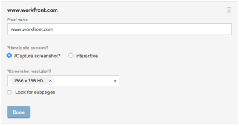

# Generar pruebas en [!DNL Workfront Proof]

>[!IMPORTANT]
>
>Este artículo se refiere a la funcionalidad en el producto independiente [!DNL Workfront Proof]. Para obtener información sobre pruebas en el interior [!DNL Adobe Workfront], consulte [Prueba](../../../review-and-approve-work/proofing/proofing.md).

[!DNL Workfront Proof] permite crear pruebas a partir de documentos o sitios web, y compartirlas con otros usuarios. Los pasos siguientes describen las distintas opciones de configuración disponibles:

## Generar una prueba para un documento

1. Realice una de las siguientes acciones para empezar a crear una prueba nueva y mostrar la variable [!UICONTROL Nueva prueba] página:

   * Haga clic en el icono verde **[!UICONTROL Nueva prueba]** en la esquina superior izquierda de cualquier página.
   * En el **[!UICONTROL Panel]** , en el **[!UICONTROL Información general]** , haga clic en la pestaña **[!UICONTROL Nueva prueba]** vínculo.

   * Enviar a través de Dropzone (función empresarial).
   * La variable **[!UICONTROL Nueva prueba]** se muestra.

1. Para probar uno o más documentos, agregue documentos para probarlos de cualquiera de las siguientes maneras (repita este proceso para agregar varios documentos que se van a probar):

   * Arrastre un documento desde el sistema de archivos hasta el área de arrastrar y soltar de la sección **[!UICONTROL Agregar archivos]** .
   * Haga clic en el área de arrastrar y soltar de la **[!UICONTROL Agregar archivos]** , busque y seleccione el documento que desea cargar desde el sistema de archivos de la estación de trabajo.

      

1. Para probar uno o varios sitios web, especifique la dirección URL del sitio web que desea probar en la **[!UICONTROL Agregar archivos]** área y, a continuación, pulse **[!UICONTROL Entrar]**.

1. (Opcional) Repita este proceso para agregar varios sitios web a la prueba.

   Para obtener más información sobre la prueba de sitios web, consulte [Generar una prueba para una dirección URL](#generate-a-proof-for-a-url).

   

1. (Opcional) Modifique los nombres de archivo de cualquier archivo cargado:

   1. Pase el ratón sobre el nombre del documento que desea modificar en la lista de documentos de la **[!UICONTROL Agregar archivos]** y, a continuación, haga clic en la **[!UICONTROL Editar]** icono.

      

   1. En el **[!UICONTROL Nombre de la prueba]** , especifique un nuevo nombre y haga clic en **[!UICONTROL Listo]**.

   1. (Opcional) Para eliminar cualquier archivo de la carga, pase el ratón sobre el documento que quiera eliminar en la lista de documentos de la **[!UICONTROL Agregar archivos]** y, a continuación, haga clic en la **[!UICONTROL Eliminar]** icono.

      

   1. (Opcional) Active la opción . **[!UICONTROL Combinar todos los archivos compatibles en una sola prueba]**.

      **Cuando esta opción está habilitada:** Todos los archivos estáticos y sitios web están disponibles en una sola prueba, y puede cargar hasta 50 archivos a la vez.

      >[!NOTE]
      >
      >Los archivos interactivos, incluidos los vídeos y los sitios web interactivos, no se pueden combinar en una sola prueba.

      **Cuando esta opción está desactivada:** Todos los documentos y sitios web se generan como pruebas individuales y se pueden cargar hasta 20 archivos a la vez.

      Para combinar todos los archivos y sitios web cargados en una sola prueba:

      1. Active la opción , **[!UICONTROL Combinar todos los archivos compatibles en una sola prueba]**.
      1. En el **[!UICONTROL Nombre de la prueba]** especifique un nuevo nombre para la prueba combinada.
      1. En el **[!UICONTROL Agregar archivos]** , reordene los archivos incluidos arrastrando un archivo al orden deseado. El orden de los archivos es el orden de página de la prueba combinada. Para obtener más información sobre la creación de pruebas combinadas, consulte [Creación de una prueba de varias páginas](../../../review-and-approve-work/proofing/creating-proofs-within-workfront/create-multi-page-proof.md).

1. (Opcional) Si desea utilizar un flujo de trabajo automatizado que incluya varias etapas, en la variable **[!UICONTROL Flujo de trabajo]** , seleccione entre las siguientes opciones:

   * **Básico:** Seleccione esta opción para designar a los usuarios que desea que tengan acceso a la prueba inmediatamente después de crearla. Puede compartir la prueba con varios usuarios.

      Para obtener más información sobre cómo compartir una prueba, consulte &quot;Adición de usuarios a una prueba&quot; en [Compartir una prueba en [!DNL Adobe Workfront]](../../../review-and-approve-work/proofing/managing-proofs-within-workfront/share-a-proof-in-workfront.md).

   * **Automatizado:** Seleccione esta opción para administrar la revisión y aprobación del contenido cuando tenga procesos de revisión complejos o si envía contenido para su revisión a los mismos grupos de personas regularmente. Con el flujo de trabajo automatizado, la prueba pasa de una fase a otra hasta la aprobación final. Se notifica a los usuarios relevantes en cualquier momento para solicitar su aprobación.

      Para obtener más información sobre la creación de un flujo de trabajo automatizado, consulte [Configure una prueba con un flujo de trabajo automatizado en [!DNL Workfront Proof]](../../../workfront-proof/wp-work-proofsfiles/automated-workflow/set-up-proof-auto-workflow.md#create2).

1. Seleccione si desea enviar notificaciones por correo electrónico y un mensaje personalizado a los usuarios seleccionados en el paso anterior:

   * **Notifique a los destinatarios sobre esta prueba:** Seleccione esta opción para enviar una notificación por correo electrónico a los usuarios. When **[!UICONTROL Uso compartido básico]** se selecciona en la variable **[!UICONTROL Flujo de trabajo]** , se envía una notificación por correo electrónico cuando se crea la prueba. When **[!UICONTROL Flujo de trabajo automatizado]** se selecciona en la variable **[!UICONTROL Flujo de trabajo]** , una notificación por correo electrónico se envía cuando la prueba entra en la fase del flujo de trabajo automatizado al que está asociado el usuario.

   * **Añadir mensaje personalizado:** Seleccione esta opción para incluir un mensaje personalizado en la notificación. Puede especificar un asunto y un cuerpo del mensaje. El cuerpo del mensaje puede incluir formato de texto enriquecido, como negrita, viñetas e hipervínculos.

1. Seleccione cualquiera de las siguientes opciones de configuración de prueba:

   <table style="table-layout:auto"> 
    <col> 
    <col> 
    <tbody> 
     <tr> 
      <td role="rowheader">Requerir inicio de sesión: la prueba solo se puede compartir con otros usuarios</td> 
      <td> 
<strong>Requerir inicio de sesión : la prueba solo se puede compartir con otros usuarios:</strong> Cuando se selecciona esta opción, solo [!DNL Workfront Proof] los usuarios pueden ver la prueba.
 
Esta opción está desactivada de forma predeterminada; cualquier persona con la URL puede ver la prueba.
 
Cuando se selecciona esta opción:
 
       <ul> 
        <li>Los usuarios no pueden iniciar sesión en la prueba a menos que se hayan añadido a ella.</li> 
        <li>Las suscripciones no se pueden habilitar.</li> 
       </ul> </td> 
     </tr> 
     <tr> 
      <td role="rowheader">Solo se requiere una decisión para esta prueba</td> 
      <td> 
Cuando se selecciona esta opción, la revisión se completa después de que uno de los responsables de la toma de decisiones tome una decisión.
 
Esta opción está desactivada de forma predeterminada.
 </td> 
     </tr> 
     <tr> 
      <td role="rowheader">Requerir que las decisiones se firmen electrónicamente</td> 
      <td>Los usuarios deben especificar su nombre de usuario y contraseña en el momento en que toman una decisión sobre una prueba.</td> 
     </tr> 
     <tr> 
      <td role="rowheader">Bloquear la prueba cuando se toman todas las decisiones necesarias</td> 
      <td> 
<strong></strong> Cuando esta configuración está habilitada, el estado de prueba se bloquea después de tomar todas las decisiones. El estado se cambia automáticamente de desbloqueado a bloqueado cuando el aprobador final decide.
 
Esta opción está desactivada de forma predeterminada.
 </td> 
     </tr> 
     <tr> 
      <td role="rowheader">Descargar archivo original</td> 
      <td> 
<strong></strong> Cuando se selecciona esta opción, los revisores pueden descargar el archivo original desde el que se creó la prueba.
 
Cuando se anula la selección de esta opción, el icono Descargar deja de estar visible. Esta opción está activada de forma predeterminada.
 </td> 
     </tr> 
     <tr> 
      <td role="rowheader">Comparta la prueba mediante una URL pública o código incrustado</td> 
      <td>Cuando se selecciona esta opción, la prueba se puede compartir mediante una URL pública o un código incrustado.</td> 
     </tr> 
     <tr> 
      <td role="rowheader">Suscripción a la prueba mediante URL pública o código incrustado</td> 
      <td> 
Cuando se selecciona esta opción, las personas que no se hayan agregado explícitamente a la prueba pueden suscribirse a la prueba. A la persona suscrita a la prueba se le concede la función y el correo electrónico que usted define en la siguiente configuración:
 
       <ul> 
        <li><strong>Función de suscriptor</strong>: La función de prueba predeterminada que se asigna a todos los revisores que se suscriben a la prueba.</li> 
        <li><strong>Configuración de alertas de correo electrónico para suscriptores</strong>: La alerta de correo electrónico predeterminada asignada a todos los revisores que se suscriben a la prueba.</li> 
        <li> 
<strong>Probar el acceso a través del enlace de correo electrónico requerido para</strong>: Configure si el suscriptor recibe un correo electrónico con un vínculo a la prueba. Puede seleccionar <strong>Sin correo electrónico</strong> (no se requiere un vínculo de correo electrónico para acceder a la prueba), <strong>Solo correo electrónico de notificación de prueba</strong> (el suscriptor recibe un enlace a la prueba por correo electrónico sin ninguna verificación), o <strong>Correos electrónicos de notificación de validación y prueba</strong> (El suscriptor recibe un enlace a la prueba por correo electrónico y debe hacer clic en el vínculo para acceder a una prueba; el propósito de esta opción es garantizar que la persona ha introducido una dirección de correo electrónico correcta a la que tiene acceso).
 
Nota: Si las pruebas tienen el flujo de trabajo automatizado adjunto, todas las suscripciones generarán correos electrónicos de confirmación al propietario de la prueba, por lo que podrían decidir en qué fase se debe añadir a la persona.
 </li> 
       </ul> </td> 
     </tr> 
    </tbody> 
   </table>

1. Haga clic en **[!UICONTROL Crear prueba]**.

   Workfront comienza a generar una prueba de los documentos o sitios web seleccionados. Según el tamaño y el tipo del archivo, el tiempo de retraso en la carga de un documento varía. Tenga paciencia, ya que los archivos más grandes tardan más en generarse. Puede salir de la página y Workfront seguirá generando su archivo. El tamaño máximo de carga de archivos es de 4 GB.

   Una vez generada la prueba, haga clic en **[!UICONTROL Vaya a la prueba]** para iniciar la herramienta de prueba.

   

   El documento aparece en la herramienta de corrección.

   Los usuarios que no tengan las pruebas habilitadas en su cuenta podrán ver el documento y realizar comentarios en la prueba.

## Generar una prueba para una dirección URL {#generate-a-proof-for-a-url}

Puede generar una prueba de una URL por primera vez. O bien, puede generar una nueva versión de una prueba de URL en la que se haya generado previamente una prueba.

>[!NOTE]
>
>Puede generar una prueba interactiva para una URL solo si su [!DNL Workfront] el entorno está integrado con un [!DNL Workfront Proof] Cuenta Premium. Si no puede utilizar pruebas como se explica en esta sección, póngase en contacto con el administrador del sistema.

Para generar una prueba de una URL:

1. Realice una de las siguientes acciones para empezar a crear una prueba nueva y mostrar la variable [!UICONTROL Nueva prueba] página:

   * Haga clic en el icono verde **[!UICONTROL Nueva prueba]** en la esquina superior izquierda de cualquier página.
   * En el **[!UICONTROL Panel]** , en el **[!UICONTROL Información general]** , haga clic en la pestaña **[!UICONTROL Nueva prueba]** vínculo.

   * Enviar a través de Dropzone (función empresarial).

1. (Condicional) En el **[!UICONTROL Nueva prueba]** que aparece para crear una nueva versión de una prueba existente:

   1. Seleccione la prueba de URL donde desee agregar una nueva versión.
   1. Haga clic en el **[!UICONTROL Nueva versión]** en la parte superior de la página.

      

1. En la página New proof version que se muestra, especifique la dirección URL del sitio web que desea probar en la **[!UICONTROL Agregar archivos]** área y, a continuación, pulse **[!UICONTROL Entrar]**.

1. (Opcional) Repita este proceso para agregar varios sitios web a la prueba.

   

1. Haga clic en el sitio web de la lista de documentos de la **[!UICONTROL Agregar archivos]** .

   

1. Especifique un **[!UICONTROL Nombre de la prueba]** para la prueba.

   De forma predeterminada, el nombre de la prueba es el mismo que la dirección URL del sitio.

1. Select **[!UICONTROL Gestión del contenido del sitio]** opciones:

   <table style="table-layout:auto"> 
    <col> 
    <col> 
    <tbody> 
     <tr> 
      <td role="rowheader">Captura de pantalla</td> 
      <td>Crea una prueba de una imagen estática de la página principal de la dirección URL.</td> 
     </tr> 
     <tr> 
      <td role="rowheader">Interactiva</td> 
      <td> 
Crea una prueba que permite a los revisores navegar por el sitio, ver imágenes de HTML5, elementos de Flash, etc.
 
Para crear una prueba interactiva, el sitio web debe alojarse con un protocolo seguro (https). Además, los sitios web que no se pueden incrustar en un iframe no se pueden generar como una prueba interactiva (las restricciones de incrustación de iframes están controladas por el sitio web que está intentando incrustar).
 
Una vez creada la prueba inicial, esta configuración no se puede cambiar al crear versiones posteriores.
 
Para obtener más información sobre pruebas interactivas, consulte <a href="#generate-a-proof-for-interactive-content" class="MCXref xref">Generar una prueba de contenido interactivo</a>.
 </td> 
     </tr> 
     <tr> 
      <td role="rowheader">Resolución de la captura de pantalla</td> 
      <td> 
(Esta opción no está disponible para pruebas interactivas). Puede ajustar la resolución en la que se muestra el contenido o seleccionar varias resoluciones.
 
Esto permite a los usuarios que revisan la prueba ver cómo aparecerá el contenido en distintos dispositivos, como teléfonos de diversos tamaños, tabletas y monitores.
 
Si selecciona varias resoluciones, se crea una prueba independiente para cada resolución seleccionada.
 
Cuando los usuarios comentan la prueba, la resolución de pantalla actual se muestra automáticamente en el comentario para asegurarse de que otros usuarios son conscientes de la resolución con la que está asociado el comentario.
 </td> 
     </tr> 
     <tr> 
      <td role="rowheader">Buscar subpáginas</td> 
      <td>(Esta opción no está disponible para pruebas interactivas). Seleccione esta opción para navegar por las páginas del sitio web. Puede ampliar el sitio web hasta dos niveles de profundidad desde la página principal. Pase el ratón sobre una página para ver la dirección URL de la página. Seleccione solo las páginas que desee probar. Cada página seleccionada se crea como una prueba individual de forma predeterminada; o bien, habilite la variable <strong>Combinar en una sola prueba</strong> para combinar todas las páginas seleccionadas en una sola prueba.</td> 
     </tr> 
    </tbody> 
   </table>

1. (Opcional) Configure cualquier opción de prueba avanzada, como compartir la prueba, agregar un flujo de trabajo automatizado o configurar los ajustes de acceso y suscripción. Para obtener más información sobre estas opciones, consulte los siguientes artículos:

   * [Compartir una prueba en [!DNL Adobe Workfront]](../../../review-and-approve-work/proofing/managing-proofs-within-workfront/share-a-proof-in-workfront.md)
   * [Configure una prueba con un flujo de trabajo automatizado en [!DNL Workfront Proof]](../../../workfront-proof/wp-work-proofsfiles/automated-workflow/set-up-proof-auto-workflow.md)
   * [Configuración de acceso y suscripción para una prueba](../../../review-and-approve-work/proofing/managing-proofs-within-workfront/configure-access-subscription-settings-proof.md)

1. Haga clic en **[!UICONTROL Listo]**.

   Si agrega una versión nueva a una prueba de URL existente, todas las opciones configuradas en la prueba original o en la versión anterior se mantendrán en esta versión. Si agrega una versión nueva a una prueba de URL existente, todas las opciones configuradas en la prueba original o en la versión anterior se mantendrán en esta versión.

1. Haga clic en **[!UICONTROL Crear prueba]**.

## Generar una prueba de contenido interactivo {#generate-a-proof-for-interactive-content}

Para utilizar esta función se necesita un plan Pro Workfront o superior. Para obtener más información sobre los distintos planes disponibles, consulte [Planes de Workfront](https://www.workfront.com/plans).

Para obtener más información sobre el contenido interactivo, consulte [Información general sobre pruebas de contenido interactivo](../../../review-and-approve-work/proofing/proofing-overview/interactive-content-proofs.md).

* [Añadir contenido interactivo como URL](#add-interactive-content-as-a-url)
* [Añadir contenido interactivo como archivo ZIP](#add-interactive-content-as-a-zip-file)

### Añadir contenido interactivo como URL {#add-interactive-content-as-a-url}

Para obtener información sobre cómo añadir una prueba de URL interactiva, consulte  [Generar una prueba para una dirección URL](#generate-a-proof-for-a-url).

### Añadir contenido interactivo como archivo ZIP {#add-interactive-content-as-a-zip-file}

1. Prepare su contenido creando un archivo .zip agrupado.

   Para obtener información sobre las especificaciones de archivos empaquetados .zip, consulte [Acerca de la preparación de contenido interactivo en un archivo ZIP para pruebas](../../../review-and-approve-work/proofing/proofing-overview/interactive-content-proofs.md#howtoprepareaninteractiveziparchive) en el artículo [Información general sobre pruebas de contenido interactivo](../../../review-and-approve-work/proofing/proofing-overview/interactive-content-proofs.md).

1. Realice una de las siguientes acciones para empezar a crear una prueba nueva y mostrar la variable [!UICONTROL Nueva prueba] página:

   * Haga clic en el icono verde **[!UICONTROL Nueva prueba]** en la esquina superior izquierda de cualquier página.
   * En el **[!UICONTROL Panel]** , en el **[!UICONTROL Información general]** , haga clic en la pestaña **[!UICONTROL Nueva prueba]** vínculo.

   * Enviar a través de Dropzone (función empresarial).

1. En el **[!UICONTROL Nueva prueba]** página que aparecerá, arrastre y suelte el paquete .zip interactivo en el **[!UICONTROL Añadir archivos]** .

1. (Opcional) Configure cualquier opción de prueba avanzada, como compartir la prueba, agregar un flujo de trabajo automatizado o configurar los ajustes de acceso y suscripción. Para obtener más información sobre estas opciones, consulte los siguientes artículos:

   * [Compartir una prueba en [!DNL Adobe Workfront]](../../../review-and-approve-work/proofing/managing-proofs-within-workfront/share-a-proof-in-workfront.md)
   * en el artículo
   * [Configuración de acceso y suscripción para una prueba](../../../review-and-approve-work/proofing/managing-proofs-within-workfront/configure-access-subscription-settings-proof.md)

1. Haga clic en **[!UICONTROL Crear prueba]**.

   Workfront comienza a generar una prueba del paquete .zip. Según el tamaño del paquete, el tiempo de retraso en la carga de un documento varía. Los archivos más grandes tardan más en generarse. Puede salir de la página y Workfront seguirá generando su archivo. El tamaño máximo de carga de archivos es de 4 GB.

   Una vez generada la prueba, puede hacer clic en el botón **[!UICONTROL Vaya a la prueba]** que aparece para abrir la prueba.
