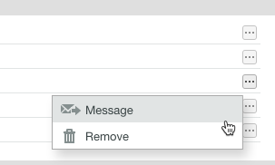

# Administrar archivos en [!DNL Workfront Proof]

>[!IMPORTANT]
>
>Este artículo hace referencia a la funcionalidad del producto independiente [!DNL Workfront Proof]. Para obtener información sobre la revisión dentro de [!DNL Adobe Workfront], consulte [Revisión](../../../review-and-approve-work/proofing/proofing.md).

Puede administrar, compartir y ver información sobre los archivos (no pruebas) cargados en Workfront Proof (consulte [Cargar archivos y contenido web en [!DNL Workfront Proof]](../../../workfront-proof/wp-work-proofsfiles/create-proofs-and-files/upload-files-web-content.md)).

1. Haga clic en la flecha hacia abajo a la derecha de **[!UICONTROL Vistas]** en el panel de navegación izquierdo y, a continuación, haga clic en **[!UICONTROL Archivos]** en el menú desplegable.

1. Haga clic en el botón **[!UICONTROL Más]** del archivo y, a continuación, haga clic en **[!UICONTROL Ver detalles del archivo]** en el menú que aparece.\
   \
   Puede ver y editar los detalles sobre el archivo en la ventana que aparece. Por ejemplo, puede cambiar el nombre de archivo en la parte superior de la ventana, la [!DNL Workfront Proof] **Carpeta** que almacena el archivo y el **Propietario** del archivo.\
   

1. (Opcional) Si tiene derechos de edición para el archivo, utilice los botones de acción de la esquina superior derecha para administrar y compartir el archivo:

* **[!UICONTROL Etiquetas]**. Administrar etiquetas aplicadas al archivo.\
   \
   Debajo de los botones de acción, puede ver cualquier etiqueta aplicada al archivo. Para quitar una etiqueta no deseada, haga clic en la x situada junto a ella.\
   

* **[!UICONTROL Mover a]**. Organice los archivos en carpetas. Puede mover un archivo entre carpetas existentes o colocarlo en una carpeta nueva.\
   

* **[!UICONTROL Compartir]**. Compartir archivos con otras personas. [!DNL Workfront Proof] envía una notificación por correo electrónico a los destinatarios que incluye un mensaje personalizado y vínculos de descarga.\
   

* **[!UICONTROL Papelera]**. Puede eliminar el archivo moviéndolo a la papelera. Tenga en cuenta que el archivo se contabilizará en el límite de almacenamiento hasta que se vacíe la papelera (consulte [Restaurar y vaciar la papelera en [!DNL Workfront Proof]](../../../workfront-proof/wp-work-proofsfiles/manage-your-work/restore-and-empty-trash.md)).\
   

* **[!UICONTROL Más]**. En esta lista desplegable, puede hacer clic en **[!UICONTROL Convertir en prueba]** para crear una prueba para un archivo (consulte [Generar pruebas en [!DNL Workfront Proof]](../../../workfront-proof/wp-work-proofsfiles/create-proofs-and-files/generate-proofs.md)). El archivo debe cumplir con los requisitos de tipos de archivo para las pruebas (consulte [Información general sobre los tipos de archivo de revisión admitidos y los límites de tamaño](../../../review-and-approve-work/proofing/proofing-overview/supported-proofing-file-types.md)). Si el nombre del archivo coincide con el nombre de una revisión existente, [!DNL Workfront Proof] mostrará un mensaje con un vínculo que le permitirá convertir el archivo a una **[!UICONTROL Nueva versión]** de esa revisión (consulte).\
   

  >[!TIP]
  >
  >Para los archivos que se compartieron desde otra cuenta de [!DNL Workfront Proof] (y no se cargaron en su propia cuenta), la conversión solo está disponible en los planes de empresa.

  También puede hacer clic en **[!UICONTROL Descargar]** para descargar el archivo original en su equipo.

1. (Opcional) Abra la sección **[!UICONTROL Compartido con]** para enumerar los usuarios con los que se compartió el archivo.

   Puede **[!UICONTROL Enviar un mensaje]** o **[!UICONTROL Quitar]** a un usuario mediante el icono **[!UICONTROL Más]** que aparece a la derecha.

   

   Si elige enviar un mensaje a uno de estos usuarios, aparecerá la página **[!DNL Message all]**, donde podrá enviar varios mensajes a la vez.

1. Abra la sección **[!UICONTROL Actividad]** para ver una lista de todas las actividades del archivo, incluida la hora, la fecha y el usuario que realizó la acción. La actividad incluye lo siguiente:

   * Archivo cargado
   * Nuevas personas añadidas
   * Personas eliminadas
   * Archivo descargado

1. Abra la sección **[!UICONTROL Mensajes]** para rastrear los mensajes que los usuarios han enviado en asociación con el archivo. Puede ver el contenido de un mensaje haciendo clic en el icono “i” a la derecha.
