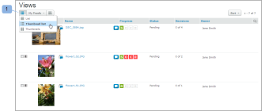
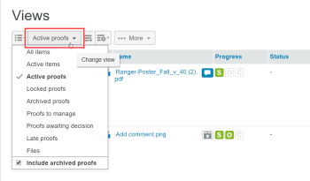
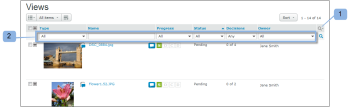
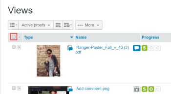

# Administrar elementos en la página [!UICONTROL Vistas] de [!DNL Workfront Proof]

>[!IMPORTANT]
>
>Este artículo hace referencia a la funcionalidad del producto independiente [!DNL Workfront Proof]. Para obtener información sobre la revisión dentro de [!DNL Adobe Workfront], vea [Revisión](../../../review-and-approve-work/proofing/proofing.md).

La página [!UICONTROL Vistas] le permite ver todas las pruebas, archivos y carpetas y trabajar con ellos en un solo lugar.

## Mostrando la página [!UICONTROL Vistas]

1. Haga clic en **[!UICONTROL Vistas]** en la barra lateral izquierda.
1. En el menú desplegable (2), haga clic en la vista (3) que desee ver.

## Cambiando el diseño de página de [!UICONTROL Vistas]

El diseño de página predeterminado [!UICONTROL Vistas] es la lista de miniaturas. En este diseño, puede ver una imagen en miniatura de cada prueba, archivo (si es posible generarlo) y carpetas (si se ha configurado), con otros detalles incluidos en columnas independientes.

1. Haga clic en el icono **[!UICONTROL Diseño de página]** (1) y, a continuación, elija el diseño que desee.

## Cambiando la lista [!UICONTROL Vistas]

Para cambiar lo que se ve en la lista [!UICONTROL Vistas]:

1. Haga clic en el botón **[!UICONTROL Cambiar vista]**.\
   El nombre que aparece en este botón depende de la vista que seleccionó la última vez que la utilizó.\
   

1. Haga clic en una vista diferente en el menú desplegable:

   * **[!UICONTROL Todos los elementos]**: incluye todas las pruebas, archivos y carpetas para los que tiene permiso de visualización. Es la opción predeterminada al abrir la página [!UICONTROL Views]. Tiene la opción de incluir/excluir pruebas archivadas en esta vista.
   * **[!UICONTROL Elementos activos]**: todas las pruebas, archivos y carpetas activos.
   * **[!UICONTROL Pruebas activas]**: todas las pruebas activas (no archivadas) para las que tiene permiso de visualización.
   * **[!UICONTROL Pruebas bloqueadas]**: Solo pruebas bloqueadas.
   * **[!UICONTROL Pruebas archivadas]**: Solo pruebas archivadas (consulte [Archivar en [!DNL Workfront Proof]](../../../workfront-proof/wp-work-proofsfiles/organize-your-work/archive.md)).

   * **[!UICONTROL Mis pruebas]**: muestra solo las pruebas de las que es el propietario y que se le han delegado. Para obtener más información, consulte [Designación de propietarios de pruebas temporales en [!DNL Workfront Proof]](../../../workfront-proof/wp-getstarted/personal-settings/designate-temp-proof-owners.md).

   * **[!UICONTROL Pruebas pendientes de decisión]**: muestra solo las pruebas en las que debe tomar una decisión
   * **[!UICONTROL Pruebas tardías]**: Muestra solo las pruebas para las que ha pasado la fecha límite
   * **[!UICONTROL Archivos]**: Muestra solo archivos

   En cada una de estas vistas, se incluyen las siguientes columnas

   * **Tipo**: icono del elemento con el icono de prueba, archivo o carpeta
   * **Nombre**: nombre de la prueba, archivo o carpeta
   * **Progreso**: S=Enviado, O=Abierto, C=Comentario, D=Decisión (consulte Barra de progreso)
   * **Estado**: [!UICONTROL Pendiente, se requieren cambios, aprobado]
   * **Decisiones**: Número de decisiones tomadas y número requerido
   * **Propietario**: Nombre de la persona a la que pertenece la prueba\

     Mis pruebas, Pruebas pendientes de decisión y Vistas de pruebas tardías tienen una columna adicional llamada Mi plazo. Esta columna muestra sus propias fechas límite en las pruebas en las que se le agrega explícitamente como revisor/aprobador.

     >[!NOTE]
     >
     >Si se aleja de la página Vistas y vuelve a ella más adelante en la misma sesión, aparecerá la última vista seleccionada.

     También puede crear sus propias vistas. Consulte [Crear y administrar vistas personalizadas en [!DNL Workfront Proof]](../../../workfront-proof/wp-work-proofsfiles/manage-your-work/create-and-manage-custom-views.md) para obtener más información.

## Filtrado de elementos

Puede filtrar la información enumerada en una vista.

1. Haga clic en el icono **Mostrar filtros** en la parte superior derecha de la página (1).\
   

1. Aparecerá la barra de filtro (2) y cada categoría tendrá un menú desplegable de filtrado (3) para seleccionar el valor que prefiera. El valor predeterminado de cada categoría es Todos.
1. La barra de filtros no se muestra en las vistas personalizadas que cree. Para esas vistas, puede aplicar y editar filtros en la ficha [!UICONTROL Filtros]. Para obtener más información, consulte [Crear y administrar vistas personalizadas en [!DNL Workfront Proof]](../../../workfront-proof/wp-work-proofsfiles/manage-your-work/create-and-manage-custom-views.md).
1. Para aplicar todos los filtros elegidos, haga clic en el icono [!UICONTROL Filter] (4) al final de la barra de filtrado.\
   

Los valores de Filtro que seleccione permanecerán activos hasta que los cambie. Si desea volver a ver y tener acceso a la lista completa de elementos, debe volver a cambiar todos los valores de filtro al valor predeterminado, que es **[!UICONTROL Todos]**.

>[!NOTE]
>
>Si establece opciones de filtrado y, a continuación, oculta la barra de filtrado haciendo clic en el icono [!UICONTROL Ocultar filtros] (5), la barra se volverá a mostrar automáticamente si cambia de vista. Si oculta la barra de filtrado mientras todos los filtros están configurados con la opción predeterminada todos, la barra de filtrado permanece oculta al cambiar de vista.

## Ordenar elementos

Cuando crea una nueva revisión (o versión) o carga un nuevo archivo, aparece en la parte superior de su lista [!UICONTROL Todos los elementos]. El elemento más antiguo aparece al final de la lista.

Para ver la lista en un orden diferente:

1. Realice una de las siguientes acciones:

   * Haga clic en uno de los encabezados de columna de la lista: Tipo, Nombre, Estado, Decisiones o Propietario.\

     Por ejemplo, si desea ver las pruebas o los archivos en orden alfabético, haga clic en el encabezado Nombre una vez (1) para ordenar la lista por nombre en orden ascendente (A - Z).\
      Puede hacer clic de nuevo en el encabezado Nombre de la prueba (2) para invertir el orden y mostrar las pruebas en orden descendente (Z - A).

   * Haga clic en la flecha abajo en la esquina superior derecha de la página [!UICONTROL Vistas] para ordenar por la fecha de creación (Más reciente o Más antiguo) o por tipo, nombre, estado, decisiones o propietario.\

     \
      Si la columna se ordena en orden ascendente, el encabezado de la columna mostrará una flecha hacia arriba junto al nombre de la columna. Para invertir el orden (a descendente), haga clic en el encabezado de columna correspondiente (se mostrará una flecha hacia abajo junto al nombre de la columna).

   * Los cambios que realice en el orden de los elementos sólo durarán mientras permanezca en la página Todos los elementos. Si sale de la página Todos los elementos y vuelve más tarde, los elementos vuelven a aparecer en el orden cronológico inverso predeterminado.

## Visualización de un resumen de revisión

Para ver información más detallada sobre una prueba:

1. Haga clic en la flecha a la izquierda de la imagen de prueba.\
   La flecha apunta hacia abajo y el resumen de la prueba se muestra debajo de la información básica sobre la prueba. El resumen de prueba muestra lo siguiente:

   * **Resumen de prueba**: Estado general de la prueba
   * **Fase**: indica el plazo de prueba y el número de decisiones tomadas y requeridas
   * **Revisores**: Se enumerará el nombre, la función y el progreso de cada revisor
   * **Versiones**: Versión de la revisión que se está viendo y número total de versiones disponibles
   * **Carpeta**: carpeta en la que se encuentra la revisión
   * **Estado**: activo, bloqueado, borrador o enviado

1. (Opcional) Si tiene derechos de edición sobre la prueba y esta tiene fases, haga clic en el menú **[!UICONTROL Más]** (tres puntos) a la derecha del escenario para acceder a las siguientes opciones:

   * **[!UICONTROL Enviar mensaje a todos]**: envía un correo electrónico a todos los revisores del escenario.
   * **[!UICONTROL Compartir]**: Agregar nuevos revisores
   * **[!UICONTROL Eliminar fase]**

1. (Opcional) Haga clic en el menú **[!UICONTROL Más]** (tres puntos) de un revisor, que se encuentra a la derecha de su nombre, para realizar una de las siguientes acciones:

   * Enviar un mensaje recordatorio al revisor.
   * Edite la configuración del revisor en la prueba.\

     En el cuadro Editar revisor que aparece, puede cambiar no solo las alertas de rol y de correo electrónico, sino también el Nombre para mostrar del revisor. Tenga en cuenta que el Nombre para mostrar solo se puede cambiar en la prueba específica, no en los detalles del revisor en la página Contactos. Consulte [Contactos](https://support.workfront.com/hc/en-us/sections/115000920808-Contacts) para obtener más información.

   * Seleccione al revisor que será el principal encargado de tomar las decisiones sobre la prueba.
   * Elimine el revisor de la prueba.
   * También puede cambiar las Alertas de rol y de correo electrónico de un revisor añadido a la prueba.

## Inclusión y exclusión de pruebas archivadas

La vista [!UICONTROL Todos los elementos] muestra de forma predeterminada todas las pruebas, archivos y carpetas activos y bloqueados. También proporciona la opción de incluir o excluir pruebas archivadas en la vista.\
Para incluir las pruebas archivadas:

1. Cuando elija una vista, haga clic en **[!UICONTROL Incluir pruebas archivadas]**.\
   \
   Las pruebas archivadas aparecerán con un icono archivado para distinguirlas de otras pruebas.\
   

## Abrir un elemento desde una vista de lista

1. Realice una de las siguientes acciones:

   * Para ver los detalles de una prueba, un archivo o una carpeta, haga clic en su nombre.
   * Para abrir una revisión en el visor de revisiones, haga clic en **[!UICONTROL Ir a la revisión]**\.

     Para obtener información acerca del visor de revisión, vea [Revisar una revisión](../../../review-and-approve-work/proofing/reviewing-proofs-within-workfront/review-a-proof/review-a-proof.md).

## Realización de acciones en varios elementos

Para seleccionar varios elementos:

1. Haga clic en la casilla situada encima de la lista.\
   

1. En las opciones adicionales que aparecen encima de la lista Vistas, realice una de las acciones siguientes en los archivos seleccionados:

   * Haz clic en **[!UICONTROL Etiquetas]** para agregar una etiqueta a estos elementos.
   * Haga clic en **[!UICONTROL Mover a]** para mover los elementos seleccionados a una carpeta diferente (o mover los elementos fuera de la carpeta si selecciona (No hay ninguna carpeta seleccionada).
   * Haga clic en **[!UICONTROL Compartir elementos seleccionados]** para compartir todos estos elementos con revisores adicionales.\

     

   * Haga clic en **[!UICONTROL Eliminar]** para mover los elementos seleccionados a la papelera.\

     

   * Haga clic en el menú **[!UICONTROL Más]** para ver las acciones adicionales disponibles.

   * Las acciones se aplicarán únicamente a los elementos seleccionados que tengan la opción particular disponible. Por ejemplo, si selecciona archivos y pruebas y elige [!UICONTROL Bloquear], solo se bloquearán las pruebas (porque no puede bloquear los archivos)

## Mover un elemento a una carpeta

Si tiene los derechos de edición para hacerlo, puede mover pruebas, archivos y carpetas a carpetas específicas en la página [!UICONTROL Vistas].

1. Abra el árbol de carpetas en la barra lateral haciendo clic en la flecha a la izquierda de la carpeta superior.
1. Realice una de las siguientes acciones:

   * Para mover un elemento, haga clic en él y manténgalo pulsado, arrastrándolo y soltándolo en la carpeta en la que desea colocarlo.
   * Para mover varios elementos al mismo tiempo, puede seleccionar las casillas de verificación a la izquierda de los elementos, hacer clic en **[!UICONTROL Mover a]**&#x200B;encima de la lista y, a continuación, seleccionar la carpeta donde desee colocarlos o crear una nueva carpeta para ellos.
