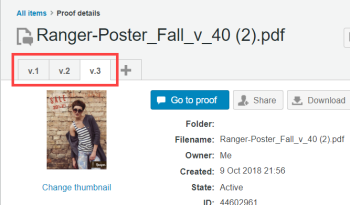

# Administración de versiones de revisión en [!DNL Workfront Proof]

>[!IMPORTANT]
>
>Este artículo hace referencia a la funcionalidad del producto independiente [!DNL Workfront Proof]. Para obtener información sobre la revisión dentro de [!DNL Adobe Workfront], consulte [Revisión](../../../review-and-approve-work/proofing/proofing.md).

Gestionar los comentarios de varias versiones o revisiones de un trabajo puede suponer un gran reto. [!DNL Workfront Proof] simplifica este proceso al permitirle crear y comparar varias versiones de una revisión.

No hay límite en cuanto al número de versiones de una revisión que puede crear. Por lo tanto, si necesita pasar por muchas revisiones con un cliente para obtener una aprobación final, todas las versiones creadas se pueden ver y administrar fácilmente dentro de [!DNL Workfront Proof].

Los permisos son específicos de una versión, por lo que puede conceder a una persona permiso para ver una versión, pero no otra. Por el contrario, si comparte una versión posterior con una persona, no podrá ver las versiones anteriores a menos que vuelva atrás y las añada explícitamente también a esas versiones anteriores.

Para crear una nueva versión de una prueba, debe tener derechos de edición sobre la prueba.

Consulte [Administrar funciones de prueba en  [!DNL Workfront Proof]](../../../workfront-proof/wp-work-proofsfiles/share-proofs-and-files/manage-proof-roles.md) para obtener más información sobre quién tiene derechos de edición en una prueba. Consulte para obtener más información sobre la creación de versiones.

## Visualización de versiones de revisión en el visor de corrección

El nombre completo de la versión que está viendo se muestra en la parte superior izquierda del visor de corrección. Las demás versiones de la revisión solo se mostrarán como números de versión.

1. Abra una revisión en el visor de corrección, de acuerdo con la descripción que hay en [Apertura de una revisión en  [!DNL Workfront Proof]](../../../workfront-proof/wp-work-proofsfiles/review-proofs-wpv/open-proof.md).
1. En el visor de corrección, haga clic en el número de versión que aparece a la derecha del nombre de la revisión.
1. Para ver la otra versión, haga clic en su nombre en el menú que aparece al hacer clic en el número de versión.
1. Para comparar dos versiones, haga clic en el icono de **[!UICONTROL Comparar pruebas]**.\
   \
   Si hay varias versiones de la revisión, puede seleccionar qué dos versiones desea comparar haciendo clic en el número de versión correspondiente a cada lado de la pantalla de división del modo de comparación.

Para obtener información sobre la revisión de pruebas en un visor de corrección, consulte [Revisión de una prueba](../../../review-and-approve-work/proofing/reviewing-proofs-within-workfront/review-a-proof/review-a-proof.md).

## Acceso a las versiones de revisión mediante la página de detalles de la revisión

Puede acceder a todas las versiones de una revisión a través de la página de detalles de la revisión.

1. Abra la página de detalles de la revisión correspondientes a una revisión según la descripción de [Administrar detalles de la revisión en  [!DNL Workfront Proof]](../../../workfront-proof/wp-work-proofsfiles/manage-your-work/manage-proof-details.md).
1. Haga clic en la pestaña correspondiente a las pestañas de la versión en la parte superior de la página y haga clic en **[!UICONTROL Ir a la revisión]** para abrir la versión que desee en el visor de corrección.\
   

## Vinculación de versiones de revisión

Si la revisión tiene varias versiones, la versión anterior de la revisión se conoce comúnmente como prueba revisión.

Si desea cambiar la prueba principal (versión anterior) a otra prueba de su cuenta o conectar una sola prueba a otra prueba de su cuenta (como una nueva versión de la otra prueba), puede hacerlo fácilmente siguiendo estos pasos:

1. Abra la página de detalles de la revisión correspondientes a una revisión, según la descripción de [Administrar detalles de la revisión en  [!DNL Workfront Proof]](../../../workfront-proof/wp-work-proofsfiles/manage-your-work/manage-proof-details.md).
1. Haga clic en **[!UICONTROL Más]** > **[!UICONTROL Cambiar la versión anterior]**.

1. En el cuadro **[!UICONTROL Cambiar la versión anterior]** que aparece, seleccione la prueba que desee establecer como prueba principal (versión anterior).\
   Si necesita ayuda para encontrar la prueba en la lista, puede ordenar las columnas haciendo clic en el encabezado de la columna.

1. Haga clic en **[!UICONTROL Cambiar la versión anterior]** en la parte inferior del cuadro para conectar versiones.

>[!NOTE]
>
>Cuando conecta una prueba a otra prueba de su cuenta (como una nueva versión), [!DNL Workfront Proof] bloquea la prueba que ahora es de la versión anterior.

## Desvinculación de las versiones de prueba

Puede desvincular la prueba que está viendo actualmente de su prueba principal (versión anterior) sin vincularla a otra prueba de su cuenta:

1. Abra la página Detalles de la revisión, de acuerdo con la descripción de [Administrar detalles de la revisión en  [!DNL Workfront Proof]](../../../workfront-proof/wp-work-proofsfiles/manage-your-work/manage-proof-details.md).
1. Haga clic en **[!UICONTROL Más]** > **[!UICONTROL Quitar vínculo a la versión anterior]**.

   * Solo se puede desvincular (desconectar) la última versión de todo el conjunto de versiones. A continuación, se convertirá en una sola prueba.
   * Si necesita insertar una versión entre dos versiones existentes, puede desvincular todas las versiones de la misma prueba y volver a vincularlas en el orden correcto.

## Acerca de los conjuntos de versiones y los límites de prueba

Cada conjunto de cinco versiones contará como una prueba de su límite total de pruebas.

Por ejemplo, si carga cinco versiones de un diseño (incluida la versión original), eso cuenta como una prueba. Si carga seis versiones de un diseño, eso cuenta como dos pruebas. Once versiones contarían como tres pruebas, etc.

En el caso de los archivos audiovisuales, cada nueva versión se cuenta como una nueva prueba.
