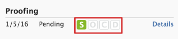
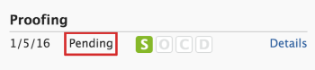
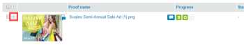
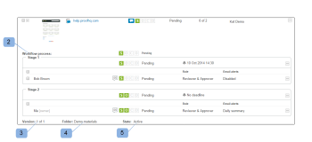
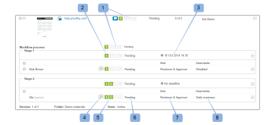
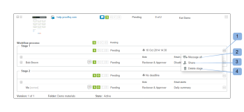
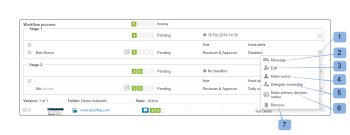
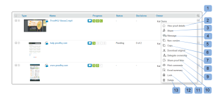

# Ver el progreso y el estado de una prueba en [!DNL Workfront Proof]

>[!IMPORTANT]
>
>Este artículo hace referencia a la funcionalidad del producto independiente [!DNL Workfront Proof]. Para obtener información sobre la revisión dentro de [!DNL Adobe Workfront], consulte [Revisión](../../../review-and-approve-work/proofing/proofing.md).

## Explicación del progreso de la revisión

Progreso de la revisión indica el trabajo realizado en una revisión desde el momento en que esta se envía a los destinatarios hasta el momento en que estos toman una decisión sobre ella.

* [Iconos de progreso](#progress-icons)
* [Niveles de progreso de la revisión](#levels-of-proof-progress)

### Iconos de progreso {#progress-icons}

Los iconos de progreso S, O, C y D aparecen en la barra de progreso para indicar el progreso de la revisión.

Indican la siguiente información sobre una prueba:

<table style="table-layout:auto"> 
 <col> 
 <col> 
 <thead> 
  <tr> 
   <td> 
<strong>Icono de progreso</strong> 
 </td> 
   <td> 
<strong>Descripción</strong> 
 </td> 
  </tr> 
 </thead> 
 <tbody> 
  <tr> 
   <td> 
  
 </td> 
   <td> 
<strong>Enviado</strong>. La prueba se ha enviado a los revisores.
 </td> 
  </tr> 
  <tr> 
   <td> 
  
 
 
 </td> 
   <td> 
<strong>Abierta</strong>. Un revisor ha abierto la página de detalles de la revisión o la propia revisión en el visor de corrección.
 </td> 
  </tr> 
  <tr> 
   <td> 
  
 </td> 
   <td> 
<strong>Comentarios</strong>. Los revisores (usuarios que pueden hacer comentarios) han hecho comentarios sobre la prueba.
 
Si no hay ningún revisor designado para la prueba, este icono no se muestra.
 </td> 
  </tr> 
  <tr> 
   <td> 
  
 </td> 
   <td> 
<strong>Decisión</strong>. Un revisor ha tomado una decisión sobre la prueba.
 
Si no hay aprobadores (responsables de la toma de decisiones) designados para la prueba, este icono no se muestra. 
 </td> 
  </tr> 
 </tbody> 
</table>

Estos iconos pueden aparecer en los colores siguientes para indicar información sobre el progreso de la prueba:

* **Verde**. Finalizado.
* **Blanco**. No se ha finalizado.
* **Naranja**. No se ha finalizado y la fecha límite es en menos de 24 horas.
* **Rojo**. No se ha completado y ha pasado la fecha límite.

### Niveles de progreso de la revisión {#levels-of-proof-progress}

Workfront Proof utiliza los iconos de progreso para rastrear el progreso de una prueba en cada uno de los siguientes niveles:

* Para cada revisor, en función de la actividad de esa persona en la prueba.
* Para cada fase, en función del progreso del revisor en el escenario en que esté más retrasado en el proceso de revisión. Para obtener más información, consulte [Información general sobre las fases del flujo de trabajo automatizado](../../../review-and-approve-work/proofing/proofing-overview/stages.md).
* Para la prueba, en función del progreso de la etapa (grupo de revisores), que es el que va más retrasado en el proceso de revisión.

Para ver un ejemplo de cómo determina [!DNL Workfront Proof] el progreso mediante el revisor o la fase que está más atrasada, supongamos que tres revisores de una prueba necesitan tomar una decisión. Si dos de ellos han tomado su decisión pero el tercero no, la barra de progreso de la prueba no muestra la letra D en verde debido a que la decisión pendiente.

Si el ajuste [!UICONTROL Primary Decision Maker] se selecciona en una prueba y el responsable de la toma de decisiones principal envía una decisión, el ID de la barra de progreso de la revisión se vuelve verde para todos los revisores porque no se requieren otras decisiones.

Del mismo modo, si se selecciona la configuración [!UICONTROL Only One Decision Required] en una prueba y cualquier revisor envía una decisión, el ID de la barra de progreso de la revisión se vuelve verde para todos los revisores porque no se requieren otras decisiones.

## Explicación del estado de la prueba

El estado de la prueba muestra el estado de las decisiones que se requieren para la prueba.

\
Las opciones de estado estándar son los siguientes:

* Pendiente
* Aprobado
* Aprobado con cambios
* Es necesario hacer cambios
* No es relevante

Si las decisiones personalizadas se configuran en la cuenta, las opciones de estado reflejan la configuración de decisiones personalizadas.

El estado de la prueba lo determina el participante “en el peor de los casos”. Por ejemplo, supongamos que hay tres decisiones sobre la prueba: dos tienen el estado **Aceptado** y una tiene el estado **Rechazado**. La decisión “en el peor de los casos” de Rechazado sobrepasa las reglas de las demás decisiones y el estado general de la prueba se muestra como **Rechazado**.

## Ver progreso y estado {#viewing-progress-and-status}

Puede ver el progreso y el estado de las pruebas, las fases y los revisores de cada fase.

* [Resumen de la prueba](#proof-summary)
* [Menú Acciones de la fase](#stage-actions-menu)
* [En la sección [!UICONTROL Resumen], también puede acceder a los menús de acciones del revisor, siempre que tenga derechos de edición sobre la prueba. Para obtener más información, consulte Perfiles de permisos de prueba en Workfront Proof y Administrar funciones de prueba en Workfront Proof. El menú [!UICONTROL Acciones del revisor] (1) aparece cuando pasa el puntero por encima de los detalles del revisor y le permite:](#in-the-summary-section-you-can-also-access-the-reviewer-actions-menus-provided-you-have-edit-rights-on-the-proof-for-more-information-see-proof-permissions-profiles-in-workfront-proof-and-manage-proof-roles-in-workfront-proof-the-reviewer-actions-menu-1-appears-when-you-hover-over-the-reviewer-s-details-and-allows-you-to)
* [Menú Acciones de prueba](#proof-actions-menu)

### Resumen de la prueba {#proof-summary}

Cada prueba de la carpeta tiene un resumen ampliable que le permite ver y editar rápidamente los detalles de la prueba.

Para expandir o contraer el resumen lo haga siguiente:

1. Haga clic en la flecha a la izquierda de la prueba en el panel de control o en cualquier vista de lista.

El resumen incluye lo siguiente:

* Flujo de trabajo (2)
* Versión (3)
* Carpeta (4)
* Estado (5)\
   

En el resumen, puede ver y editar los siguientes detalles de la prueba:

* Progreso de la revisión (1)
* Progreso de cada fase (2)
* Plazo establecido para la fase (3)
* Detalles del revisor:

   * Número de comentarios y respuestas de cada revisor (4)
   * Progreso de cada revisor (5)
   * Decisión (si una decisión ha incluido firmas electrónicas, se mostrará un icono junto a la decisión que lo indique). (6)
   * Función en la prueba (7)
   * Configuración de alertas de correo electrónico (8)

>[!NOTE]
>
>La capacidad para editar los detalles de la prueba depende de los derechos que tenga sobre la misma (consulte [Perfiles de permisos de prueba en [!DNL Workfront Proof]](../../../workfront-proof/wp-acct-admin/account-settings/proof-perm-profiles-in-wp.md) y [Administrar funciones de prueba en  [!DNL Workfront Proof]](../../../workfront-proof/wp-work-proofsfiles/share-proofs-and-files/manage-proof-roles.md)).

### Menú [!UICONTROL Acciones de la fase]  {#stage-actions-menu}

Cada fase del flujo de trabajo tiene un menú independiente, que le permite realizar acciones de forma masiva relacionadas con los revisores de dicha fase.

El menú [!UICONTROL Acciones de la fase] aparece cuando pasa el puntero por encima de la sección Fase (1) y le permite efectuar lo siguiente:

* [!UICONTROL Enviar mensaje a todos] (2)
* [!UICONTROL Compartir] (3)
* [!UICONTROL Eliminar fase] (4)

>[!NOTE]
>
>La disponibilidad de estas opciones depende de los derechos que tenga sobre la prueba (consulte [Perfiles de permisos de prueba en [!DNL Workfront Proof]](../../../workfront-proof/wp-acct-admin/account-settings/proof-perm-profiles-in-wp.md) y [Administrar funciones de prueba en [!DNL Workfront Proof]](../../../workfront-proof/wp-work-proofsfiles/share-proofs-and-files/manage-proof-roles.md)).

En la sección Resumen, también puede acceder a los menús de acciones del revisor, siempre que tenga derechos de edición sobre la prueba. Para obtener más información, consulte [Perfiles de permisos de prueba en [!DNL Workfront Proof]](../../../workfront-proof/wp-acct-admin/account-settings/proof-perm-profiles-in-wp.md) y [Administrar funciones de prueba en [!DNL Workfront Proof]](../../../workfront-proof/wp-work-proofsfiles/share-proofs-and-files/manage-proof-roles.md). El menú de acciones del revisor (1) aparece cuando pasa el puntero por encima de los detalles del revisor y le permite:

* Enviar un mensaje al revisor (2)
* Editar detalles del revisor (3): permite editar el nombre para mostrar, la función de prueba y las alertas de correo electrónico de ese revisor
* Convertirlos en propietarios de la prueba (4)
* Convertirlos en el principal responsable de la toma de decisiones (5)
* Quitar de la prueba (6)

>[!NOTE]
>
>La visibilidad de estas opciones depende de los derechos que tenga sobre la revisión (consulte [Perfiles de permisos de prueba en [!DNL Workfront Proof]](../../../workfront-proof/wp-acct-admin/account-settings/proof-perm-profiles-in-wp.md) y [Administrar funciones de prueba en [!DNL Workfront Proof]](../../../workfront-proof/wp-work-proofsfiles/share-proofs-and-files/manage-proof-roles.md)).

### Menú Acciones de prueba {#proof-actions-menu}

Cada revisión también tiene un menú (1) que le permite realizar las siguientes acciones:

* Puede acceder a la página de detalles de la prueba (2)
* Compartir la prueba con otras personas (3)
* Enviar un mensaje a los revisores (4)
* Crear una nueva versión de la prueba (5)
* Copiar la prueba (6)
* Descargar el archivo original (7)
* Compartir enlaces de revisión (8)
* Imprimir comentarios (9)
* Solicitar un resumen de Excel de la prueba (10)
* Bloquear la prueba (11)
* Eliminar la prueba (12)

>[!NOTE]
>
>La disponibilidad de estas opciones depende de los derechos que tenga sobre la prueba (consulte [Perfiles de permisos de prueba en [!DNL Workfront Proof]](../../../workfront-proof/wp-acct-admin/account-settings/proof-perm-profiles-in-wp.md) y [Administrar funciones de prueba en [!DNL Workfront Proof]](../../../workfront-proof/wp-work-proofsfiles/share-proofs-and-files/manage-proof-roles.md)).

Para obtener información sobre cómo ver el progreso y el estado de la prueba en [!DNL Workfront], consulte [Ver progreso y estado](#viewing-progress-and-status).

Para obtener información sobre el progreso y el estado de visualización en el visor de corrección de escritorio, consulte [Revisar un flujo de trabajo en el visor de revisión](../../../workfront-proof/wp-work-proofsfiles/review-proofs-wpv/review-workflow.md).
