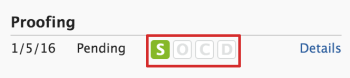
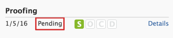

# Ver el progreso y estado de una prueba en [!DNL Workfront Proof]

>[!IMPORTANT]
>
>Este artículo se refiere a la funcionalidad en el producto independiente [!DNL Workfront Proof]. Para obtener información sobre pruebas en el interior [!DNL Adobe Workfront], consulte [Prueba](../../../review-and-approve-work/proofing/proofing.md).

## Explicación del progreso de la prueba

El progreso de la prueba indica el trabajo realizado en una prueba desde el momento en que envía la prueba a los revisores hasta el momento en que toman una decisión sobre la prueba.

* [Iconos de progreso](#progress-icons)
* [Niveles de progreso de la prueba](#levels-of-proof-progress)

### Iconos de progreso {#progress-icons}

Los iconos de progreso, S, O, C y D, aparecen en la barra de progreso para indicar el progreso de la prueba.

Indican la siguiente información sobre una prueba:

<table style="table-layout:auto"> 
 <col> 
 <col> 
 <thead> 
  <tr> 
   <td> 
<strong>Icono de progreso</strong> 
 </td> 
   <td> 
<strong>Descripción</strong> 
 </td> 
  </tr> 
 </thead> 
 <tbody> 
  <tr> 
   <td> 
  
 </td> 
   <td> 
<strong>Se envió</strong>. La prueba se ha enviado a los revisores.
 </td> 
  </tr> 
  <tr> 
   <td> 
  
 
 
 </td> 
   <td> 
<strong>Se abrió</strong>. Un revisor ha abierto la página de detalles de la prueba o la propia prueba en el visor de pruebas.
 </td> 
  </tr> 
  <tr> 
   <td> 
  
 </td> 
   <td> 
<strong>Comentarios</strong>. Los revisores (usuarios que pueden realizar comentarios) han hecho comentarios en la prueba.
 
Si no hay revisores designados para la prueba, este icono no se muestra.
 </td> 
  </tr> 
  <tr> 
   <td> 
  
 </td> 
   <td> 
<strong>Decisión</strong>. Un revisor ha tomado una decisión sobre la prueba.
 
Si no hay aprobadores (responsables de la toma de decisiones) designados para la prueba, este icono no se muestra. 
 </td> 
  </tr> 
 </tbody> 
</table>

Estos iconos pueden aparecer en los colores siguientes para indicar cierta información sobre el progreso de la prueba:

* **Verde**. Finalizado.
* **Blanco**. No completado.
* **Naranja**. No completado y la fecha límite es inferior a 24 horas.
* **Rojo**. No está completo y ha pasado el plazo.

### Niveles de progreso de la prueba {#levels-of-proof-progress}

Workfront Proof utiliza los iconos de progreso para rastrear el progreso de una prueba en cada uno de los niveles siguientes:

* Para cada revisor, en función de la actividad de esa persona en la prueba.
* Para cada fase, en función del progreso, el revisor en la fase que está más detrás en el proceso de prueba. Para obtener más información, consulte [Resumen de las etapas del flujo de trabajo automatizado](../../../review-and-approve-work/proofing/proofing-overview/stages.md).
* Para la prueba, en función del progreso de la fase (grupo de revisores) que es la más atrasada en el proceso de prueba.

Para ver un ejemplo de cómo [!DNL Workfront Proof] determina el progreso mediante el revisor o la fase que está más detrás, supongamos que tres revisores de una prueba deben tomar una decisión. Si dos de ellos han tomado su decisión pero la tercera no, la barra de progreso de la prueba no muestra la D en verde debido a la decisión pendiente.

Si la variable [!UICONTROL Creador de decisiones principal] se selecciona en una prueba y el principal responsable de la toma de decisiones envía una decisión, el ID de la barra de progreso de la prueba se vuelve verde para todos los revisores porque no se necesitan otras decisiones.

Del mismo modo, si la variable [!UICONTROL Solo se requiere una decisión] se selecciona en una prueba y cualquier revisor envía una decisión, el ID de la barra de progreso de la prueba se vuelve verde para todos los revisores porque no se necesitan otras decisiones.

## Explicación del estado de la prueba

El estado de la prueba muestra el estado de las decisiones necesarias para la prueba.

\
Las opciones de estado estándar son:

* Pendiente
* Aprobado
* Aprobado con cambios
* Cambios necesarios
* No relevante

Si las decisiones personalizadas están configuradas en la cuenta, las opciones de estado reflejarán la configuración de decisión personalizada.

El estado de la prueba está determinado por el participante &quot;en el peor de los casos&quot;. Por ejemplo, supongamos que hay tres decisiones sobre la prueba: dos tienen el estado de **Aceptado** y uno tiene el estado de **Rechazado**. La decisión del &quot;peor de los casos&quot; de Rechazado prevalece sobre las demás decisiones y el estado general de la prueba se muestra como **Rechazado**.

## Visualización del progreso y el estado {#viewing-progress-and-status}

Puede ver el progreso y el estado de las pruebas, las etapas y los revisores en cada etapa.

* [Resumen de prueba](#proof-summary)
* [Menú Acciones de escenario](#stage-actions-menu)
* [En el [!UICONTROL Resumen] , también puede acceder a los menús de acciones del revisor, siempre que tenga derechos de edición en la prueba. Para obtener más información, consulte Perfiles de permisos de prueba en Workfront Proof y Administrar funciones de prueba en Workfront Proof. La variable [!UICONTROL Acciones del revisor] (1) aparece al pasar el ratón por encima de los detalles del revisor y le permite:](#in-the-summary-section-you-can-also-access-the-reviewer-actions-menus-provided-you-have-edit-rights-on-the-proof-for-more-information-see-proof-permissions-profiles-in-workfront-proof-and-manage-proof-roles-in-workfront-proof-the-reviewer-actions-menu-1-appears-when-you-hover-over-the-reviewer-s-details-and-allows-you-to)
* [Menú Acciones de prueba](#proof-actions-menu)

### Resumen de prueba {#proof-summary}

Cada prueba de la carpeta tiene un resumen ampliable que le permite ver y editar rápidamente los detalles de la prueba.

Para expandir o contraer el resumen:

1. Haga clic en la flecha a la izquierda de la prueba en el panel o en cualquier vista de lista.

El resumen incluye lo siguiente:

* Flujo de trabajo (2)
* Versión (3)
* Carpeta (4)
* Estado (5)\
   

En el resumen, puede ver y editar los siguientes detalles de la prueba:

* Progreso de la prueba (1)
* Progreso de cada etapa (2)
* Plazo fijado para la fase (3)
* Detalles del revisor:

   * Número de comentarios y respuestas de cada revisor (4)
   * Progreso de cada revisor (5)
   * Decisión (si una decisión ha incluido firmas electrónicas, se mostrará un icono junto a la decisión que lo indique). (6)
   * Función de la prueba (7)
   * Configuración de alertas de correo electrónico (8)

>[!NOTE]
>
>La capacidad de editar los detalles de la prueba depende de los derechos de la prueba (consulte [Perfiles de permisos de prueba en [!DNL Workfront Proof]](../../../workfront-proof/wp-acct-admin/account-settings/proof-perm-profiles-in-wp.md) y [Administrar funciones de prueba en [!DNL Workfront Proof]](../../../workfront-proof/wp-work-proofsfiles/share-proofs-and-files/manage-proof-roles.md)).

### [!UICONTROL Acciones de fase] Menú  {#stage-actions-menu}

Cada etapa del flujo de trabajo tiene un menú independiente que le permite realizar acciones masivas relacionadas con los revisores en esa etapa.

La variable [!UICONTROL Acciones de escenario] aparece al pasar el ratón por encima de la sección del escenario (1) y le permite

* [!UICONTROL Mensaje todo] (2)
* [!UICONTROL Compartir] (3)
* [!UICONTROL Eliminar etapa] (4)

>[!NOTE]
>
>La disponibilidad de estas opciones depende de los derechos de la prueba (consulte [Perfiles de permisos de prueba en [!DNL Workfront Proof]](../../../workfront-proof/wp-acct-admin/account-settings/proof-perm-profiles-in-wp.md) y [Administrar funciones de prueba en [!DNL Workfront Proof]](../../../workfront-proof/wp-work-proofsfiles/share-proofs-and-files/manage-proof-roles.md)).

En la sección Resumen, también puede acceder a los menús de acciones del revisor, siempre que tenga derechos de edición en la prueba. Para obtener más información, consulte [Perfiles de permisos de prueba en [!DNL Workfront Proof]](../../../workfront-proof/wp-acct-admin/account-settings/proof-perm-profiles-in-wp.md) y [Administrar funciones de prueba en [!DNL Workfront Proof]](../../../workfront-proof/wp-work-proofsfiles/share-proofs-and-files/manage-proof-roles.md). El menú Acciones del revisor (1) aparece al pasar el ratón por encima de los detalles del revisor y le permite:

* Envío de un mensaje al revisor (2)
* Editar los detalles del revisor (3): permite editar el nombre para mostrar, la función de prueba y la alerta de correo electrónico para ese revisor
* Conversión en propietario de la prueba (4)
* Convertirlos en los principales responsables de la toma de decisiones (5)
* Retirar de la prueba (6)

>[!NOTE]
>
>La visibilidad de estas opciones depende de los derechos de la prueba (consulte [Perfiles de permisos de prueba en [!DNL Workfront Proof]](../../../workfront-proof/wp-acct-admin/account-settings/proof-perm-profiles-in-wp.md) y [Administrar funciones de prueba en [!DNL Workfront Proof]](../../../workfront-proof/wp-work-proofsfiles/share-proofs-and-files/manage-proof-roles.md)).

### Menú Acciones de prueba {#proof-actions-menu}

Cada prueba también tiene un menú (1) que le permite realizar las siguientes acciones:

* Puede acceder a la página Detalles de la prueba (2)
* Comparta la prueba con otras personas (3)
* Envío de un mensaje a los revisores (4)
* Crear una nueva versión de la prueba (5)
* Copiar la prueba (6)
* Descargar el archivo original (7)
* Compartir vínculos de prueba (8)
* Imprimir comentarios (9)
* Solicitar un resumen de Excel de la prueba (10)
* Bloqueo de la prueba (11)
* Eliminar la prueba (12)

>[!NOTE]
>
>La disponibilidad de estas opciones depende de los derechos de la prueba (consulte [Perfiles de permisos de prueba en [!DNL Workfront Proof]](../../../workfront-proof/wp-acct-admin/account-settings/proof-perm-profiles-in-wp.md) y [Administrar funciones de prueba en [!DNL Workfront Proof]](../../../workfront-proof/wp-work-proofsfiles/share-proofs-and-files/manage-proof-roles.md)).

Para obtener información sobre cómo ver el progreso y el estado de la prueba en [!DNL Workfront], consulte [Visualización del progreso y el estado](#viewing-progress-and-status).

Para obtener información sobre cómo ver el progreso y el estado en el Visor de prueba de escritorio, consulte [Revisar un flujo de trabajo en el visor de pruebas](../../../workfront-proof/wp-work-proofsfiles/review-proofs-wpv/review-workflow.md).
