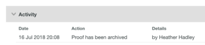

# Archivar en [!DNL Workfront Proof]

>[!IMPORTANT]
>
>Este artículo hace referencia a la funcionalidad del producto independiente [!DNL Workfront Proof]. Para obtener información sobre la revisión dentro de [!DNL Adobe Workfront], vea [Revisión](../../../review-and-approve-work/proofing/proofing.md).

[!DNL Workfront Proof] archiva pruebas después de un período de 60 días de inactividad.

Si tiene derechos de edición, puede archivar manualmente una prueba en cualquier momento. Para obtener información acerca de los derechos de edición, vea [Perfiles de permisos de revisión en [!DNL Workfront Proof]](../../../workfront-proof/wp-acct-admin/account-settings/proof-perm-profiles-in-wp.md).

Pruebas archivadas:

* Aparecer solo en la vista de pruebas archivadas de la página Vistas (consulte &quot;Cómo saber si una prueba está archivada&quot; a continuación)
* Permanecer en su cuenta indefinidamente (a menos que se eliminen)
* Cualquier persona puede desarchivar el informe en cualquier momento (incluidos los revisores que no son [!DNL Workfront Proof] usuarios)
* No cuente hasta su límite de almacenamiento
* Bloquear automáticamente cuando se archivan automáticamente
* Se puede bloquear o desbloquear cuando se archiva manualmente

El archivado y el desarchivado se registran en la sección Actividad de la prueba. Para obtener más información, consulte [Administrar detalles de revisión en [!DNL Workfront Proof]](../../../workfront-proof/wp-work-proofsfiles/manage-your-work/manage-proof-details.md).

>[!NOTE]
>
>No puede archivar archivos y carpetas.

## Archivado manual de pruebas

Si tiene derechos de edición, puede archivar manualmente una prueba en cualquier momento. Para obtener información acerca de los derechos de edición, vea [Perfiles de permisos de revisión en [!DNL Workfront Proof]](../../../workfront-proof/wp-acct-admin/account-settings/proof-perm-profiles-in-wp.md).

El proceso de archivado puede tardar hasta 24 horas en completarse.

1. En el panel o en una vista de lista, active la casilla de verificación de cada revisión que desee archivar (consulte [Administrar elementos en la página Vistas en [!DNL Workfront Proof]](../../../workfront-proof/wp-work-proofsfiles/manage-your-work/manage-items-on-views-page.md) para obtener información sobre las vistas de lista).

1. Seleccione **[!UICONTROL Más]** > **[!UICONTROL Archivo]**.\
   Aparecerá el cuadro de mensaje [!UICONTROL Archivar pruebas].

1. Haga clic en una opción para especificar si desea que la prueba esté bloqueada o desbloqueada mientras se archiva.\
   [!DNL Workfront Proof] archiva la prueba con la opción de bloqueo que especifique.

## Listado de pruebas archivadas

Una revisión que se ha archivado solo aparece en la vista **[!UICONTROL Pruebas archivadas]**, con el icono archivado a la derecha del nombre de la revisión.

Para mostrar la vista Pruebas archivadas:

1. Haga clic en **[!UICONTROL Vistas]** y, a continuación, haga clic en **[!UICONTROL Todos los elementos]** > **[!UICONTROL Pruebas archivadas]**.

   Al hacer clic en el nombre de una prueba archivada en esta lista, aparece la página [!UICONTROL Detalles de la prueba], que muestra un botón **[!UICONTROL Desarchivar]** en la parte superior de esta página.

   Además, si expande la sección **[!UICONTROL Actividad]** en esta página, podrá ver una entrada que le indicará cuándo se archivó la prueba y quién la archivó.\
   \
   Si la sección **[!UICONTROL Actividad]** no muestra el nombre del usuario que archivó la prueba, significa que la prueba se archivó automáticamente después de 60 días de inactividad.\
   Para ver el contenido de una prueba archivada, primero debe desarchivarla.

## Desarchivar pruebas

Cualquiera puede desarchivar una prueba en cualquier momento. Esto incluye a los revisores que no son [!DNL Workfront Proof] usuarios.

Para desarchivar una prueba desde la vista Pruebas archivadas:

1. Haga clic en **[!UICONTROL Vistas]** y, a continuación, haga clic en **[!UICONTROL Todos los elementos]** > **[!UICONTROL Pruebas archivadas]**.

1. Haga clic en la casilla de verificación situada junto a las pruebas que desee desarchivar.
1. Haga clic en **[!UICONTROL Más]** y, a continuación, haga clic en **[!UICONTROL Desarchivar]** en el menú que aparece.\
   Aparece un mensaje en la parte superior de la página para indicar que se está desarchivando la prueba.
