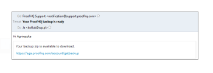

# Hacer Una Copia De Seguridad De Los Datos De [!DNL Workfront Proof]

>[!IMPORTANT]
>
>Este artículo hace referencia a la funcionalidad del producto independiente [!DNL Workfront Proof]. Para obtener información sobre la revisión dentro de [!DNL Adobe Workfront], vea [Revisión](../../../review-and-approve-work/proofing/proofing.md).

## Introducción a las copias de seguridad

Puede solicitar una copia de seguridad de todos sus datos en [!DNL Workfront Proof] mediante la función de copia de seguridad.

La copia de seguridad se enviará como archivo .zip. Incluye una exportación XML de todos los datos (incluidos los comentarios y las respuestas de todas las versiones de todas las pruebas); sin embargo, no incluye los archivos originales cargados como pruebas.

Cada archivo .zip de copia de seguridad creado para que lo descargue tiene un nombre de archivo único, como:

9789_05_05_2011_61703.zip

El nombre de archivo de este ejemplo proporciona la siguiente información:

* 9789 es su identificador de cuenta [!DNL Workfront Proof]
* 05_05_2011 es la fecha de creación, 5 de mayo de 2011
* 61703 es un número aleatorio asignado por el sistema

Esta convención de nombres le facilita almacenar todos los archivos .zip de copia de seguridad en una sola ubicación en el equipo y saber exactamente cuándo se creó cada copia de seguridad para usted.

La función [!UICONTROL Copia de seguridad] le permite decidir cómo usar sus recursos:

* Permite liberar espacio de almacenamiento sin perder las pruebas activas o archivadas. Puede solicitar una copia de seguridad, eliminar las pruebas y vaciar la [restauración y vaciar la papelera en [!DNL Workfront Proof]](../../../workfront-proof/wp-work-proofsfiles/manage-your-work/restore-and-empty-trash.md).
* Permite acceder a cualquier archivo que haya cargado originalmente en [!DNL Workfront] Proof. Puede descargarlas mediante la función [!UICONTROL descargar archivo original] antes de eliminar las pruebas.

>[!NOTE]
>
>Tenga en cuenta lo siguiente al utilizar copias de seguridad:
>
>* Las copias de seguridad están disponibles en los planes Enterprise y Unlimited. Póngase en contacto con nuestro [equipo de ventas](mailto:sales@proofhq.com) para obtener un presupuesto.
>* El tipo de codificación de datos se establece en UTF-8 de forma predeterminada y se recomienda esta configuración. Es el tipo de codificación más utilizado por las aplicaciones de Internet.
>* Solo puede solicitar un(a) [!DNL backup] a la vez. Cuando se procese el archivo .zip de copia de seguridad, el vínculo Solicitar nueva copia de seguridad de la ficha Copias de seguridad no aparecerá y el mensaje mostrado permanecerá sin cambios. Para obtener información sobre cómo solicitar una copia de seguridad, consulte [Solicitar una copia de seguridad de datos nueva en [!DNL Workfront Proof]](../../../workfront-proof/wp-acct-admin/account-settings/request-new-data-backup-in-wp.md).
>

## Copia de seguridad de los datos

1. Haga clic en **[!UICONTROL Configuración de la cuenta]** en la esquina superior derecha de la interfaz [!DNL Workfront Proof]. (1)
1. Haga clic en la ficha **[!UICONTROL Copias de seguridad]**. (2)
1. Haga clic en el vínculo **[!UICONTROL Solicitar nueva copia de seguridad]** (3)

Cuando la copia de seguridad está lista, ocurre lo siguiente:

* Recibió un mensaje de correo electrónico de [!DNL Workfront Proof] en el que se le notifica (&quot;Su copia de seguridad de [!DNL Workfront Proof] está lista&quot;). El correo electrónico contiene un vínculo de descarga para los datos de copia de seguridad.
* La ficha Copia de seguridad de [Configuración de la cuenta](https://support.workfront.com/hc/en-us/sections/115000912147-Account-settings) muestra un vínculo de descarga para los datos de la copia de seguridad.
* El enlace Solicitar nueva copia de seguridad (3) vuelve a aparecer en la pestaña Copias de seguridad

Los datos estarán listos para descargarse como archivo zip. Puede descargar el archivo .zip de copia de seguridad desde el mensaje de correo electrónico de notificación o en la [!UICONTROL configuración de la cuenta], tal como se describe en las secciones siguientes:

* [Descargando el archivo .zip de copia de seguridad desde la notificación por correo electrónico](#downloading-your-backup-zip-file-from-your-email-notification)
* [Descargando el archivo .zip de copia de seguridad desde la configuración de la cuenta](#downloading-your-backup-zip-file-from-the-account-settings)

## Descargando el archivo .zip de copia de seguridad desde la notificación por correo electrónico {#downloading-your-backup-zip-file-from-your-email-notification}

Cuando el archivo .zip de copia de seguridad esté listo para descargarse, recibirá un mensaje de correo electrónico de [!DNL Workfront Proof] con la línea de asunto &quot;La copia de seguridad de [!DNL Workfront Proof] está lista&quot;.

Para descargar el archivo .zip de copia de seguridad desde el correo electrónico:

1. En el correo electrónico, haga clic en el vínculo de descarga.\
   \
   Si actualmente no inició sesión en [!DNL Workfront Proof], se abre una nueva ventana del explorador y se muestra la página de inicio de sesión.

## Descargando el archivo .zip de copia de seguridad desde la configuración de la cuenta {#downloading-your-backup-zip-file-from-the-account-settings}

Cuando el archivo .zip de copia de seguridad está listo para descargarse, la ficha [!UICONTROL Copia de seguridad] lo indica mostrando un vínculo de descarga. Además, el vínculo [!UICONTROL Solicitar nueva copia de seguridad] vuelve a aparecer.

1. Haga clic en **[!UICONTROL Configuración de la cuenta]** en la esquina superior derecha de la interfaz [!DNL Workfront Proof]. (1)
1. Haga clic en la ficha **[!UICONTROL Copias de seguridad]**. (2)\
   Si ningún usuario de su cuenta ha solicitado ninguna copia de seguridad, la ficha [!UICONTROL Copias de seguridad] indica que no tiene copias de seguridad. Si un usuario ha solicitado una copia de seguridad, la pestaña muestra la fecha de creación y el vínculo de descarga de la última copia de seguridad.

1. Haga clic en el vínculo **[!UICONTROL Descargar copia de seguridad]**. (3)\
    Aparece una pantalla de descarga de archivos en la que se le pregunta si desea abrir o guardar el archivo descargado.

1. Haga clic en **[!UICONTROL Guardar]** y, a continuación, seleccione la ubicación del equipo en la que desea guardar el archivo .zip de copia de seguridad.\
   El mensaje que identifica la fecha de la copia de seguridad más reciente permanece en la parte inferior de la página [!UICONTROL Copia de seguridad] hasta la próxima vez que solicite una copia de seguridad. El vínculo Descargar copia de seguridad se aplica a la última copia de seguridad. Siempre que se muestre el vínculo [!UICONTROL Solicitar nueva copia de seguridad], puede hacer clic en él para solicitar otra copia de seguridad.

## Descripción de los archivos del archivo .zip de copia de seguridad

El archivo .zip de copia de seguridad contiene siete archivos CSV (de valores separados por comas o delimitados por comas) que incluyen información de las pruebas activas y archivadas hasta el momento en que se realizó la copia de seguridad de los datos:

* comments.csv: incluye comentarios en las pruebas
* comment_replies.csv: incluye respuestas a comentarios sobre pruebas organization.csv: incluye el identificador numérico y el nombre de la organización (su cuenta)
* contacts.csv: incluye el identificador numérico, el nombre y la organización de cada contacto
* files.csv: incluye información de la página Detalles de revisión o de la página Detalles del archivo sobre pruebas o archivos cargados en [!DNL Workfront Proof]
* recipients.csv: incluye el identificador numérico, la función y las decisiones de cada persona especificada como revisor, revisor y aprobador, etc., cuando las pruebas se cargan para su revisión en [!DNL Workfront Proof]
* users.csv: incluye identificadores numéricos y nombres de todos los usuarios de la cuenta

Puede extraer estos archivos del archivo .zip de copia de seguridad con cualquier utilidad zip que utilice y, a continuación, almacenarlos en la ubicación que elija en el equipo. Después de guardar el archivo zip y extraer los archivos CSV individuales, puede manipular la información como desee para el mantenimiento de registros interno.

Cada archivo .zip de copia de seguridad creado a petición suya tiene un nombre distintivo que incluye la fecha de creación de la copia de seguridad, pero los archivos CSV incluidos en cada archivo .zip de copia de seguridad siempre tienen los mismos nombres. Puede utilizar uno de los siguientes métodos para asegurarse de que los archivos de copia de seguridad son distintos entre sí:

* Cree una nueva carpeta para cada archivo .zip de copia de seguridad y los archivos CSV que extraiga de él.
* Cambie el nombre de cada archivo CSV individual para incluir la fecha de la copia de seguridad cuando la extraiga del archivo zip.

>[!NOTE]
>
>Si [!DNL Microsoft Excel] está instalado en el equipo, la utilidad de extracción podría indicar el tipo de archivo de los archivos CSV individuales como [!DNL Microsoft Office Excel] archivo de valores separados por comas. Puede abrir un archivo CSV extraído con [!DNL Excel] y guardarlo como un libro de [!DNL Excel] (&#42;.xlsx) o cualquier otro tipo de archivo.
