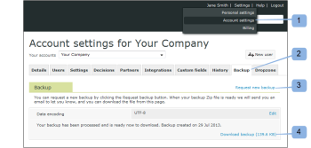

# Haga una copia de seguridad de su [!DNL Workfront Proof] Datos

>[!IMPORTANT]
>
>Este artículo se refiere a la funcionalidad en el producto independiente [!DNL Workfront Proof]. Para obtener información sobre pruebas en el interior [!DNL Adobe Workfront], consulte [Prueba](../../../review-and-approve-work/proofing/proofing.md).

## Introducción a las copias de seguridad

Puede solicitar una copia de seguridad de todos sus datos en [!DNL Workfront Proof] usando la función de copia de seguridad.

La copia de seguridad se le entrega como archivo .zip. Incluye una exportación XML de todos los datos (incluidos comentarios y respuestas para todas las versiones de todas las pruebas); sin embargo, no incluye los archivos originales que ha cargado como pruebas.

Cada archivo .zip de copia de seguridad creado para descargar tiene un nombre de archivo único, como:

9789_05_05_2011_61703.zip

El nombre de archivo de este ejemplo proporciona la siguiente información:

* 9789 es tu [!DNL Workfront Proof] identificador de cuenta
* 05_05_2011 es la fecha de creación, 5 de mayo de 2011
* 61703 es un número aleatorio asignado por el sistema

Esta convención de nombres le facilita almacenar todos sus archivos .zip de copia de seguridad en una sola ubicación de su equipo y saber exactamente cuándo se creó cada copia de seguridad para usted.

La variable [!UICONTROL Copia de seguridad] permite decidir cómo utilizar los recursos:

* Permite liberar espacio de almacenamiento sin perder las pruebas activas o archivadas. Puede solicitar una copia de seguridad, eliminar las pruebas y, a continuación, vaciar la variable [Restaurar y vaciar la papelera en [!DNL Workfront Proof]](../../../workfront-proof/wp-work-proofsfiles/manage-your-work/restore-and-empty-trash.md).
* Permite acceder a los archivos que haya cargado originalmente en [!DNL Workfront] Prueba. Puede descargarlas utilizando la variable [!UICONTROL descargar archivo original] antes de eliminar las pruebas.

>[!NOTE]
>
>Tenga en cuenta lo siguiente cuando utilice backups:
>
>* Las copias de seguridad están disponibles en Planes empresariales e ilimitados. Póngase en contacto con nuestro [equipo de ventas](mailto:sales@proofhq.com) para un presupuesto.
>* El tipo de codificación de datos está definido en UTF-8 de forma predeterminada y se recomienda esta configuración. Este es el tipo de codificación más utilizado por las aplicaciones de Internet.
>* Solo se puede solicitar una [!DNL backup] a la vez. Cuando se procesa el archivo .zip de copia de seguridad, el vínculo Request new backup de la pestaña Backups no aparece y el mensaje mostrado permanece sin cambios. Para obtener información sobre cómo solicitar una copia de seguridad, consulte [Solicite una nueva copia de seguridad de datos en [!DNL Workfront Proof]](../../../workfront-proof/wp-acct-admin/account-settings/request-new-data-backup-in-wp.md).
>

## Copia de seguridad de datos

1. Haga clic en **[!UICONTROL Configuración de la cuenta]** en la esquina superior derecha del [!DNL Workfront Proof] interfaz. (1)
1. Haga clic en el **[!UICONTROL Copias de seguridad]** pestaña . (2)
1. Haga clic en el **[!UICONTROL Solicitar nueva copia de seguridad]** link (3)

Cuando la copia de seguridad está lista, se produce lo siguiente:

* Recibe un correo electrónico de [!DNL Workfront Proof] notificarle esto (&quot;Su [!DNL Workfront Proof] la copia de seguridad está lista&quot;). El correo electrónico contiene un vínculo de descarga para los datos de copia de seguridad.
* La variable [Configuración de la cuenta](https://support.workfront.com/hc/en-us/sections/115000912147-Account-settings) La pestaña Copia de seguridad muestra un vínculo de descarga para los datos de copia de seguridad.
* El vínculo Solicitar nueva copia de seguridad (3) vuelve a aparecer en la pestaña Copias de seguridad

Sus datos estarán listos para descargarse como archivo zip. Puede descargar el archivo .zip de copia de seguridad desde el correo electrónico de notificación o desde el [!UICONTROL configuración de la cuenta], tal como se describe en las secciones siguientes:

* [Descarga del archivo .zip de copia de seguridad de la notificación por correo electrónico](#downloading-your-backup-zip-file-from-your-email-notification)
* [Descarga del archivo .zip de copia de seguridad desde la configuración de la cuenta](#downloading-your-backup-zip-file-from-the-account-settings)

## Descarga del archivo .zip de copia de seguridad de la notificación por correo electrónico {#downloading-your-backup-zip-file-from-your-email-notification}

Cuando el archivo .zip de copia de seguridad esté listo para descargarse, recibirá un correo electrónico de [!DNL Workfront Proof] con la línea de asunto &quot;Su [!DNL Workfront Proof] la copia de seguridad está lista&#39;.

Para descargar el archivo .zip de copia de seguridad del correo electrónico:

1. Haga clic en el vínculo de descarga del correo electrónico.\
   \
   Si actualmente no ha iniciado sesión en [!DNL Workfront Proof], se abre una nueva ventana del explorador que muestra la página de inicio de sesión.

## Descarga del archivo .zip de copia de seguridad desde la configuración de la cuenta {#downloading-your-backup-zip-file-from-the-account-settings}

Cuando el archivo .zip de copia de seguridad esté listo para descargarse, la variable [!UICONTROL Copia de seguridad] indica esto mostrando un vínculo de descarga. Además, la variable [!UICONTROL Solicitar nueva copia de seguridad] aparece de nuevo.

1. Haga clic en **[!UICONTROL Configuración de la cuenta]** en la esquina superior derecha del [!DNL Workfront Proof] interfaz. (1)
1. Haga clic en el **[!UICONTROL Copias de seguridad]** pestaña . (2)\
   Si ningún usuario de su cuenta ha solicitado copias de seguridad, la variable [!UICONTROL Copias de seguridad] indica que no tiene copias de seguridad. Si un usuario ha solicitado una copia de seguridad, la pestaña muestra la fecha de creación y el vínculo de descarga de la última copia de seguridad.

1. Haga clic en el **[!UICONTROL Descargar copia de seguridad]** vínculo. (3)\
    Aparece una pantalla Descarga de archivos en la que se pregunta si desea abrir o guardar el archivo de descarga.

1. Haga clic en **[!UICONTROL Guardar]** y, a continuación, seleccione la ubicación del equipo donde desea guardar el archivo .zip de copia de seguridad.\
   El mensaje que identifica la fecha de la copia de seguridad más reciente permanece en la parte inferior de la [!UICONTROL Copia de seguridad] hasta la próxima vez que solicite una copia de seguridad. El vínculo Descargar copia de seguridad se aplica a la última copia de seguridad. Siempre que [!UICONTROL Solicitar nueva copia de seguridad] para solicitar otra copia de seguridad.

## Explicación de los archivos del archivo .zip de copia de seguridad

El archivo .zip de copia de seguridad contiene siete archivos CSV (valores separados por comas o delimitados por comas) que incluyen información de las pruebas activas y archivadas hasta el momento en que se realizó la copia de seguridad de los datos:

* comments.csv : incluye comentarios sobre pruebas
* comment_answers.csv : incluye respuestas a comentarios en proofs Organization.csv; incluye identificador numérico y nombre de la organización (su cuenta)
* contacts.csv : incluye identificador numérico, nombre y organización para cada contacto
* files.csv : incluye información de la página Detalles de la prueba o de la página Detalles del archivo sobre pruebas o archivos cargados en [!DNL Workfront Proof]
* recipients.csv : incluye identificador numérico, función y decisiones de cada persona especificada como revisor, revisor y aprobador, etc., cuando se cargan pruebas para su revisión en [!DNL Workfront Proof]
* users.csv : incluye identificadores numéricos y nombres de todos los usuarios de la cuenta

Puede extraer estos archivos del archivo .zip de copia de seguridad con la utilidad zip que utilice y almacenarlos en la ubicación que elija en el equipo. Después de guardar el archivo zip y extraer los archivos CSV individuales, puede manipular la información según sus preferencias para el mantenimiento de registros internos.

Cada archivo .zip de copia de seguridad creado a su solicitud tiene un nombre distintivo que incluye la fecha de creación de la copia de seguridad, pero los archivos CSV incluidos en cada archivo .zip de copia de seguridad siempre tienen los mismos nombres. Es posible que desee utilizar uno de los siguientes métodos para asegurarse de que los archivos de copia de seguridad son distintos entre sí:

* Cree una nueva carpeta para cada archivo .zip de copia de seguridad y los archivos CSV que extraiga de él.
* Cambie el nombre de cada archivo CSV para incluir la fecha de copia de seguridad cuando lo extraiga del archivo zip.

>[!NOTE]
>
>If [!DNL Microsoft Excel] está instalado en el equipo, la utilidad de extracción podría enumerar el tipo de archivo de los archivos CSV individuales como [!DNL Microsoft Office Excel] Archivo de valores separados por comas. Puede abrir un archivo CSV extraído mediante [!DNL Excel] y guarde el archivo como un [!DNL Excel] libro (&#42;.xlsx) o cualquier otro tipo de archivo.
