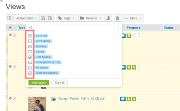
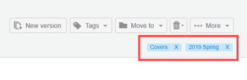
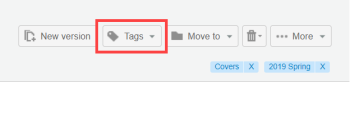
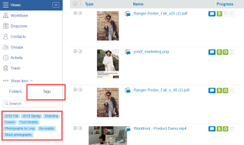

# Crear y administrar etiquetas en [!DNL Workfront Proof]

>[!IMPORTANT]
>
>Este artículo hace referencia a la funcionalidad del producto independiente [!DNL Workfront] Proof. Para obtener información sobre la revisión dentro de [!DNL Adobe Workfront], consulte [Revisión](../../../review-and-approve-work/proofing/proofing.md).

Puede crear y editar etiquetas y aplicarlas a las pruebas y los archivos. Es ideal para cuando se tienen muchos elementos de [!DNL Workfront Proof] diferentes, como proyectos, divisiones y clientes, y se desea identificarlos y encontrarlos fácilmente.

Puede aplicar etiquetas a pruebas nuevas o existentes, archivos nuevos, versiones nuevas y copias en cualquiera de las páginas de vista de lista.

>[!TIP]
>
>Puede resultar útil utilizar varias etiquetas cuando se aplique más de una categoría a un elemento. Puede aplicar un número ilimitado de etiquetas a cualquier elemento.

La configuración de perfiles y permisos afecta a la funcionalidad de etiquetas disponible:

* Los administradores de facturación, los administradores y los supervisores pueden utilizar todas las funciones descritas en esta página.
* Los administradores solo pueden crear y editar etiquetas para sus elementos.
* Los observadores no pueden aplicar ni editar etiquetas en los elementos, pero pueden ver las etiquetas que otros usuarios han aplicado a los elementos, así como la pestaña Etiquetas en Configuración personal.

Para obtener más información acerca de estos perfiles y permisos, consulte [Perfiles de permisos de prueba en  [!DNL Workfront Proof]](../../../workfront-proof/wp-acct-admin/account-settings/proof-perm-profiles-in-wp.md).

## Creación, edición o eliminación de una etiqueta en la cuenta

1. Haga clic en **[!UICONTROL Settings]** > **[!UICONTROL Personal Settings]**.

1. Abra la pestaña **[!UICONTROL Tags]** en la parte superior de la página **[!UICONTROL Personal settings]**.\
   Realice una de las siguientes acciones:

   * Para crear una etiqueta, haga clic en **[!UICONTROL New tag]**, escriba un nombre para la etiqueta y pulse **[!UICONTROL Enter]**.\

     Los nombres de las etiquetas deben incluir al menos un carácter alfanumérico y no más de 30 caracteres.\
      Para editar una etiqueta existente, haga clic en el nombre de la etiqueta, escriba el nuevo texto y pulse **[!UICONTROL Enter]**.

   * Para eliminar una etiqueta, haga clic en el icono de la papelera al final de la fila donde aparece la etiqueta.

## Visualización de Información sobre las etiquetas

1. Haga clic en **[!UICONTROL Settings]** > **[!UICONTROL Personal settings]**.

1. Abra la pestaña **[!UICONTROL Tags]** en la parte superior de la página **[!UICONTROL Personal settings]**.\
   La pestaña **[!UICONTROL etiquetas]** proporciona la siguiente información sobre las etiquetas:

   * **Nombre**
   * **Total de elementos** a los cuales se ha aplicado la etiqueta
   * **Elementos sobre los que tiene permiso de visualización** a los que se ha aplicado la etiqueta

1. (Opcional) Si desea ver todos los elementos a los que se les ha aplicado una etiqueta en particular, haga clic en el número que aparece junto a esa etiqueta en **Elementos sobre los que tiene permiso de visualización**.\
   La página Resultados de la búsqueda que aparecerá enumera todos los elementos que se le permite ver a los que se aplica la etiqueta.

## Creación de etiquetas para uno o varios elementos

1. En una vista de lista o en el tablero, seleccione el elemento o elementos para los que desea crear o administrar etiquetas.
1. Haga clic en **[!UICONTROL Tags]** > **[!UICONTROL New tag]** justo encima de la lista, escriba un nombre para la etiqueta y haga clic en **[!UICONTROL Create]**.

1. Seleccione la etiqueta nueva y luego haga clic en **[!UICONTROL Añadir etiquetas]**.

## Administración de etiquetas para uno o más elementos

1. En una vista de lista o en el tablero, seleccione el elemento o elementos para los que desea crear o administrar etiquetas.
1. Haga clic en **[!UICONTROL Tags]** > **[!UICONTROL Manage tags]** justo encima de la lista.

1. En la pestaña [!UICONTROL Tags] que aparece, administre las etiquetas como se ha descrito anteriormente en [Creación, edición o eliminación de una pestaña](https://support.workfront.com/knowledge/articles/115004379508/en-us?brand_id=662728&return_to=%2Fhc%2Fen-us%2Farticles%2F115004379508#CreatingEditingDeletingTag).\
   Se aplica una etiqueta a todos los elementos seleccionados cuando la casilla de verificación situada junto a la etiqueta es de color gris oscuro. Si es gris claro, con esta etiqueta solo se etiquetan algunos de los elementos de un lote seleccionado. Si desea quitar una etiqueta de todos los elementos seleccionados, asegúrese de que la casilla de verificación situada junto a la etiqueta esté vacía.\
   

## Administración de etiquetas desde Detalles de prueba o Detalles de archivo

Las etiquetas aplicadas a una prueba o a un archivo se muestran en las páginas Detalles de prueba y Detalles de archivo, respectivamente. En esta página, puede ver, cambiar y quitar etiquetas. Para obtener más información, consulte [Administrar detalles de prueba en  [!DNL Workfront Proof]](../../../workfront-proof/wp-work-proofsfiles/manage-your-work/manage-proof-details.md) y [Administrar archivos en  [!DNL Workfront Proof]](../../../workfront-proof/wp-work-proofsfiles/manage-your-work/manage-files.md).

1. Abra la página Detalles de la revisión de una revisión, tal como se describe en [Administrar detalles de la revisión en  [!DNL Workfront Proof]](../../../workfront-proof/wp-work-proofsfiles/manage-your-work/manage-proof-details.md).\
   O\
   Abra la página Detalles del archivo para un archivo, como se describe en [Administrar archivos en  [!DNL Workfront Proof]](../../../workfront-proof/wp-work-proofsfiles/manage-your-work/manage-files.md).\
   Cualquier etiqueta aplicada al elemento aparecerá cerca de la esquina superior derecha.\
   

1. (Opcional) Para quitar etiquetas de la prueba o del archivo, haga clic en la x que aparece junto a estos.
1. En la esquina superior derecha, haga clic en **[!UICONTROL etiquetas]**.\
   

1. En el cuadro que aparece, seleccione las etiquetas que desee aplicar al elemento (o anule la selección de las etiquetas que desee eliminar) y, a continuación, haga clic en **[!UICONTROL Añadir etiquetas]**.

## Búsqueda de un elemento mediante un nombre de etiqueta

Puede buscar un elemento utilizando el nombre de una etiqueta que sabe que está aplicada al elemento.Si comparte un elemento con alguien, podrá buscar ese elemento de la misma manera.Para ver una lista de todos los elementos a los que se les ha aplicado la etiqueta:

1. En cualquier vista de lista o panel de control, abra la pestaña **[!UICONTROL etiquetas]** en la barra lateral izquierda y, a continuación, haga clic en la etiqueta en la lista de etiquetas que aparece.\
   \
   El nombre de la etiqueta aparece en el campo de búsqueda en la esquina superior derecha de [!DNL Workfront Proof]. Puede afinar su búsqueda seleccionando etiquetas adicionales o escribiendo más palabras clave en el campo de búsqueda. Para quitar una etiqueta del campo de búsqueda, haga clic en el icono x junto al nombre de la etiqueta.
