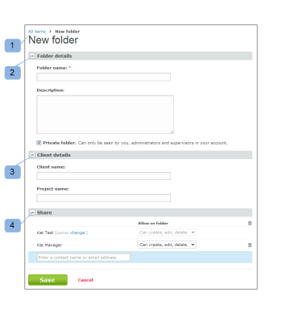
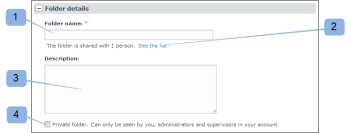
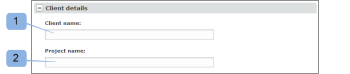

# Crear carpetas en [!DNL Workfront Proof]

>[!IMPORTANT]
>
>Este artículo se refiere a la funcionalidad en el producto independiente [!DNL Workfront Proof]. Para obtener información sobre pruebas en el interior [!DNL Adobe Workfront], consulte [Prueba](../../../review-and-approve-work/proofing/proofing.md).

## Creación de una nueva carpeta de nivel superior {#creating-a-new-top-level-folder}

1. En la barra lateral, haga clic en la flecha desplegable (1) situada junto al verde **[!UICONTROL Nueva prueba]** botón.
1. Select **[!UICONTROL Nueva carpeta]**. (2)\
   La variable [!UICONTROL Nueva carpeta] se muestra.

1. Continuar con [Configuración de la nueva carpeta](#configuring-the-new-folder).\
   

## Creación de una nueva subcarpeta {#creating-a-new-sub-folder}

Puede crear subcarpetas de cualquiera de estas formas:

* [Creación de una subcarpeta desde la página de detalles de la carpeta](#creating-a-sub-folder-from-the-folder-details-page)
* [Creación de una subcarpeta desde la página Carpetas de cuenta](#creating-a-sub-folder-from-the-account-folders-page)

>[!NOTE]
>
>Al crear una nueva subcarpeta, la lista de uso compartido se hereda de la carpeta principal.

### Creación de una subcarpeta desde el [!UICONTROL Detalles de carpeta] página {#creating-a-sub-folder-from-the-folder-details-page}

Para obtener información sobre la variable [!UICONTROL Detalles de carpeta] página, consulte [Administrar carpetas y su contenido en la prueba de Workfront](../../../workfront-proof/wp-work-proofsfiles/organize-your-work/manage-folders-and-contents.md).

Para crear una subcarpeta desde la [!UICONTROL Detalles de carpeta] página:

1. En la barra lateral, haga clic en el nombre de la carpeta en la [!UICONTROL Mis carpetas] lista (1) para acceder a la página de detalles de la carpeta

1. Haga clic en el botón new sub-folder (2) en la parte superior de la página.\
   Aparece una nueva carpeta en la lista de los elementos de la carpeta.
1. Escriba un nombre para la nueva subcarpeta. (3)
1. Press **[!UICONTROL Entrar]**.\
   O\
   Haga clic fuera del campo nombre de la carpeta .

1. (Opcional) Edite los detalles de la nueva subcarpeta en la página Detalles de la carpeta .
1. Continuar con [Configuración de la nueva carpeta](#configuring-the-new-folder).

### Creación de una subcarpeta desde la página Carpetas de cuenta {#creating-a-sub-folder-from-the-account-folders-page}

1. Haga clic en [Su nombre de cuenta] carpetas en la barra lateral para acceder a la página Carpetas de cuenta (1)\
   

1. Busque la carpeta a la que desea agregar una subcarpeta y abra la [!UICONTROL acciones] menú (2)
1. Select [!UICONTROL Nueva subcarpeta] del menú (3)\
   La variable [!UICONTROL Nueva carpeta] se muestra.
1. Continuar con [Configuración de la nueva carpeta](#configuring-the-new-folder).

## Configuración de la nueva carpeta {#configuring-the-new-folder}

Después de empezar a crear una carpeta nueva (como se describe en [Creación de una nueva carpeta de nivel superior](#creating-a-new-top-level-folder) o [Creación de una nueva subcarpeta](#creating-a-new-sub-folder)), puede configurar las opciones de configuración como se describe en esta sección.

* [Navegación de la ruta de navegación](#breadcrumb-navigation) (1)
* [Detalles de carpeta](#folder-details) (2)
* [Detalles del cliente](#client-details) (3)
* [Compartir](#share) (4)

### Navegación de la ruta de navegación {#breadcrumb-navigation}

La navegación de la ruta de exploración le muestra si está creando una carpeta de nivel superior o una subcarpeta) (1)

### Detalles de carpeta {#folder-details}

En esta sección puede añadir (y comprobar) la siguiente información a la carpeta que está creando:

* Nombre de la carpeta: este campo es obligatorio (1)
* Al hacer clic en el botón [!UICONTROL Consulte la lista] vínculo (2) mostrará una ventana emergente con una lista de personas con las que se comparte esta carpeta: esta información es especialmente útil cuando crea subcarpetas, ya que las subcarpetas se compartirán automáticamente con las mismas personas que la carpeta principal
* Descripción (3): aquí puede añadir una breve descripción de la carpeta, que será visible en la página de detalles de la carpeta
* Conversión de la carpeta en privada (4): al marcar la casilla, esta carpeta será privada (tan visible solo para las personas con las que comparta la carpeta explícitamente y los usuarios de la cuenta con los perfiles de [Perfiles de permisos de prueba en [!DNL Workfront Proof]](../../../workfront-proof/wp-acct-admin/account-settings/proof-perm-profiles-in-wp.md), [Perfiles de permisos de prueba en [!DNL Workfront Proof]](../../../workfront-proof/wp-acct-admin/account-settings/proof-perm-profiles-in-wp.md) o [Perfiles de permisos de prueba en [!DNL Workfront Proof]](../../../workfront-proof/wp-acct-admin/account-settings/proof-perm-profiles-in-wp.md) ). Consulte [Explicación de los permisos de carpetas en [!DNL Workfront Proof]](../../../workfront-proof/wp-work-proofsfiles/organize-your-work/folder-permissions.md) para obtener más información sobre carpetas privadas y públicas en Workfront Proof.

### Detalles del cliente {#client-details}

En esta sección puede completar los detalles de su cliente, lo que le permitirá ordenar la página Mis carpetas por nombre de cliente/proyecto:

* Nombre del cliente (1)
* Nombre del proyecto (2)

### Compartir {#share}

En el [!UICONTROL Compartir] puede:

* Asignar un nuevo propietario de la carpeta (1): el creador de la carpeta permanecerá en la carpeta y no se podrá eliminar. Sin embargo, puede hacer que otro usuario de su cuenta sea el propietario, lo que le otorgará derechos de edición en la carpeta.
* Compartir la carpeta con otros [!DNL Workfront Proof] usuarios escribiendo su dirección de correo electrónico (2): tenga en cuenta que las carpetas solo se pueden compartir con personas que tengan su propia [!DNL Workfront Proof] inicios de sesión.
* Establezca los permisos para las personas con las que comparte la carpeta (3). Esto resulta útil para compartir carpetas privadas con usuarios de su cuenta. Puede decidir si los usuarios que usan la variable [Perfiles de permisos de prueba en [!DNL Workfront Proof]](../../../workfront-proof/wp-acct-admin/account-settings/proof-perm-profiles-in-wp.md) debe permitirse crear, editar y eliminar elementos de la carpeta.
* Elimine un usuario de la lista de uso compartido de carpetas haciendo clic en el icono de la papelera (4) a la derecha del nombre del usuario.
* Elimine a todos de la lista de uso compartido de carpetas haciendo clic en el icono de la papelera situada más arriba (5). Tenga en cuenta que no podrá eliminar al creador o al propietario de la carpeta.

Consulte también [Compartir carpetas en [!DNL Workfront Proof]](../../../workfront-proof/wp-work-proofsfiles/organize-your-work/share-folders.md).

