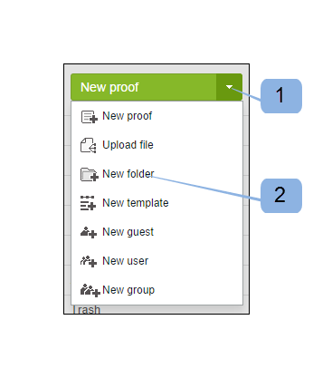
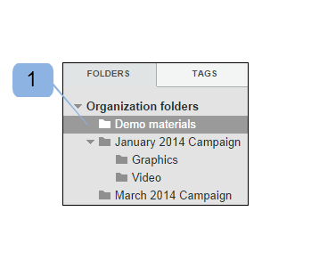
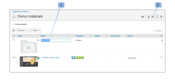
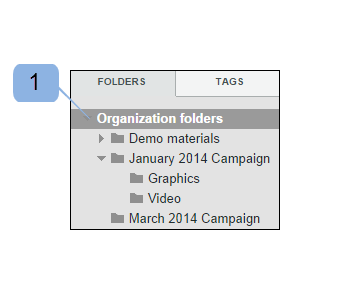
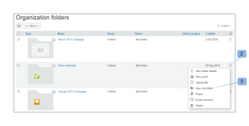
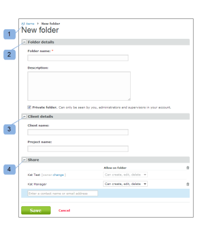
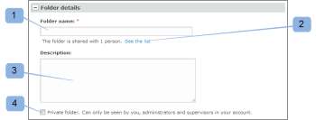
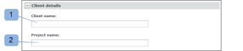
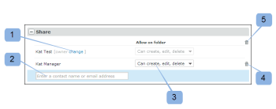

# Creación de carpetas en [!DNL Workfront Proof]

>[!IMPORTANT]
>
>Este artículo hace referencia a la funcionalidad del producto independiente [!DNL Workfront Proof]. Para obtener información sobre la revisión dentro de [!DNL Adobe Workfront], consulte [Revisión](../../../review-and-approve-work/proofing/proofing.md).

## Creación de una nueva carpeta de nivel superior {#creating-a-new-top-level-folder}

1. En la barra lateral, haga clic en la flecha desplegable (1) situada junto al botón verde **[!UICONTROL Nueva prueba]**.
1. Seleccione **[!UICONTROL Nueva carpeta]**. (2)\
   Se muestra la página [!UICONTROL Nueva carpeta].

1. Continúe con [Configuración de la nueva carpeta](#configuring-the-new-folder).\
   

## Creación de una nueva subcarpeta {#creating-a-new-sub-folder}

Es posible crear subcarpetas de cualquiera de las siguientes maneras:

* [Creación de subcarpetas desde la página de detalles de la carpeta](#creating-a-sub-folder-from-the-folder-details-page)
* [Creación de subcarpetas desde la página de carpetas de la cuenta](#creating-a-sub-folder-from-the-account-folders-page)

>[!NOTE]
>
>Al crear una nueva subcarpeta, la lista compartida se hereda de la carpeta principal.

### Creando una subcarpeta a partir de la página [!UICONTROL Detalles de la carpeta] {#creating-a-sub-folder-from-the-folder-details-page}

Para obtener información sobre la página [!UICONTROL Detalles de la carpeta], consulte [Administrar carpetas y su contenido en Workfront Proof](../../../workfront-proof/wp-work-proofsfiles/organize-your-work/manage-folders-and-contents.md).

Para crear una subcarpeta a partir de la página [!UICONTROL Detalles de la carpeta]:

1. En la barra lateral, haga clic en el nombre de la carpeta en la lista [!UICONTROL Mis carpetas] (1) para obtener acceso a la página de detalles de la carpeta

1. Haga clic en el botón de nueva subcarpeta (2) de la parte superior de la página.\
   Aparecerá una nueva carpeta en la lista de elementos de la carpeta.
1. Escriba un nombre para la nueva subcarpeta. (3)
1. Presione **[!UICONTROL Entrar]**.\
   O\
   Haga clic fuera del campo de nombre de la carpeta.

1. (Opcional) Edite los detalles de la nueva subcarpeta en la página de detalles de la carpeta.
1. Continúe con [Configuración de la nueva carpeta](#configuring-the-new-folder).

### Creación de subcarpetas desde la página de carpetas de la cuenta {#creating-a-sub-folder-from-the-account-folders-page}

1. Haga clic en las carpetas [Su nombre de cuenta] de la barra lateral para tener acceso a la página de carpetas de la cuenta (1)\
   

1. Busque la carpeta a la que quiera añadir una subcarpeta y abra el menú de [!UICONTROL acciones] (2)
1. Seleccione [!UICONTROL Nueva subcarpeta] en el menú (3)\
   Se mostrará la página [!UICONTROL Nueva carpeta].
1. Continúe con [Configuración de la nueva carpeta](#configuring-the-new-folder).

## Configuración de la nueva carpeta {#configuring-the-new-folder}

Después de empezar a crear una nueva carpeta (tal y como se describe en [Creación de una nueva carpeta de nivel superior](#creating-a-new-top-level-folder) o [Creación de una nueva subcarpeta](#creating-a-new-sub-folder)), es posible establecer las opciones de configuración que se describen en esta sección.

* [Navegación por rutas de exploración](#breadcrumb-navigation) (1)
* [Detalles de la carpeta](#folder-details) (2)
* [Detalles del cliente](#client-details) (3)
* [Compartir](#share) (4)

### Navegación por rutas de exploración {#breadcrumb-navigation}

La navegación por rutas de exploración muestra si se está creando una carpeta de nivel superior o una subcarpeta) (1)

### Detalles de la carpeta {#folder-details}

En esta sección puede añadir (y comprobar) la siguiente información a la carpeta que está creando:

* Nombre de la carpeta: este campo es obligatorio (1)
* Al hacer clic en el vínculo [!UICONTROL See the list] (2), aparecerá una ventana emergente con una lista de personas con las que se comparte esta carpeta. Esta información es especialmente útil cuando crea subcarpetas, ya que estas se compartirán automáticamente con las mismas personas que la carpeta principal
* Descripción (3): aquí puede añadir una breve descripción de la carpeta, que estará visible en la página Detalles de la carpeta
* Hacer que la carpeta sea privada (4): si marca la casilla, esta carpeta será privada (de modo que solo sea visible para las personas con las que comparta explícitamente la carpeta y los usuarios de la cuenta con los perfiles de [Perfiles de permisos de prueba en [!DNL Workfront Proof]](../../../workfront-proof/wp-acct-admin/account-settings/proof-perm-profiles-in-wp.md), [Perfiles de permisos de prueba en [!DNL Workfront Proof]](../../../workfront-proof/wp-acct-admin/account-settings/proof-perm-profiles-in-wp.md) o [Perfiles de permisos de prueba en [!DNL Workfront Proof]](../../../workfront-proof/wp-acct-admin/account-settings/proof-perm-profiles-in-wp.md)). Consulte [Comprender los permisos de carpeta en [!DNL Workfront Proof]](../../../workfront-proof/wp-work-proofsfiles/organize-your-work/folder-permissions.md) para obtener más información acerca de las carpetas privadas y públicas en Workfront Proof.

### Detalles del cliente {#client-details}

En esta sección puede rellenar los detalles del cliente, lo que le permite ordenar la página Mis carpetas por nombre de cliente/proyecto:

* Nombre del cliente (1)
* Nombre del proyecto (2)

### Compartir {#share}

En la sección [!UICONTROL Share] puede:

* Asignar un nuevo propietario a la carpeta (1): el creador de la carpeta permanecerá en la lista de la carpeta y no se podrá eliminar. Sin embargo, puede hacer que otro usuario de su cuenta sea el propietario, lo que le otorgará derechos de edición sobre la carpeta.
* Compartir la carpeta con otros usuarios de [!DNL Workfront Proof] escribiendo su dirección de correo electrónico (2). Tenga en cuenta que las carpetas solo se pueden compartir con personas que tengan sus propios inicios de sesión de [!DNL Workfront Proof].
* Definir los permisos para las personas con las que comparte la carpeta (3). Esto resulta útil para compartir carpetas privadas con usuarios de su cuenta. Puede decidir si se debe permitir a los usuarios con el perfil [Perfiles de permisos de prueba en [!DNL Workfront Proof]](../../../workfront-proof/wp-acct-admin/account-settings/proof-perm-profiles-in-wp.md) crear, editar o eliminar elementos de la carpeta.
* Quitar un usuario de la lista de uso compartido de carpetas haciendo clic en el icono de papelera (4) situado a la derecha del nombre del usuario.
* Eliminar a todos de la lista de uso compartido de carpetas haciendo clic en el icono de papelera superior (5) - tenga en cuenta que no podrá eliminar al creador o propietario de la carpeta.

Consulte también [Compartir carpetas en [!DNL Workfront Proof]](../../../workfront-proof/wp-work-proofsfiles/organize-your-work/share-folders.md).

