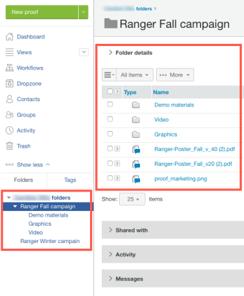

# Carpetas en [!DNL Workfront Proof]

>[!IMPORTANT]
>
>Este artículo hace referencia a la funcionalidad del producto independiente [!DNL Workfront Proof]. Para obtener información sobre la revisión dentro de [!DNL Adobe Workfront], consulte [Revisión](../../../review-and-approve-work/proofing/proofing.md).

Las carpetas son la mejor manera de organizar el trabajo en su cuenta de [!DNL Workfront Proof]. Puede crear una estructura de carpetas para reflejar la forma en que se organizan las carpetas en el equipo, con estructuras de carpetas independientes para cada cliente, trabajo o campaña.

Entre las ventajas de utilizar carpetas se incluyen las siguientes:

* **Limitación del acceso a los datos confidenciales del cliente**: si no desea que algunos de los usuarios vean algunas de las pruebas, puede convertir en privadas las carpetas donde se almacenan. Para obtener más información, consulte [Comprender los permisos de carpeta en  [!DNL Workfront Proof]](../../../workfront-proof/wp-work-proofsfiles/organize-your-work/folder-permissions.md).

* **Realización de acciones masivas en pruebas y archivos**: puede administrar cómodamente pruebas y archivos agrupados en carpetas, realizando acciones masivas sobre ellos. Por ejemplo, puede compartir varios elementos en una acción. Para obtener más información, consulte [Administrar carpetas y su contenido en  [!DNL Workfront Proof]](../../../workfront-proof/wp-work-proofsfiles/organize-your-work/manage-folders-and-contents.md).

* **Compartir carpetas con otros usuarios de Workfront Proof**: cuando comparte una carpeta, aparece en la barra lateral del otro usuario y este tiene acceso de solo lectura a todos los elementos de la carpeta. Si está cooperando estrechamente con otra cuenta de Workfront Proof, puede ser una buena idea configurar una relación de socio entre sus cuentas de Workfront Proof. De este modo, puede compartir sus carpetas con toda la compañía de una sola vez, lo que significa que las carpetas se compartirán automáticamente con los nuevos usuarios desde la cuenta de socio. Para obtener más información, consulte [Compartir carpetas en  [!DNL Workfront Proof]](../../../workfront-proof/wp-work-proofsfiles/organize-your-work/share-folders.md).

* **Agrupar revisiones en las que desee trabajar juntos o en las que desee que trabajen juntos los revisores**: cuando usted u otro revisor abre una de las revisiones e iniciar el visor de corrección, todas las revisiones de la carpeta también estarán disponibles allí. Sin salir del visor de revisiones, puede ver las otras revisiones, ordenarlas y buscarlas, y compararlas entre sí. Para obtener más información, consulte “Uso de varias revisiones en el visor de corrección”.

Puede crear sus carpetas una por una. Para obtener más información, consulte [Crear carpetas en [!DNL Workfront Proof]](../../../workfront-proof/wp-work-proofsfiles/organize-your-work/create-folders.md).
