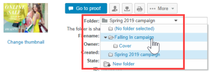

# Administrar carpetas y su contenido en [!DNL Workfront Proof]

>[!IMPORTANT]
>
>Este artículo se refiere a la funcionalidad en el producto independiente [!DNL Workfront Proof]. Para obtener información sobre pruebas en el interior [!DNL Adobe Workfront], consulte [Prueba](../../../review-and-approve-work/proofing/proofing.md).

Una de las ventajas de organizar los proyectos y pruebas en carpetas es la capacidad de administrarlos en la [!UICONTROL Detalles de carpeta] página. Esta página es un centro de control para su proyecto, desde el que puede administrar fácilmente pruebas y archivos individuales, así como realizar acciones masivas.

## Agrupación De Elementos Para Que Los Revisores Puedan Trabajar En Ellos Juntos

Puede utilizar carpetas para agrupar pruebas en las que desee que los revisores trabajen juntos. Cuando un revisor abre una de las pruebas de la carpeta para iniciar el visualizador de pruebas, todas las demás pruebas de la carpeta están disponibles: el revisor puede trabajar en cualquier prueba de la carpeta sin salir del visualizador de pruebas. Para obtener más información, consulte [Trabajar con varias pruebas en el visor de pruebas](../../../workfront-proof/wp-work-proofsfiles/review-proofs-wpv/work-with-multiple-proofs.md).

## Adición de elementos nuevos a una carpeta

Al crear una prueba o cargar un archivo, puede seleccionar la carpeta donde desea almacenarla en la [!UICONTROL Organizar] en la sección [!UICONTROL Nueva prueba] o [!UICONTROL Nuevo archivo] página.

Para obtener más información, consulte [Generar pruebas en [!DNL Workfront Proof]](../../../workfront-proof/wp-work-proofsfiles/create-proofs-and-files/generate-proofs.md) o [Cargar archivos y contenido web a [!DNL Workfront Proof]](../../../workfront-proof/wp-work-proofsfiles/create-proofs-and-files/upload-files-web-content.md).

>[!NOTE]
>
>Si actualmente está viendo la carpeta a la que desea agregar un nuevo elemento, esa carpeta aparece automáticamente en la [!UICONTROL Organizar] cuando abre la página New proof o la [!UICONTROL Nuevo archivo] página.

## Adición de elementos existentes a una carpeta

Puede agregar un archivo existente o una prueba a una carpeta.

Para obtener más información, consulte [Administrar archivos en [!DNL Workfront Proof]](../../../workfront-proof/wp-work-proofsfiles/manage-your-work/manage-files.md) o [Administrar detalles de prueba en la prueba de Workfront](../../../workfront-proof/wp-work-proofsfiles/manage-your-work/manage-proof-details.md).

1. (Condicional) Realice una de las siguientes acciones:

   * Si va a añadir una prueba a una carpeta, vaya a la [!UICONTROL Detalles de la prueba] tal como se describe en [[!UICONTROL Administrar detalles de prueba] en [!DNL Workfront Proof]](../../../workfront-proof/wp-work-proofsfiles/manage-your-work/manage-proof-details.md)
   * Si va a añadir un archivo a una carpeta, vaya a la página de detalles del archivo tal como se describe en [Administrar archivos en [!DNL Workfront Proof]](../../../workfront-proof/wp-work-proofsfiles/manage-your-work/manage-files.md).&quot;

1. Haga clic en el nombre del **Carpeta** donde se encuentra el archivo o la prueba, haga clic en el nombre de la carpeta donde desea moverlo.\
   

## Desplazamiento de elementos fuera de una carpeta

1. (Condicional) Realice una de las siguientes acciones:

   * Si está sacando una prueba de una carpeta, vaya a la [!UICONTROL Detalles de la prueba] tal como se describe en [[!UICONTROL Administrar detalles de prueba] en [!DNL Workfront Proof]](../../../workfront-proof/wp-work-proofsfiles/manage-your-work/manage-proof-details.md)\

      O\
      Si está sacando un archivo de una carpeta, vaya a la página de detalles del archivo como se describe en [Administrar archivos en [!DNL Workfront Proof]](../../../workfront-proof/wp-work-proofsfiles/manage-your-work/manage-files.md).&quot;

1. Haga clic en el nombre del **Carpeta** donde se encuentra el archivo o la prueba, haga clic en **[!UICONTROL Mover a]** > **[!UICONTROL (No hay ninguna carpeta seleccionada)]**.\
   

## Administración de una carpeta y sus elementos en el [!UICONTROL Detalles de carpeta] Página

Puede administrar fácilmente sus archivos desde el [!UICONTROL Detalles de carpeta] página.

>[!NOTE]
>
>Si no es el creador o propietario del archivo, las opciones disponibles dependerán del usuario [Perfiles de permisos de prueba en [!DNL Workfront Proof]](../../../workfront-proof/wp-acct-admin/account-settings/proof-perm-profiles-in-wp.md).

1. En el **[!UICONTROL Carpetas]** en el menú de navegación de la izquierda, haga clic en cualquier carpeta para abrir [!UICONTROL Detalles de carpeta] página.
1. Si la carpeta solo contiene pruebas archivadas, aparece un mensaje en amarillo en la parte superior de la página. Si hace clic en el vínculo del mensaje, la vista de carpetas cambia a la variable [!UICONTROL Pruebas archivadas] vista.
1. Haga clic en **[!UICONTROL Detalles de carpeta]** y, a continuación, realice una de las siguientes acciones con la carpeta utilizando las opciones que aparecen:

   * Añada o cambie la imagen en miniatura de la carpeta.
   * Ver o editar el **Descripción**, **Carpeta principal**, **Propietario**, **Cliente** o **Proyecto** asociado a la carpeta .

   * Crear la carpeta **Privado**.
   * Ver cuándo se realizó la carpeta **Creado**.
   * Consulte el nombre de la carpeta **Creador**.

1. (Opcional) Para cambiar la información asociada a un elemento de la carpeta, haga clic en el botón **[!UICONTROL Más]** a la derecha del elemento y, a continuación, utilice cualquiera de las opciones que aparecen.\
   \
   Las opciones que aparecen dependen de si el elemento es una prueba o un archivo.

   * **[!UICONTROL Ver detalles de prueba]** o **[!UICONTROL Ver detalles del archivo]**: Abre la página Detalles de la prueba o Detalles del archivo . Para obtener más información, consulte [Administrar archivos en [!DNL Workfront Proof]](../../../workfront-proof/wp-work-proofsfiles/manage-your-work/manage-files.md) o [Administrar detalles de prueba en [!DNL Workfront Proof]](../../../workfront-proof/wp-work-proofsfiles/manage-your-work/manage-proof-details.md).

   * **[!UICONTROL Compartir]**: Permite compartir el archivo con otras personas. Para obtener más información, consulte [Compartir archivos en [!UICONTROL Prueba de Workfront]](../../../workfront-proof/wp-work-proofsfiles/share-proofs-and-files/share-files.md).

   * **[!UICONTROL Mensaje]**: Envíe un correo electrónico a las personas con las que se ha compartido la prueba.
   * **[!UICONTROL Nueva versión]**: Cree una nueva versión de la prueba.
   * **[!UICONTROL Copiar]**: Copie la prueba con cualquier comentario de prueba como una nueva versión de una prueba existente o como una prueba nueva.
   * **[!UICONTROL Descargar original]**: Permite descargar el archivo original. Para obtener más información, consulte [Descargar archivos almacenados en [!DNL Workfront Proof]](../../../workfront-proof/wp-work-proofsfiles/manage-your-work/download-files-stored.md).

   * **[!UICONTROL Delegar propiedad]**: Delegar la propiedad de la prueba a otro usuario.
   * **[!UICONTROL Compartir vínculos de prueba]**: Envíe un correo electrónico que contenga un vínculo a la prueba.
   * **[!UICONTROL Imprimir comentarios]**: Imprima los comentarios que los revisores hayan hecho en la prueba.
   * **[!UICONTROL Resumen de Excel]**: Cree un archivo de Excel que contenga el resumen de impresión para la prueba.
   * **[!UICONTROL Bloqueo]**: Bloquee la prueba para que ningún otro usuario pueda abrirla.
   * **[!UICONTROL Eliminar]**: Elimina el archivo de [!DNL Workfront] Prueba.

1. (Opcional) En la **[!UICONTROL Compartido con]** , para enviar un recordatorio a un revisor de la prueba, haga clic en el botón **[!UICONTROL Más]** a la derecha del nombre del usuario y haga clic en **[!UICONTROL Mensaje]**.\
   Puede hacer clic en **[!UICONTROL Eliminar]** para dejar de compartir la carpeta con la persona.\
   Los propietarios y creadores de carpetas siempre aparecen en esta lista y no se pueden eliminar. Si un usuario se hace cargo de la propiedad de una carpeta, aparece automáticamente y no se puede eliminar.\
   Puede compartir una carpeta con usuarios individuales y empresas asociadas. Si la carpeta se comparte con una empresa asociada, puede ver la lista completa de destinatarios haciendo clic en el botón [!UICONTROL información] que aparece al pasar el ratón por encima de la fila. Para obtener más información, consulte [Cuentas de socio.](https://support.workfront.com/hc/en-us/sections/115000912107-Partner-accounts)

1. (Opcional) Edite los permisos del administrador en carpetas privadas haciendo clic en la línea de esa persona debajo de **[!UICONTROL Permitir en la carpeta]**, especificando si desea que la persona pueda crear, editar y eliminar elementos de esa carpeta. **NOTA** Esta opción solo está disponible para los administradores de la misma cuenta que el propietario de la carpeta que se agrega a las carpetas privadas. Los supervisores, administradores y administradores de facturación tienen derechos de edición sobre todas las carpetas de la cuenta y los observadores no pueden crear ningún elemento. Para obtener información sobre los permisos, consulte la [Perfiles de permisos de prueba en [!DNL Workfront Proof]](../../../workfront-proof/wp-acct-admin/account-settings/proof-perm-profiles-in-wp.md).

1. (Opcional) Haga clic en **[!UICONTROL Actividad]** para ver todas las acciones realizadas en la carpeta en orden cronológico.
1. (Opcional) Haga clic en **[!UICONTROL Mensajes]** para ver los mensajes que se han enviado a los usuarios de la carpeta.\
   Cuando pase el ratón sobre un mensaje, puede hacer clic en el botón **i** a la derecha para ver el mensaje completo.\
   \
   Aparece una ventana emergente con el correo electrónico completo:\
   

## Administración de subcarpetas

Puede administrar las subcarpetas desde la página de detalles Carpetas .

1. En el **[!UICONTROL Carpetas]** en el menú de navegación de la izquierda, haga clic en el nombre de la carpeta principal que contiene la subcarpeta para abrir **[!UICONTROL Detalles de carpeta]** página.

1. Haga clic en el **[!UICONTROL Más]** a la derecha de la subcarpeta.\
   

1. Haga clic en cualquiera de las siguientes opciones:

   * **[!UICONTROL Ver detalles de la carpeta]**: Abre el [!UICONTROL Detalles de carpeta] página.
   * **[!UICONTROL Nueva prueba]**: Permite añadir una prueba nueva a la subcarpeta.
   * **[!UICONTROL Cargar archivo]**: Permite cargar un archivo en la subcarpeta.
   * **[!UICONTROL Nueva subcarpeta]**: Crea una nueva subcarpeta dentro de la subcarpeta.
   * **[!UICONTROL Compartir]**: Permite compartir la subcarpeta con otros usuarios.
   * **[!UICONTROL Resumen de Excel]**: Permite solicitar un resumen de Excel de la subcarpeta.
   * **[!UICONTROL Eliminar]**: Permite eliminar la subcarpeta.
