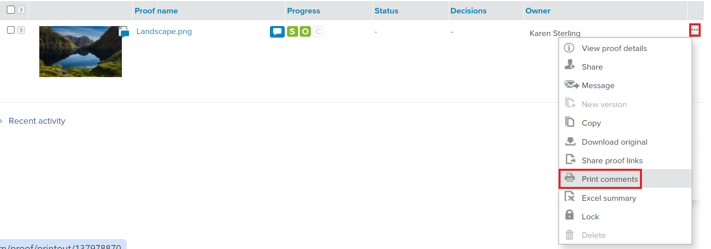
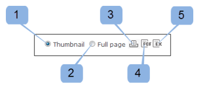
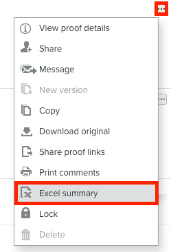

# Imprimir y exportar comentarios en [!DNL Workfront Proof]

<!-- Audited: 4/2025 -->

>[!IMPORTANT]
>
>Este artículo hace referencia a la funcionalidad del producto independiente [!DNL Workfront Proof]. Para obtener información sobre la revisión dentro de [!DNL Adobe Workfront], consulte [Revisión](../../../review-and-approve-work/proofing/proofing.md).

## Impresión de comentarios

Se puede acceder directamente al resumen de comentarios desde las siguientes áreas:

* [El Visualizador de pruebas](#the-proof-viewer)
* [La página Detalles de prueba](#the-proof-details-page)
* [El menú Acciones de  [!DNL Proof] &#x200B;](#the-proof-actions-menu)

### El Visualizador de pruebas {#the-proof-viewer}

Puede imprimir el resumen de comentarios de la prueba, incluidas las miniaturas o la imagen de vista completa de la prueba, haciendo clic en el icono **[!UICONTROL Imprimir]** del Visor de pruebas.

Para acceder al Visor de pruebas, haga clic en el botón **Ir a la prueba** de la página Detalles de la prueba.

### La página Detalles de prueba {#the-proof-details-page}

Puede imprimir el resumen de comentarios de la revisión haciendo clic en el icono **[!UICONTROL Imprimir]** de la página Detalles de la revisión.

Para acceder a la página de detalles de una prueba específica, haga clic en el nombre de la prueba en la vista de lista.

### Menú Acciones de [!DNL Proof] {#the-proof-actions-menu}

Puede imprimir el resumen de comentarios de la revisión haciendo clic en el icono **[!UICONTROL Imprimir]** en el menú [!UICONTROL Acciones de revisión].

Para acceder a la página [!UICONTROL Comments Summary] desde una vista de lista:

1. Haga clic en el menú **[!UICONTROL Acciones]**.
1. Seleccione **[!UICONTROL Imprimir comentarios]**.

   

   En la página Resumen de comentarios, seleccione una de las siguientes opciones de impresión:

   * Vista en miniatura (1)
   * Vista de página completa (2)
   * Imprimir la página (3)
   * Exportar la prueba con comentarios a un archivo PDF (4)
   * Exportar los comentarios de prueba a un archivo [!DNL Excel] (5)

### Vista en miniatura

La vista en miniatura muestra cada comentario en orden con el hilo completo para cada comentario. También puede ordenar los comentarios y ver la miniatura de cada comentario con marcas añadidas.

Para imprimir la vista de miniaturas, haga clic en el icono **[!UICONTROL Impresora]** en la esquina superior derecha de la página y seleccione una de las siguientes opciones:

* Ordenar por ID de comentario o página (1)
* Miniatura de cada comentario con marcas añadidas (2)

### Vista de página completa

La vista de página completa muestra cada página en orden con los comentarios de esa página y un pin que indica dónde se encuentra el comentario.

Para imprimir la vista de página completa, haz clic en el icono **[!UICONTROL Impresora]** en la esquina superior derecha de la página.

## Exportación de un resumen de [!DNL Excel]

Para exportar el resumen [!DNL Excel] desde el menú de acciones Prueba:

1. Haga clic en el icono **Acciones** a la derecha de la prueba y, a continuación, seleccione **[!UICONTROL [!DNL Excel]resumen]**.
   

Para descargar el resumen de [!DNL Excel] desde la página de detalles de Prueba:

1. Haga clic en el botón **Más** y luego seleccione **Exportar a Excel**.

   

## Exportar a PDF

Al exportar a un archivo de PDF, todos los comentarios aparecerán en el lector de PDF. Si un comentario tiene varias marcas asociadas, el comentario aparecerá varias veces en la lista de comentarios (una vez por cada marca).

>[!IMPORTANT]
>
>La función Exportar a PDF solo está disponible para archivos estáticos.

Para exportar una prueba con sus marcas y comentarios a PDF:

1. En el lado izquierdo de la pantalla, haga clic en **[!UICONTROL Vistas]**.
1. Haga clic en el botón **[!UICONTROL Más]** en línea con la revisión específica y, a continuación, seleccione **[!UICONTROL Imprimir comentarios]**.

1. En la esquina superior derecha de la página, haga clic en el botón **Exportar a PDF**. El PDF comienza a descargarse y se le enviará por correo electrónico una vez que se haya completado.
