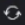

# Comparar pruebas en el visualizador de revisión

>[!IMPORTANT]
>
>Este artículo hace referencia a la funcionalidad del producto independiente [!DNL Workfront Proof]. Para obtener información sobre la revisión dentro de [!DNL Adobe Workfront], consulte [Revisión](../../../review-and-approve-work/proofing/proofing.md).

Puede ver comparaciones en paralelo de dos pruebas. Pueden ser dos versiones de la misma prueba, o dos pruebas completamente independientes.

## Comparar versiones de prueba {#compare-proof-versions}

1. Abra la prueba con varias versiones que quiere comparar.
1. En la esquina superior izquierda del visor de corrección que se muestra, haga clic en el nombre de la prueba. A continuación, en la lista de versiones que aparece, haga clic en el icono **Comparar** situado junto a la versión que desee abrir y comparar.

   

   Las pruebas se muestran una al lado de la otra, con la versión más reciente en el lado izquierdo.

   <!--
   
Separate breadcrumbs above each proof allow you to view and go to the work item associated with the proof:

   -->

   <!--
   
  

   -->

1. Continuar con [Usar las herramientas de comparación](#use-the-compare-tools).

## Comparar pruebas independientes {#compare-separate-proofs}

Puede comparar dos pruebas independientes.

* [Comparar pruebas independientes en [!DNL Workfront]](#compare-separate-proofs-in-workfront)
* [Comparar pruebas independientes en [!DNL Workfront Proof]](#compare-separate-proofs-in-workfront-proof)

### Comparar pruebas independientes en [!DNL Workfront] {#compare-separate-proofs-in-workfront}

Para obtener información sobre cómo comparar pruebas independientes de la lista de documentos dentro de [!DNL Workfront], consulte la sección [Comparar dos pruebas diferentes](../../../review-and-approve-work/proofing/reviewing-proofs-within-workfront/review-a-proof/compare-proofs.md#comparing-two-proofs-from-a-document-list) en el artículo [Comparar pruebas](../../../review-and-approve-work/proofing/reviewing-proofs-within-workfront/review-a-proof/compare-proofs.md).

### Comparar pruebas independientes en [!DNL Workfront Proof] {#compare-separate-proofs-in-workfront-proof}

>[!NOTE]
>
>Las pruebas que compare deben estar en la misma carpeta y en el mismo nivel de jerarquía dentro de la estructura de carpetas. Para obtener más información acerca del uso de carpetas para agrupar las pruebas que desea comparar, consulte [Trabajar con varias pruebas en el Visor de corrección](../../../workfront-proof/wp-work-proofsfiles/review-proofs-wpv/work-with-multiple-proofs.md)

1. Abra una de las pruebas que desee comparar en el Visor de corrección.
1. Haga clic en el icono **[!UICONTROL Modo de comparación]**.

   \
   El área de visualización se divide por la mitad y la prueba se muestra a la izquierda y a la derecha del Visor de corrección.

   

1. Haga clic en el icono [!UICONTROL carpeta] situado encima de la prueba, ya sea en el lado izquierdo o el derecho, para ver una lista de las demás pruebas dentro de la misma carpeta.

   

1. En la lista, haga clic en el nombre de la prueba que desea comparar con la prueba abierta actualmente en el visor de corrección.

   

   Aparecerán ambas pruebas.

1. Continúe con [Usar las herramientas de comparación](#use-the-compare-tools).

## Usar las herramientas de comparación {#use-the-compare-tools}

El visor de corrección proporciona varias herramientas para comparar pruebas de forma eficaz y eficiente.

* [Comparar pruebas automáticamente](#auto-compare-proofs)
* [Comparar pruebas en una superposición](#compare-proofs-in-an-overlay)
* [Comparación de navegación simultánea](#simultaneous-navigation-comparison)

### Comparar pruebas automáticamente {#auto-compare-proofs}

La comparación automática realiza una comparación píxel a píxel entre dos pruebas estáticas o de vídeo. Las diferencias detectadas se resaltan en rojo en la prueba de la izquierda.

La comparación automática no está disponible cuando se comparan pruebas interactivas.

Para comparar automáticamente dos pruebas:

1. Empiece a comparar pruebas de cualquiera de las siguientes maneras:

   * Comparar dos versiones de la misma prueba (consulte [Comparar versiones de prueba](#compare-proof-versions) en este artículo).
   * Comparar dos pruebas independientes (consulte [Comparar pruebas independientes](#compare-separate-proofs) en este artículo).

1. Haga clic en el icono **[!UICONTROL Comparar automáticamente]**. 

   

   Las diferencias entre las dos pruebas se resaltan en rojo en la prueba de la izquierda.

1. (Opcional) Haga clic en el icono **[!UICONTROL Cambiar]** para cambiar el lado activo y mostrar las diferencias en la prueba del lado derecho. De forma predeterminada, las diferencias se muestran en la prueba del lado izquierdo.

   

1. (Opcional) Haga clic en el icono **[!UICONTROL Color]** para cambiar el color y la opacidad utilizados cuando se resaltan las diferencias.

   

### Comparar pruebas en una superposición {#compare-proofs-in-an-overlay}

La comparación de superposiciones permite ver las diferencias entre dos pruebas estáticas mediante la visualización de las dos pruebas como una sola prueba, a la vez que proporciona un divisor vertical hacia abajo en el centro de la prueba. A medida que desplaza la prueba por el divisor vertical, se muestran las diferencias.

>[!NOTE]
>
>La comparación de superposiciones no está disponible cuando se comparan vídeos o pruebas interactivas.

Para habilitar la comparación de superposiciones:

1. Empiece a comparar pruebas de cualquiera de las siguientes maneras:

   * Comparar dos versiones de la misma prueba (consulte [Comparar versiones de prueba](#compare-proof-versions) en este artículo).
   * Comparar dos pruebas independientes (consulte [Comparar pruebas independientes](#compare-separate-proofs) en este artículo).

1. Haga clic en el icono **[!UICONTROL Superposición]**.

   

   Las dos pruebas se muestran como una sola prueba, con un divisor vertical hacia abajo en el centro de la prueba.

1. Realice una de las siguientes acciones:

   * Desplace la prueba por el divisor vertical. A medida que se desplaza, verá la prueba de la izquierda en el lado izquierdo del divisor vertical, mientras que la prueba de la derecha se mostrará en el lado derecho.
   * Mueva el divisor vertical hacia izquierda y derecha. A medida que mueve el divisor, verá la prueba de la izquierda en el lado izquierdo del divisor vertical, mientras que la prueba de la derecha se mostrará en el lado derecho.

### Comparación de navegación simultánea {#simultaneous-navigation-comparison}

La navegación simultánea está habilitada de forma predeterminada cuando se comparan pruebas. Está disponible cuando se comparan una prueba estática y una prueba estática, o cuando se comparan una prueba de vídeo y una prueba de vídeo. No está disponible cuando se comparan una prueba estática y una prueba de vídeo.

**Pruebas estáticas:** cuando se habilita en pruebas estáticas, la navegación simultánea bloquea el nivel de zoom y la posición de las dos pruebas durante el desplazamiento. Cuando una prueba contiene varias páginas y la navegación simultánea está habilitada, cambiar una página en una prueba hará que la página también cambie en la otra prueba.

**Pruebas de vídeo:** duando se habilita en pruebas de vídeo, la navegación simultánea recuerda la diferencia de tiempo en las escalas de tiempo de las dos pruebas.

Para habilitar la navegación simultánea si aún no está habilitada:

1. Empiece a comparar pruebas de cualquiera de las siguientes maneras:

   * Comparar dos versiones de la misma prueba (consulte [Comparar versiones de prueba](#compare-proof-versions) en este artículo).
   * Comparar dos pruebas independientes (consulte [Comparar pruebas independientes](#compare-separate-proofs) en este artículo).

1. Haga clic en el icono **[!UICONTROL Navegación simultánea]**.

   

1. (Opcional) Haga clic en el icono **[!UICONTROL Restablecer]** en cualquier momento para restablecer el nivel de zoom y la posición (para pruebas estáticas) o la escala de tiempo (para pruebas de vídeo).

   

## Salir del modo de comparación

1. Cierre la prueba que ya no desee ver haciendo clic en el icono (x) en la esquina superior izquierda de la prueba.

   

   La prueba que no cierre permanecerá abierta en el visor de corrección.
