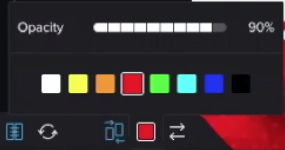

# Comparar pruebas en el visor de pruebas

>[!IMPORTANT]
>
>Este artículo se refiere a la funcionalidad en el producto independiente [!DNL Workfront Proof]. Para obtener información sobre pruebas en el interior [!DNL Adobe Workfront], consulte [Prueba](../../../review-and-approve-work/proofing/proofing.md).

Puede ver comparaciones en paralelo de dos pruebas. Pueden ser dos versiones de la misma prueba o dos pruebas completamente independientes.

## Comparar versiones de prueba {#compare-proof-versions}

1. Abra la prueba que tenga varias versiones que desee comparar.
1. En la esquina superior izquierda del visor de pruebas que se muestra, haga clic en el nombre de la prueba. A continuación, en la lista de versiones que aparece, haga clic en el botón **Comparar** junto a la versión que desea abrir y comparar.

   

   Las pruebas se muestran una al lado de la otra, con la versión más reciente a la izquierda.

   <!--
   
Separate breadcrumbs above each proof allow you to view and go to the work item associated with the proof:

   -->

   <!--
   
  

   -->

1. Continuar con [Uso de las herramientas de comparación](#use-the-compare-tools).

## Comparar pruebas independientes {#compare-separate-proofs}

Puede comparar dos pruebas independientes.

* [Compare pruebas independientes en [!DNL Workfront]](#compare-separate-proofs-in-workfront)
* [Compare pruebas independientes en [!DNL Workfront Proof]](#compare-separate-proofs-in-workfront-proof)

### Compare pruebas independientes en [!DNL Workfront] {#compare-separate-proofs-in-workfront}

Para obtener información sobre cómo comparar pruebas independientes de la lista de documentos dentro de [!DNL Workfront], consulte la [Comparar dos pruebas diferentes](../../../review-and-approve-work/proofing/reviewing-proofs-within-workfront/review-a-proof/compare-proofs.md#comparing-two-proofs-from-a-document-list) en la sección [Comparar pruebas](../../../review-and-approve-work/proofing/reviewing-proofs-within-workfront/review-a-proof/compare-proofs.md) artículo.

### Compare pruebas independientes en [!DNL Workfront Proof] {#compare-separate-proofs-in-workfront-proof}

>[!NOTE]
>
>Las pruebas comparadas deben encontrarse en la misma carpeta y en el mismo nivel de jerarquía dentro de la estructura de carpetas. Para obtener más información sobre el uso de carpetas para agrupar pruebas que desee comparar, consulte [Trabajar con varias pruebas en el visor de pruebas](../../../workfront-proof/wp-work-proofsfiles/review-proofs-wpv/work-with-multiple-proofs.md)

1. Abra una de las pruebas que desee comparar en el visor de pruebas.
1. Haga clic en el **[!UICONTROL Modo de comparación]** icono.

   \
   El área de visualización se divide por la mitad y la prueba se muestra a la izquierda y a la derecha del visor de pruebas.

   

1. Haga clic en el [!UICONTROL carpeta] encima de la prueba, ya sea en el lado izquierdo o derecho para mostrar las otras pruebas dentro de la misma carpeta.

   

1. En la lista, haga clic en el nombre de la prueba que desea comparar con la prueba que está abierta en el visor de pruebas.

   

   Aparecen ambas pruebas.

1. Continuar con [Uso de las herramientas de comparación](#use-the-compare-tools).

## Uso de las herramientas de comparación {#use-the-compare-tools}

El visor de pruebas proporciona varias herramientas para comparar pruebas de forma eficaz y eficiente.

* [Comparación automática de pruebas](#auto-compare-proofs)
* [Comparar pruebas en una superposición](#compare-proofs-in-an-overlay)
* [Comparación de navegación simultánea](#simultaneous-navigation-comparison)

### Comparación automática de pruebas {#auto-compare-proofs}

La comparación automática realiza una comparación píxel a píxel entre dos pruebas estáticas o de vídeo. Cualquier diferencia detectada se resalta en rojo en la prueba de la izquierda.

La comparación automática no está disponible cuando se comparan pruebas interactivas.

Para comparar automáticamente dos pruebas:

1. Empiece comparando pruebas de cualquiera de estas formas:

   * Compare dos versiones de la misma prueba (consulte [Comparar versiones de prueba](#compare-proof-versions) en este artículo).
   * Comparar dos pruebas independientes (consulte [Comparar pruebas independientes](#compare-separate-proofs) en este artículo).

1. Haga clic en el **[!UICONTROL Comparación automática]** icono.

   

   Cualquier diferencia entre las dos pruebas se resalta en rojo en la prueba de la izquierda.

1. (Opcional) Haga clic en el **[!UICONTROL Conmutador]** para cambiar el lado activo de modo que las diferencias se muestren en la prueba del lado derecho. De forma predeterminada, las diferencias se muestran en la prueba del lado izquierdo.

   

1. (Opcional) Haga clic en el **[!UICONTROL Color]** para cambiar el color y la opacidad utilizados cuando se resaltan las diferencias.

   

### Comparar pruebas en una superposición {#compare-proofs-in-an-overlay}

La comparación de superposiciones permite ver las diferencias entre dos pruebas estáticas viendo las dos pruebas como una sola prueba, mientras proporciona un divisor vertical en el centro de la prueba. A medida que recorta la prueba en el divisor vertical, se muestran las diferencias.

>[!NOTE]
>
>La comparación de superposiciones no está disponible cuando se comparan vídeos o pruebas interactivas.

Para habilitar la comparación de superposiciones:

1. Empiece comparando pruebas de cualquiera de estas formas:

   * Compare dos versiones de la misma prueba (consulte [Comparar versiones de prueba](#compare-proof-versions) en este artículo).
   * Comparar dos pruebas independientes (consulte [Comparar pruebas independientes](#compare-separate-proofs) en este artículo).

1. Haga clic en el **[!UICONTROL Superposición]** icono.

   

   Las dos pruebas se muestran como una sola prueba, con un divisor vertical en el centro de la prueba.

1. Realice una de las siguientes acciones:

   * Desplace la prueba a través del divisor vertical. A medida que recorre, verá la prueba a la izquierda en el lado izquierdo del divisor vertical, mientras que la prueba a la derecha se mostrará en el lado derecho.
   * Mueva el divisor vertical a la izquierda y a la derecha. Al mover el divisor, verá la prueba a la izquierda del divisor vertical, mientras que la prueba a la derecha se mostrará en el lado derecho.

### Comparación de navegación simultánea {#simultaneous-navigation-comparison}

La navegación simultánea está habilitada de forma predeterminada al comparar pruebas. Está disponible al comparar una prueba estática con una prueba estática o al comparar una prueba de vídeo y una prueba de vídeo. No está disponible al comparar una prueba estática y una prueba de vídeo.

**Pruebas estáticas:** Cuando se habilita en las pruebas estáticas, la navegación simultánea bloquea el nivel de zoom y la posición de las dos pruebas al panoramizar o desplazar. Cuando una prueba contiene varias páginas y la navegación simultánea está habilitada, el cambio de páginas en una prueba provoca que la página cambie en la otra prueba.

**Pruebas de vídeo:** Cuando se habilita en las pruebas de vídeo, la navegación simultánea recuerda la diferencia horaria en las líneas de tiempo de las dos pruebas.

Para habilitar la navegación simultánea si no está activada:

1. Empiece comparando pruebas de cualquiera de estas formas:

   * Compare dos versiones de la misma prueba (consulte [Comparar versiones de prueba](#compare-proof-versions) en este artículo).
   * Comparar dos pruebas independientes (consulte [Comparar pruebas independientes](#compare-separate-proofs) en este artículo).

1. Haga clic en el **[!UICONTROL Navegación simultánea]** icono.

   

1. (Opcional) Haga clic en el **[!UICONTROL Restablecer]** en cualquier momento para restablecer el nivel de zoom y la posición (para pruebas estáticas) o la cronología (para pruebas de vídeo).

   

## Salir del modo de comparación

1. Cierre la prueba que ya no desee ver haciendo clic en el icono (x) en la esquina superior izquierda de la prueba.

   

   La prueba de que no se cierra permanece abierta en el visor de pruebas.
