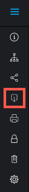

# Descarga de una revisión en el visor de corrección

>[!IMPORTANT]
>
>Este artículo hace referencia a la funcionalidad del producto independiente [!DNL Workfront Proof]. Para obtener información sobre la revisión dentro de [!DNL Adobe Workfront], consulte [Revisión](../../../review-and-approve-work/proofing/proofing.md).

Puede descargar archivos de una prueba existente. Sin embargo, solo se descargan los archivos; los comentarios y otra información asociada a la prueba no se incluyen en la descarga.

1. En la barra de herramientas de la izquierda del visor de corrección, haga clic en el botón **[!UICONTROL Descargar]**.\
   

1. Busque la ubicación en el sistema de archivos donde quiera descargar la prueba y luego haga clic en **[!UICONTROL Guardar]**.
