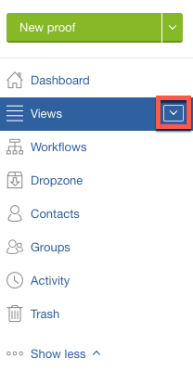

# Apertura de una prueba en [!DNL Workfront Proof]

>[!IMPORTANT]
>
>Este artículo hace referencia a la funcionalidad del producto independiente [!DNL Workfront Proof]. Para obtener información sobre la revisión dentro de [!DNL Adobe Workfront], consulte [Revisión](../../../review-and-approve-work/proofing/proofing.md).

1. Haga clic en el botón de flecha hacia abajo situado junto a **[!UICONTROL Vistas]** en la barra lateral.\
   

1. Elija **[!UICONTROL Todos los elementos]** en el menú que aparece.
1. Haga clic en el icono de **[!UICONTROL Ir a la revisión]** de la revisión que desee ver.\
   \
   El visor de corrección predeterminado se inicia en una nueva pestaña del explorador y el enfoque cambia a esa pestaña. Puede tener varias pruebas abiertas simultáneamente, cada una en su propia pestaña.

1. Continúe con uno de los siguientes artículos, según el visor de corrección que esté utilizando.

   * Para revisar en el Visor de corrección web, consulte [Revisión de pruebas en el visor de corrección web.](https://support.workfront.com/hc/en-us/sections/115000275214)
   * Para revisar en el visor de corrección de escritorio, consulte [Revisión de pruebas de escritorio en el visor de corrección de escritorio](ttps://support.workfront.com/hc/en-us/search/click?data=BAh7CjoHaWRsKwjm7%2BTRUwA6CXR5cGVJIgxhcnRpY2xlBjoGRVQ6CHVybEkiVC9oYy9lbi11cy9hcnRpY2xlcy8zNjAwMDM3MjczMzQtUmV2aWV3aW5nLVByb29mcy1pbi10aGUtRGVza3RvcC1Qcm9vZmluZy1WaWV3ZXIGOwdUOg5zZWFyY2hfaWRJIik0NDIyMjdkZi0zYTA4LTQ2YjItYTdkMy1kYzM1YjhlN2U4MjUGOwdGOglyYW5raQc%3D--2056c434cf6f4f97ca87532493ebfeb67ca07b63).

   Para obtener más información sobre los visores de corrección, consulte [Información general sobre las diferencias entre el visor de corrección web y el visor de corrección de escritorio](../../../review-and-approve-work/proofing/proofing-overview/understand-differences-between-web-viewer.md).
