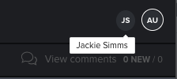

# Revisar una prueba simultáneamente con varios revisores

>[!IMPORTANT]
>
>Este artículo se refiere a la funcionalidad en el producto independiente [!DNL Workfront Proof]. Para obtener información sobre pruebas en el interior [!DNL Adobe Workfront], consulte [Prueba](../../../review-and-approve-work/proofing/proofing.md).

Varios revisores pueden revisar una prueba al mismo tiempo. Al revisar una prueba, puede ver quién más está revisando actualmente la misma prueba.

Puede ver indicadores de presencia cuando otros revisores tienen la misma prueba abierta, independientemente de si añaden o no comentarios a la prueba. Si añaden comentarios, estos aparecen mientras revisa la prueba; no es necesario actualizar el visor de pruebas para verlo.

1. Vea los indicadores de presencia en la esquina superior derecha del visor de pruebas.

   Si está utilizando [!DNL Workfront Proof] (no la funcionalidad de pruebas integrada con [!DNL Workfront]), los indicadores de presencia contienen la variable [!DNL Workfront Proof] imagen de perfil o, si no hay ninguna imagen de perfil, la primera y la última inicial si el usuario.

   Imágenes de perfil en [!DNL Workfront] no aparecen en el visor de pruebas.

1. (Opcional) Pase el cursor sobre un indicador de presencia para ver el nombre del usuario.

   
