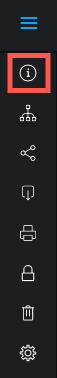

# Vista de la actividad de una prueba en el visor de pruebas

>[!IMPORTANT]
>
>Este artículo hace referencia a la funcionalidad del producto independiente [!DNL Workfront Proof]. Para obtener información sobre la revisión dentro de [!DNL Adobe Workfront], vea [Revisión](../../../review-and-approve-work/proofing/proofing.md).

Puede ver la actividad reciente de una prueba determinada. Esto incluye todas las actividades y decisiones tomadas por cualquier usuario asignado a la prueba.

1. Si no se muestra la barra de herramientas izquierda, haga clic en el icono **[!UICONTROL Menú]** en la esquina superior izquierda del visor de revisión.

   

1. En la barra de herramientas a la izquierda del visor de revisión, haga clic en el botón **[!UICONTROL Detalles de revisión]**.

   

1. En la página **[!UICONTROL Detalles de revisión]** que aparece, con **[!UICONTROL Detalles de revisión]** seleccionados, vea los detalles, el estado y el progreso de la revisión.

1. Para obtener información sobre el estado de prueba, consulte [Comprender el estado de prueba en [!DNL Workfront Proof]](../../../workfront-proof/wp-work-proofsfiles/manage-your-work/proof-state.md).

1. Para obtener información sobre el progreso de la prueba, consulte [Ver el progreso y el estado de una prueba en [!DNL Workfront Proof]](../../../workfront-proof/wp-work-proofsfiles/manage-your-work/view-progress-and-status-of-proof.md).
1. Haga clic en **[!UICONTROL Actividad de revisión]** para ver la siguiente información:

   * **Fecha**: La hora y fecha en que se realizó la acción.
   * **Acción**: La acción que se produjo en la revisión.
   * **Detalles**: El usuario que realizó la acción.
