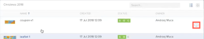
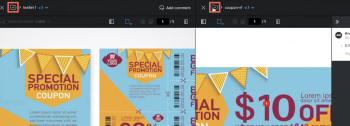

# Trabajar con varias pruebas en el visor de pruebas

>[!IMPORTANT]
>
>Este artículo hace referencia a la funcionalidad del producto independiente [!DNL Workfront Proof]. Para obtener información sobre la revisión dentro de [!DNL Adobe Workfront], vea [Revisión](../../../review-and-approve-work/proofing/proofing.md).

En [!DNL Workfront Proof], puede usar carpetas para agrupar pruebas en las que desee trabajar juntos o en las que desee que trabajen juntos los revisores. Cuando usted u otro revisor abre una de las pruebas e inicia el visor de pruebas, todas las pruebas de la carpeta también están disponibles allí. Sin salir del visor de pruebas, puede ver las otras pruebas, ordenarlas y buscarlas, y compararlas entre sí.

Para obtener información general acerca de las carpetas, vea [Carpetas en [!DNL Workfront Proof]](../../../workfront-proof/wp-work-proofsfiles/organize-your-work/folders.md).

>[!NOTE]
>
>La capacidad de un revisor para abrir cualquier prueba en una carpeta depende de su acceso a la prueba. Para obtener información sobre el acceso a las pruebas, consulte [Generar pruebas en [!DNL Workfront Proof]](../../../workfront-proof/wp-work-proofsfiles/create-proofs-and-files/generate-proofs.md).

## Agrupar pruebas en una carpeta

1. En Workfront Proof (fuera del visor de revisión), cree una carpeta, tal como se describe en [Crear carpetas en [!DNL Workfront Proof]](../../../workfront-proof/wp-work-proofsfiles/organize-your-work/create-folders.md).
1. En el panel o en una vista de lista, agrupe las pruebas en las que desee trabajar arrastrándolas a la carpeta creada.

   

## Revisar varias pruebas agrupadas en una carpeta

Como revisor, puede trabajar con varias pruebas en una carpeta sin salir del visor de pruebas.

1. En [!DNL Workfront Proof], haga clic en el nombre de la carpeta para abrirla y luego abra una revisión en la carpeta para iniciar el visor de revisiones.

   O

   Abra una prueba desde una URL pública o desde una notificación por correo electrónico e inicie sesión en el sistema según sea necesario.

1. Haga clic en el icono de la carpeta, en la esquina superior izquierda del visor de pruebas.

   

   Esto abre la carpeta que contiene la prueba actual y las demás pruebas que ha agregado a ella.

   

1. (Opcional) Realice cualquiera de las siguientes acciones con las pruebas de la carpeta mientras utiliza el visor de pruebas:

   * Para buscar en la carpeta la prueba que desee, haga clic en el cuadro **[!UICONTROL Buscar]** situado en la esquina superior derecha de la lista y empiece a escribir parte del nombre de la prueba; a continuación, haga clic en la prueba cuando aparezca.
   * Para ordenar las pruebas según el contenido de una columna, haga clic en **[!UICONTROL Nombre]**, **[!UICONTROL Creado]**, **[!UICONTROL Estado]** o **[!UICONTROL Propietario]** en la lista.

   * Para comparar dos pruebas en la carpeta, abra una prueba, luego seleccione la otra en la lista de carpetas y haga clic en el botón [!UICONTROL Comparar] en el extremo derecho de esa prueba (consulte [Comparar pruebas en el visor de pruebas](../../../workfront-proof/wp-work-proofsfiles/review-proofs-wpv/compare-proofs.md) si necesita más información acerca de la comparación de dos pruebas).

     

     Mientras compara pruebas, si desea cambiar a una nueva prueba, ya sea en el lado izquierdo o derecho del visor de pruebas, haga clic en el botón [!UICONTROL Comparar] situado encima de la prueba.

     
