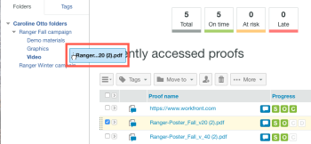
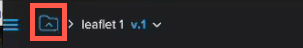
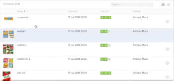
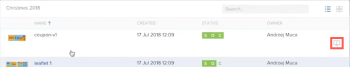
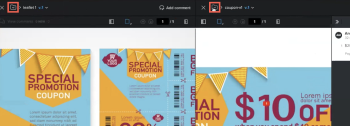

# Trabajar con varias revisiones en el visor de corrección

>[!IMPORTANT]
>
>Este artículo hace referencia a la funcionalidad del producto independiente [!DNL Workfront Proof]. Para obtener información sobre la revisión dentro de [!DNL Adobe Workfront], consulte [Revisión](../../../review-and-approve-work/proofing/proofing.md).

En [!DNL Workfront Proof], puede utilizar carpetas para agrupar las pruebas en las que desea trabajar conjuntamente o en las que desea que trabajen conjuntamente los revisores. Cuando usted u otro revisor abre una de las revisiones e inicia el visor de corrección, todas las revisiones de la carpeta también están disponibles allí. Sin salir del visor de revisiones, puede ver las otras revisiones, ordenarlas y buscarlas, y compararlas entre sí.

Para obtener información general acerca de las carpetas, consulte [Carpetas en [!DNL Workfront Proof]](../../../workfront-proof/wp-work-proofsfiles/organize-your-work/folders.md).

>[!NOTE]
>
>La capacidad de un revisor para abrir cualquier prueba en una carpeta depende de su acceso a la prueba. Para obtener información sobre el acceso a las pruebas, consulte [Generar pruebas en [!DNL Workfront Proof]](../../../workfront-proof/wp-work-proofsfiles/create-proofs-and-files/generate-proofs.md).

## Agrupar pruebas en una carpeta

1. En Workfront Proof (fuera del visor de corrección), cree una carpeta, tal como se describe en [Crear carpetas en [!DNL Workfront Proof]](../../../workfront-proof/wp-work-proofsfiles/organize-your-work/create-folders.md).
1. En el panel de control o en una vista de lista, agrupe las pruebas en las que desee trabajar arrastrándolas a la carpeta creada.

   

## Revisar varias pruebas agrupadas en una carpeta

Como revisor, puede trabajar con varias revisiones en una carpeta sin salir del visor de corrección.

1. En [!DNL Workfront Proof], haga clic en el nombre de la carpeta para abrirla y luego abra una revisión en la carpeta para iniciar el visor de corrección.

   O

   Abra una prueba desde una URL pública o desde una notificación por correo electrónico e inicie sesión en el sistema según sea necesario.

1. Haga clic en el icono de la carpeta, en la esquina superior izquierda del visor de corrección.

   

   Se abrirá la carpeta que contiene la prueba actual y las demás pruebas que haya añadido.

   

1. (Opcional) Realice cualquiera de las siguientes acciones con las revisiones de la carpeta mientras utiliza el visor de corrección:

   * Para buscar en la carpeta la prueba que desee, haga clic en el cuadro **[!UICONTROL Buscar]** situado en la esquina superior derecha de la lista y empiece a escribir parte del nombre de la prueba; a continuación, haga clic en la prueba cuando aparezca.
   * Para ordenar las pruebas según el contenido de una columna, haga clic en **[!UICONTROL Nombre]**, **[!UICONTROL Creado]**, **[!UICONTROL Estado]** o **[!UICONTROL Propietario]** en la lista.

   * Para comparar dos revisiones en la carpeta, abra una revisión, luego seleccione la otra en la lista de carpetas y haga clic en el botón [!UICONTROL Comparar] en el extremo derecho de esa revisión (consulte [Comparar revisiones en el visor de corrección](../../../workfront-proof/wp-work-proofsfiles/review-proofs-wpv/compare-proofs.md) si necesita más información acerca de la comparación de dos revisiones).

     

     Mientras compara revisiones, si desea cambiar a una nueva revisión, ya sea en el lado izquierdo o derecho del visor de corrección, haga clic en el botón [!UICONTROL Comparar] situado encima de la revisión.

     
