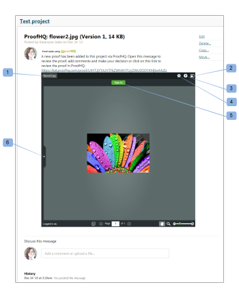

# Crear una revisión mínima en [!DNL Workfront Proof]

>[!IMPORTANT]
>
>Este artículo hace referencia a la funcionalidad del producto independiente [!DNL Workfront Proof]. Para obtener información sobre la revisión dentro de [!DNL Adobe Workfront], consulte [Revisión](../../../review-and-approve-work/proofing/proofing.md).

Miniproof es un widget que permite incrustar una prueba en una página web, un blog o una wiki.

Miniproof le muestra la prueba junto con todos los comentarios y marcas existentes. Puede trabajar en la revisión como si estuviera en [!DNL Workfront Proof].

A continuación, se muestra un ejemplo de un Miniproof incrustado en un proyecto de BaseCamp:

* Nombre de la prueba (1)
* Pantalla completa (2): abre la prueba en el visualizador de pruebas (fuera del entorno en el que se incrustó la prueba mínima)
* Vínculos de ayuda (3)
* Menú Acciones (4)
* Ver comentarios en la barra lateral (5)

Para incrustar una prueba mínima en un sitio web, blog o wiki:

1. Vaya a la página **[!UICONTROL Detalles de revisión]** de una revisión, tal como se describe en [Administrar detalles de revisión en [!DNL Workfront Proof]](../../../workfront-proof/wp-work-proofsfiles/manage-your-work/manage-proof-details.md).

1. Abrir la sección **[!UICONTROL Más opciones para compartir]** de la página
1. Asegúrese de que el código incrustado esté habilitado (1).
1. Haga clic en el vínculo [!UICONTROL Copiar código] (2) para copiar el código incrustado en el portapapeles.
1. Pegue el código en el sitio web, blog o wiki en el que esté trabajando para incrustar la prueba mínima.

![[!DNL Embed_code].png](assets/embed-code-350x218.png)
