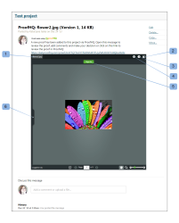

# Incrustar un Miniproof

>[!IMPORTANT]
>
>Este artículo hace referencia a la funcionalidad del producto independiente [!DNL Workfront Proof]. Para obtener información sobre la revisión dentro de [!DNL Adobe Workfront], consulte [Revisión](../../../review-and-approve-work/proofing/proofing.md).

Miniproof es un widget que permite incrustar una prueba en una página web, un blog o una wiki. Miniproof le muestra la prueba junto con todos los comentarios y marcas existentes. Puede usarlo para trabajar en la prueba igual que si estuviera en [!DNL Workfront Proof].

A continuación, se muestra un ejemplo de un Miniproof incrustado en un proyecto de BaseCamp:

* Nombre de la prueba (1)
* Pantalla completa (2): abrirá la prueba en el visualizador de pruebas (fuera del entorno en el que se incrustó Miniproof)
* Vínculos de ayuda (3)
* Menú Acciones (4)
* Ver comentarios en la barra lateral (5)

Para incrustar un Miniproof en una página web, un blog o una wiki:

1. Vaya a la página **[!UICONTROL Detalles de la prueba]** de una revisión (consulte “Página de detalles de la prueba” en [Administrar detalles de la prueba en  [!DNL Workfront Proof]](../../../workfront-proof/wp-work-proofsfiles/manage-your-work/manage-proof-details.md)).

1. Haga clic en **[!UICONTROL Más opciones para compartir]** para expandir esta sección.
1. Junto a **[!UICONTROL Código incrustado]**, asegúrese de que está seleccionada la opción **[!UICONTROL Habilitar]**.

1. Haga clic en **[!UICONTROL Copiar código]** para copiar el código incrustado en el portapapeles.
1. Pegue el código en el sitio web, blog o wiki donde desea incrustar Miniproof.
