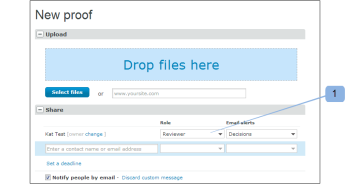
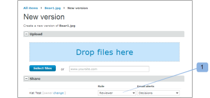
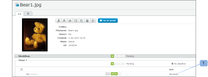
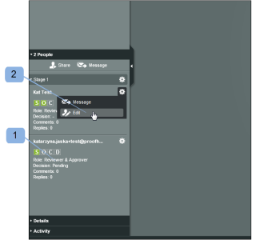
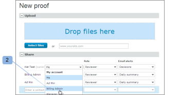

# Administrar funciones de prueba en [!DNL Workfront Proof]

<!-- Audited: 01/2024 -->

>[!IMPORTANT]
>
>Este artículo hace referencia a la funcionalidad del producto independiente [!DNL Workfront Proof]. Para obtener información sobre la revisión dentro de [!DNL Adobe Workfront], consulte [Revisión](../../../review-and-approve-work/proofing/proofing.md).

Las funciones de prueba permiten conceder permisos a usuarios limitados por el perfil de permiso configurado en su perfil de usuario. (Para obtener más información sobre los perfiles de permisos, consulte [Perfiles de permisos de prueba en  [!DNL Workfront Proof]](../../../workfront-proof/wp-acct-admin/account-settings/proof-perm-profiles-in-wp.md)).

Las funciones de prueba son diferentes de los perfiles de cuenta. El perfil de su cuenta se relaciona con el nivel de permiso general que tiene en su cuenta y afectará a los derechos que tiene sobre todas las pruebas de su cuenta, incluso aquellas que no se hayan compartido explícitamente con usted.

Para obtener más información, consulte [Perfiles de permisos de prueba en  [!DNL Workfront Proof]](../../../workfront-proof/wp-acct-admin/account-settings/proof-perm-profiles-in-wp.md).

## Acerca de las funciones de prueba

Las siguientes funciones de prueba se otorgan a los usuarios para una prueba individual en el momento en que se invita al usuario a revisarla:

* [Solo lectura](#read-only)
* [Revisor](#reviewer)
* [Aprobador](#approver)
* [Revisor y aprobador](#reviewer-approver)
* [Autor](#author)
* [Moderador](#moderator)

La función de prueba define qué acciones puede realizar un revisor en relación con esa revisión específica.

Por ejemplo, si es un revisor, se le pedirá que revise la prueba añadiendo marcas y comentarios. Si es un revisor y aprobador, se le pedirá que revise y que tome una decisión sobre la prueba.

Ciertas funciones de prueba otorgan a un revisor derechos de edición sobre la prueba (incluso si su perfil de cuenta no lo hace) y les permiten utilizar algunas funciones adicionales, como añadir acciones en comentarios, crear nuevas versiones y añadir más revisores a la prueba.

Para obtener más información, consulte los siguientes artículos:

* [Utilizar acciones en comentarios de revisión](../../../review-and-approve-work/proofing/reviewing-proofs-within-workfront/comment-on-a-proof/use-actions-on-comments-in-viewer.md)
* [Compartir una prueba en  [!DNL Workfront Proof]](../../../workfront-proof/wp-work-proofsfiles/share-proofs-and-files/share-proof.md)

### Solo lectura

{#read-only}

Puede ver una prueba

 No puede añadir marcas

 No puede añadir comentarios

 No puede tomar una decisión

 No puede eliminar los comentarios de otros usuarios

 no tiene derechos de edición sobre la prueba

>[!NOTE]
>
>Si se comparte una carpeta con un usuario de [!DNL Workfront Proof], se le otorgarán automáticamente derechos de solo lectura a todos los elementos existentes y añadidos posteriormente en la carpeta.

Para obtener más información, consulte [Compartir carpetas en  [!DNL Workfront Proof]](../../../workfront-proof/wp-work-proofsfiles/organize-your-work/share-folders.md).

### Revisor {#reviewer}

 Puede ver una prueba

 Puede añadir marcas

 Puede añadir comentarios

![[!DNL cleaner].png](assets/cleaner.png) Puede editar sus propios comentarios si no hay respuestas

 No puede tomar una decisión

 No puede editar ni eliminar los comentarios de otros usuarios

 No tiene derechos de edición sobre la prueba

### Aprobador {#approver}

 Puede ver una prueba

 Puede tomar una decisión

 No puede añadir marcas

 No puede añadir comentarios

 No puede editar ni eliminar los comentarios de otros usuarios

 No tiene derechos de edición sobre la prueba

### Revisor y aprobador {#reviewer-approver}

 Puede ver una prueba

 Puede añadir marcas

 Puede añadir comentarios

![[!DNL cleaner].png](assets/cleaner.png) Puede editar sus propios comentarios si no hay respuestas

 Puede tomar una decisión

 No puede editar ni eliminar los comentarios de otros usuarios

 No tiene derechos de edición sobre la prueba

### Autor {#author}

 Puede añadir marcas

 Puede añadir comentarios

![[!DNL cleaner].png](assets/cleaner.png) Puede editar sus propios comentarios si no hay respuestas

 Puede tomar una decisión

Puede enviar nuevas versiones

 Puede crear una copia de la prueba

 Puede compartir la prueba con otras personas

 Puede aplicar acciones sobre los comentarios

 Puede resolver comentarios

 No puede editar ni eliminar los comentarios de otros usuarios

>[!NOTE]
>
>Esta función solo se puede asignar a los usuarios de [!DNL Workfront Proof].

### Moderador {#moderator}

 Puede añadir marcas

 Puede añadir comentarios

![[!DNL cleaner].png](assets/cleaner.png) Puede editar sus propios comentarios si no hay respuestas

 Puede tomar una decisión

 Puede enviar nuevas versiones

 Puede añadir nuevos revisores

 Puede aplicar acciones sobre los comentarios

Puede resolver comentarios

 Puede eliminar comentarios y respuestas en la prueba (que haya realizado o que hayan realizado otros usuarios)

* Si se elimina el primer comentario de un hilo de comentarios, se eliminará todo el hilo
* Al eliminar respuestas en el hilo de comentarios, solo se eliminará esa respuesta

 No puede editar los comentarios de otros usuarios

Esta función permite a la persona administrar y moderar los comentarios de la prueba, lo que le da la oportunidad de mantener solo los comentarios relevantes sobre la prueba y eliminar los que no lo son.

>[!NOTE]
>
>Esta función solo se puede asignar a los usuarios de [!DNL Workfront Proof].

## Asignación de funciones de prueba

Puede asignar funciones de prueba al crear nuevas pruebas, al crear versiones nuevas de pruebas existentes o en pruebas existentes.

### Nuevas pruebas {#new-proofs}

Se pueden asignar funciones de prueba a los revisores en la página [!UICONTROL New proof] durante el proceso de creación de la prueba (1).

### Nuevas versiones {#new-versions}

Al crear una nueva versión de una prueba, se muestran automáticamente los revisores de la versión anterior (con la misma función que la de la versión anterior).

Puede editar las funciones de prueba aplicadas a los revisores al crear la nueva versión (1).

### Pruebas existentes {#existing-proofs}

Si desea cambiar la función de una persona en una prueba existente, puede hacerlo en la página [!UICONTROL Proof details] editando directamente su función en la sección de flujo de trabajo (1).

## Comprobación de funciones en el visor de pruebas

Puede comprobar la función de un revisor directamente desde el visor de pruebas (1) y editarla (2) si es necesario.

## Funciones de prueba predeterminadas

Puede establecer la función de prueba predeterminada en la página [!DNL Proofing Defaults] de su Configuración personal. Esto significa que, cuando se le añada a una prueba, la función de revisión predeterminada se rellenará automáticamente. Tenga en cuenta que un usuario con derechos de edición sobre una prueba puede cambiar esta función en el nivel de revisión.

>[!NOTE]
>
>Solo los usuarios con perfiles de Administrador o Administrador de facturación pueden cambiar los valores predeterminados de la revisión para otros usuarios de su cuenta.

Para obtener más información, consulte [Configuración personal en  [!DNL Workfront Proof]](../../../workfront-proof/wp-getstarted/personal-settings/personal-settings.md).

## Creadores y propietarios

Los creadores y propietarios tienen derechos de edición completos sobre la prueba.

### Creadores {#creators}

El creador de la prueba es la persona que carga la prueba en primer lugar. El creador de la prueba se muestra automáticamente en la lista de personas de la prueba (en su función predeterminada).

En la página [!UICONTROL Nueva prueba] puede asignar una función de prueba diferente al creador de la prueba (que no sea su función predeterminada).

El creador de la prueba no se puede cambiar ni eliminar de una prueba.

### Propietarios {#owners}

De manera predeterminada, el Creador también es el Propietario de la prueba; sin embargo, puede convertir a otra persona en el Propietario de la prueba al crear inicialmente la prueba (en la página [!UICONTROL Nueva prueba]).

Para cambiar el propietario en la página Nueva prueba:

1. Haga clic en el vínculo de cambio que aparece junto al nombre del creador.
1. Seleccione el nuevo propietario del menú desplegable. (2)

Una vez creada la prueba, aún es posible cambiar el propietario. Cualquier persona con derechos de edición sobre la prueba podrá cambiar la propiedad de la prueba a otro usuario a través de la página [!UICONTROL Detalles de la revisión] (véase a continuación).

La capacidad de cambiar el propietario de una prueba es especialmente útil desde el punto de vista de la administración del flujo de trabajo. Permite a la persona responsable del proyecto asumir la propiedad de las pruebas, lo que le otorga derechos de edición sobre las pruebas y la posibilidad de verlas en la vista [!UICONTROL Mis pruebas].

Para cambiar el propietario de la prueba a través de la página [!UICONTROL Detalles de la revisión]:

* Haga clic en el menú Acciones junto al nombre de la persona que desea convertir en propietario.
* Seleccione [!UICONTROL **Convertir en propietario**] del menú desplegable.
* También puede hacer clic en el campo [!UICONTROL **Propietario**] junto a la imagen de prueba y elegir el nuevo Propietario en la lista desplegable que se muestra.

Una vez hecho esto, se mostrará la palabra “Propietario” junto al nombre de esa persona.

>[!NOTE]
>
>Solo un usuario de la misma cuenta o una cuenta de socio puede convertirse en propietario de una prueba. Un usuario de una cuenta de socio puede convertirse en propietario de una prueba solo cuando:
>
>* Existe una relación de socio configurada entre las cuentas. Para obtener más información, consulte [Cuentas de socio en  [!DNL Workfront Proof]](../../../workfront-proof/wp-acct-admin/partner-accounts/partner-accounts.md).
>* No hay campos personalizados en la página [!UICONTROL Nueva prueba].
>* La prueba no se ha asignado a una carpeta.
>* No se han aplicado etiquetas a la prueba.

Para delegar temporalmente la propiedad de la revisión en [!DNL Workfront Proof], consulte [Designación de propietarios temporales de la revisión en  [!DNL Workfront Proof]](../../../workfront-proof/wp-getstarted/personal-settings/designate-temp-proof-owners.md).
